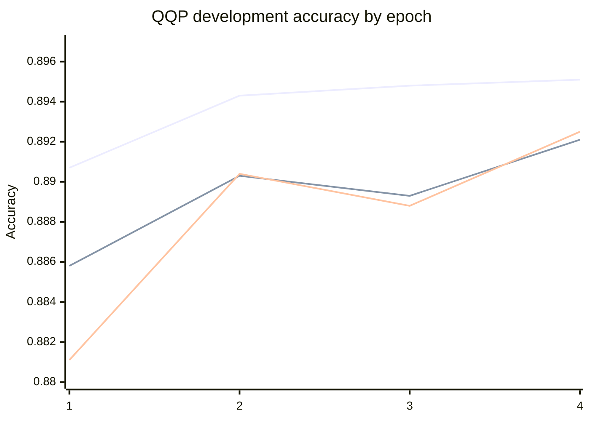
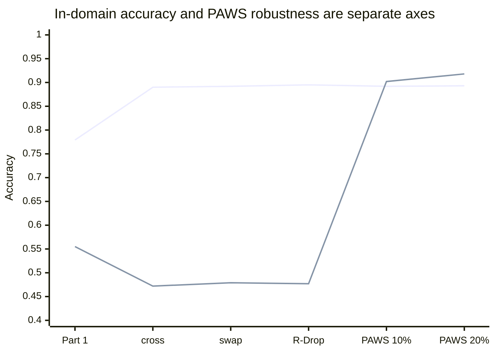
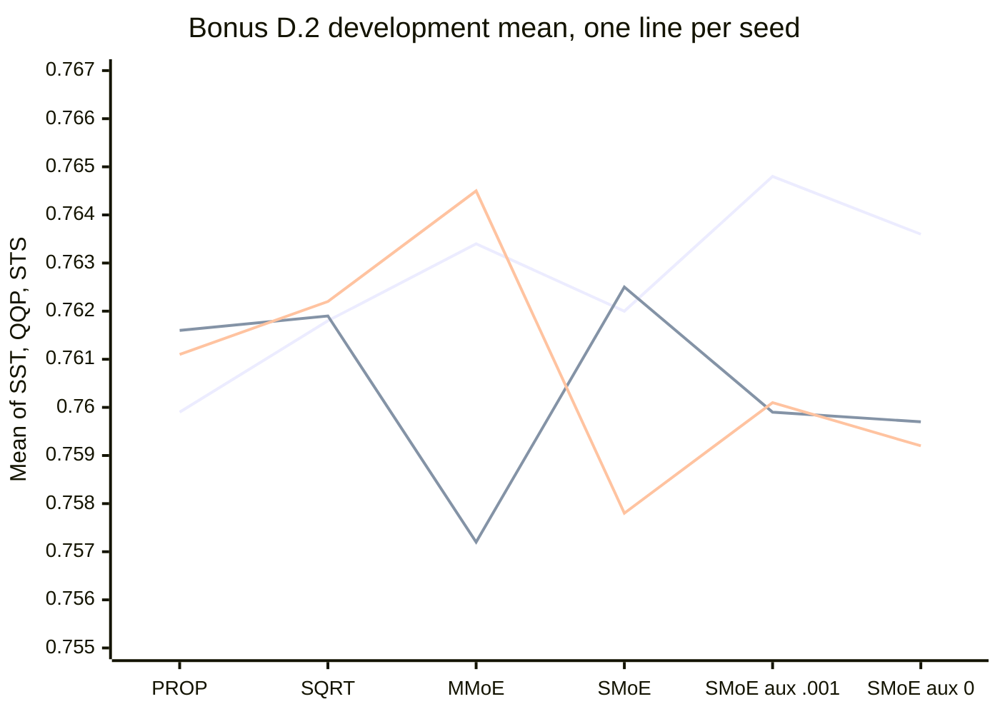
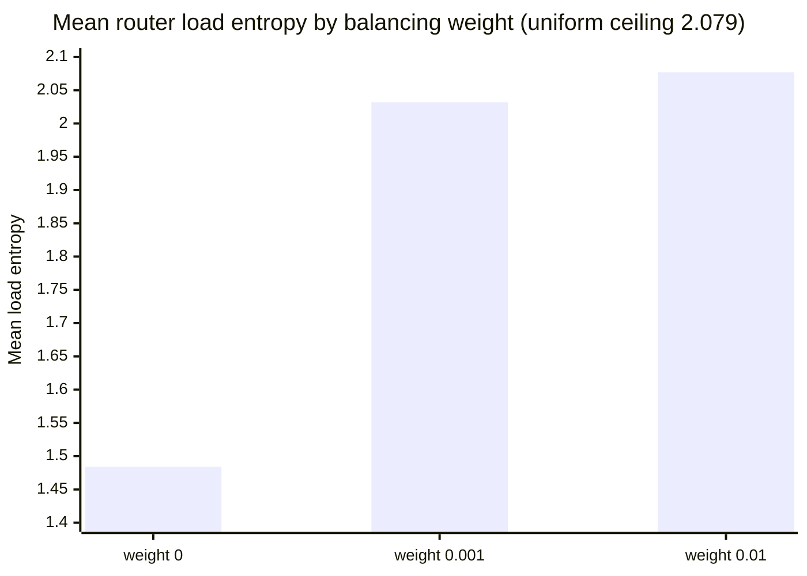

# DNLP SS26 Final Project

This repository contains our project for the **Deep Learning for Natural Language Processing (DNLP)** course at the University of Göttingen. The project is based on the official course handout, which can be found [here](https://docs.google.com/document/d/1pZiPDbcUVhU9ODeMUI_lXZKQWSsxr7GO/edit).

The project focuses on implementing and improving Transformer-based models for several Natural Language Processing tasks. We work with both **BERT** and **BART** and evaluate them on multiple downstream tasks.

For the **BERT**-based tasks, we address:
- Sentiment classification (SST)
- Paraphrase detection (QQP)
- Semantic textual similarity (STS)

For the **BART**-based tasks, we address:
- ETPC paraphrase-type detection
- ETPC paraphrase generation

In addition to the required tasks, we have also implemented and evaluated the two optional BONUS tasks specified in the project:
- minBERT Paraphrase-Type Detection
- Multitask Classification (Single model jointly on QQP, SST, and STS)

The repository contains our implementations, training and evaluation procedures, experiments, results, and analysis. We compare baseline approaches with our proposed improvements and investigate their effectiveness across the different tasks.

# Group Name: Attention Is All You Need

-   **Group name:** Attention Is All You Need
    
-   **Group code:** G05

-   **Group repository:** https://github.com/nirish2407/dnlp
    
-   **Tutor responsible:** 	Tolga Ermis
    
-   **Group team leader:** Nirish Samant
    
-   **Group members:**
    - Ajay Singh Dhillon (ajaysingh.dhillon@stud.uni-goettingen.de)
    - Mahmoud Abdellahi (mahmoud.abdellahi@stud.uni-goettingen.de)
    - Hasnain Sayyed (m.sayyed@stud.uni-goettingen.de)
    - Nirish Samant (nirish.samant@stud.uni-goettingen.de)
    - Praveen Babu Geddada (p.geddada@stud.uni-goettingen.de)

# Group Member Contributions

<br>

| **Group Member Name**                          |  **Contribution**                                                                   |
|:-----------------------------------------------|:------------------------------------------------------------------------------------|
| Hasnain Sayyed ([Hasnain01-hub](https://github.com/Hasnain01-hub)) | 1) Sentiment Analysis (SST) |
| Ajay Singh Dhillon ([Ajaysdhillon](https://github.com/Ajaysdhillon)) | 2) Semantic Textual Similarity (STS) |
| Mahmoud Abdellahi ([m-mahmoud-mohamed](https://github.com/m-mahmoud-mohamed)) | 3) Quora Paraphrase Detection (QQP), 7) BONUS D.2 Multitask Classification (SST + QQP + STS) |
| Nirish Samant ([nirish2407](https://github.com/nirish2407)) | 4) ETPC BART Paraphrase Type Detection, 6) BONUS D.1 minBERT Paraphrase Type Detection |
| Praveen Babu Geddada ([Gpraveenbabu](https://github.com/Gpraveenbabu)) | 5) ETPC BART Paraphrase Type Generation |

<br>


# Setup instructions

Everything runs from the repository root.

```bash
bash setup_gwdg.sh          # or: bash setup.sh outside the GWDG cluster
module load miniforge3
conda activate dnlp
```

Only the QQP robustness experiments need external data, downloaded by a
commit-pinned script that verifies SHA-256 checksums:

```bash
bash scripts/3_Quora_Paraphrase_Detection/download_paws_wiki.sh
```

### Verify the installation

```bash
cd sanity_test
python optimizer_test.py          # AdamW against the reference update
python sanity_check.py            # minBERT forward pass against reference output
cd ..
python -m unittest discover -s tests -t . -v
sbatch scripts/shared/gpu_sanity.sh          # optional cluster GPU check
```

### Build the submission

```bash
python prepare_submit.py
mv dnlp_final_project_submission.zip GroupID_DNLPSS26_TutorName_Part02.zip
```

`prepare_submit.py` is the packager shipped with the course repository. It
walks `predictions/` and writes every file it finds there into
`dnlp_final_project_submission.zip` under a fixed name, so rename the ZIP
afterwards. It validates nothing, so check the five required paths yourself
before running it, and move anything that should not be shipped out of
`predictions/`.

### Repository layout

Work is grouped by task. Each task owns a directory of the same name under
`analysis/`, `docs/`, `scripts/` and `tests/`, named after its README section.

```text
.
├── AI_Usage_Cards/                                                             one card per task
├── analysis/                                                                   evaluation and diagnostic programs
│   ├── 2_Semantic_Textual_Similarity/
│   │   ├── diag/                                                               tracked machine-readable metric reports
│   │   ├── plots/                                                              figures referenced in the report
│   │   ├── sts-similarity-dev-output.csv                                       canonical dev prediction
│   │   ├── apply_centering.py
│   │   ├── compare_seeds.py
│   │   ├── export_hf.py
│   │   ├── layer_analysis.py
│   │   ├── lexical_baseline_check.py
│   │   ├── linear_alignment_probe.py
│   │   ├── nli_pretrain.py
│   │   ├── pooling_geometry_analysis.py
│   │   ├── preprocess_nli.py
│   │   ├── relexicalization_plot.py
│   │   ├── residual_bootstrap.py
│   │   ├── residualized_probe_analysis.py
│   │   ├── run_all_analysis.py
│   │   └── sanity_check_meanpool.py
│   ├── 3_Quora_Paraphrase_Detection/
│   │   ├── diag/                                                               tracked machine-readable metric reports
│   │   ├── predictions/                                                        final train and dev predictions
│   │   ├── qqp_diagnostics.py
│   │   └── qqp_ensemble.py
│   ├── 4_Bart_Paraphrase_Type_Detection/                                       experiment outputs
│   ├── 6_minBert_Paraphrase_Type_Detection/                                    experiment outputs
│   └── 7_Bonus_Multitask_Classification/
│       ├── diag/                                                               tracked machine-readable metric reports
│       ├── predictions/                                                        final train and dev predictions
│       ├── bonus_d2_summary.py
│       ├── multitask_final_inference.py
│       └── multitask_moe_diagnostics.py
├── data/                                                                       course datasets (external data is ignored)
├── docs/                                                                       extended per-task method and result reports
│   ├── 2_Semantic_Textual_Similarity/task-sts.md
│   ├── 3_Quora_Paraphrase_Detection/task-qqp.md
│   ├── 4_Bart_Paraphrase_Type_Detection/4_Bart_Paraphrase_Type_Detection.md
│   ├── 7_Bonus_Multitask_Classification/bonus-d2-multitask.md
│   ├── repository-guide.md                                                     shared conventions
│   └── task-report-template.md                                                 shared template
├── predictions/
│   ├── {bert,bart}/                                                            canonical model outputs (STS, QQP and BONUS D.2
│   │                                                                           keep only their test files here)
├── sanity_test/                                                                course-provided minBERT and AdamW checks
├── scripts/                                                                    SLURM launchers and miscellaneous Python scripts
│   ├── 2_Semantic_Textual_Similarity/
│   ├── 3_Quora_Paraphrase_Detection/
│   ├── 4_Bart_Paraphrase_Type_Detection/
│   ├── 6_minBert_Paraphrase_Type_Detection/
│   ├── 7_Bonus_Multitask_Classification/
│   └── shared/
├── tests/                                                                      focused regression tests
│   ├── 2_Semantic_Textual_Similarity/
│   ├── 3_Quora_Paraphrase_Detection/
│   ├── 7_Bonus_Multitask_Classification/
│   ├── report_tables.py                                                        shared README-table checking helpers
│   └── test_repository_layout.py                                               per-task layout invariants
├── bert.py                                                                     minBERT encoder
├── moe.py                                                                      sparse Mixture-of-Experts layers
├── multitask_classifier.py                                                     task heads, routing architectures, CLI
├── multitask_training.py                                                       QQP and multitask training engine
├── bonus_d1_minBert_paraphrase_detection_helper_functions.py                   Helper Module used by minBert Paraphrase Type Detection
├── bart_detection.py                                                           BART Paraphrase Type Detection Main Module
├── bart_detection_contrastive_learning.py                                      Helper Module used by bart_detection.py     
└── prepare_submit.py                                                           course-provided submission packager
```

Conventions for adding a task contribution, and the merge procedure, are in
[`docs/repository-guide.md`](docs/repository-guide.md).

# 1) SST Sentiment Classification

## 1.1) Task Description

Sentiment Analysis is the task of identifying the sentiment expressed in a piece of text. In this project, we use the Stanford Sentiment Treebank dataset. Each movie review sentence is labelled with one of five sentiment classes: negative (0), somewhat negative (1), neutral (2), somewhat positive (3), and positive (4).

The project data contains 7,898 training examples, 1,974 development examples, and 1,975 test examples. The model receives one sentence and predicts its sentiment class. Performance is evaluated using classification accuracy on the development set.

## 1.2) Training and Execution

For the final Part 2 comparison, we use a tuned SST baseline with learning rate 2e-5, batch size 64, 5 epochs, seed 11711, and R Drop disabled.

### SST baseline

```bash
python multitask_classifier.py \
  --engine legacy \
  --option finetune \
  --task sst \
  --epochs 5 \
  --lr 2e-5 \
  --batch_size 64 \
  --seed 11711 \
  --rdrop_alpha 0.0 \
  --use_gpu \
  --local_files_only
```

### Final R Drop model

```bash
python multitask_classifier.py \
  --engine legacy \
  --option finetune \
  --task sst \
  --epochs 5 \
  --lr 2e-5 \
  --batch_size 64 \
  --seed 11711 \
  --rdrop_alpha 1.0 \
  --use_gpu \
  --local_files_only
```

The random seed used for the final comparison is 11711.

## 1.3) Baseline Implementation

The baseline uses a pretrained BERT model for five class sentiment classification. Each sentence is passed through BERT and the `pooler_output` representation is used as the sentence representation.

Dropout is applied before a linear classification layer maps the 768 dimensional BERT representation to the five sentiment classes.

During fine tuning, all BERT parameters are updated together with the sentiment classifier. Cross Entropy is used as the training loss.

### 1.3.1) Model Configuration

| Parameter | Configuration |
|---|---|
| Pretrained model | bert base uncased |
| Sentence representation | `pooler_output` using CLS |
| Classification layer | Linear 768 → 5 |
| Dropout probability | 0.3 |
| Optimizer | AdamW |
| Learning rate | 2e-5 |
| Batch size | 64 |
| Number of epochs | 5 |
| Loss function | Cross Entropy |
| Random seed | 11711 |
| R Drop | Disabled |

### 1.3.2) Training Procedure

For each batch, the sentence is passed through BERT to obtain the pooled CLS representation. Dropout is applied before the representation is passed to the linear classifier. The classifier produces one score for each of the five sentiment classes.

Cross Entropy loss is calculated using the correct sentiment label. Backpropagation is then used to calculate the gradients and AdamW updates the model parameters.

After every epoch, training accuracy and development accuracy are calculated. A new checkpoint is saved only when development accuracy improves. Training continues for all requested epochs, but the checkpoint with the best development result is kept for final evaluation.

### 1.3.3) Baseline Results

The tuned baseline uses learning rate 2e-5 with R Drop disabled.

| Epoch | Training Loss | Training Accuracy | Development Accuracy |
|------:|-------------:|------------------:|---------------------:|
| 1 | 1.342 | 0.525 | 0.468 |
| 2 | 1.053 | 0.652 | 0.522 |
| 3 | 0.882 | 0.757 | **0.530** |
| 4 | 0.742 | 0.830 | 0.526 |
| 5 | 0.581 | 0.860 | 0.509 |

The best development accuracy was **0.530** at epoch 3.

After epoch 3, training accuracy continued to increase while development accuracy decreased. This shows that the model was fitting the training data more strongly without improving on unseen development examples.

## 1.4) Experiments Part 02

The main issue was overfitting. The development score reached its best value before the end of training while training accuracy continued to rise.

The Part 2 experiments therefore explored different ways to improve generalization. We tested regularization, learning rate scheduling, layer specific optimization, a larger classification head, alternative sentence representations, hyperparameter tuning, and R Drop.

### 1.4.1) Regularization and Learning Rate Scheduling

The first experiments focused on reducing overfitting.

Label smoothing was tested to reduce overconfidence. Gradient clipping was tested to limit very large gradient updates. A warmup and linear decay schedule was tested to change the learning rate during training. Stronger dropout was also tested.

| Configuration | Best Development Accuracy |
|---|---:|
| Label smoothing 0.1 configuration | 0.528 |
| Warmup 10 percent followed by linear decay | 0.525 |
| Label smoothing 0.05 with gradient clipping | 0.527 |
| Dropout 0.5 with 5 epochs | 0.521 |

None of these configurations improved over the 0.530 baseline.

### 1.4.2) Layer Wise Learning Rate Decay

We tested smaller learning rates for lower BERT layers and larger learning rates for upper layers.

| Layer Group | Learning Rate |
|---|---:|
| Layers 0 to 5 | 1e-6 |
| Layers 6 to 11 | 5e-6 |
| Classifier and embeddings | 1e-5 |

| Configuration | Best Development Accuracy |
|---|---:|
| Layer wise learning rate decay with label smoothing 0.05 | 0.527 |

The development accuracy reached 0.527 and remained below the baseline.

### 1.4.3) MLP Classification Head

The baseline uses one linear classification layer. We tested a larger head to check whether more model capacity could improve sentiment prediction.

```text
768 → 256 → ReLU → 5
```

| Configuration | Best Development Accuracy |
|---|---:|
| MLP head with layer wise learning rates | 0.522 |

The larger classification head did not improve the result.

### 1.4.4) Mean Pooling over Token Representations

The baseline uses `pooler_output`, which is based on the CLS representation. We tested whether averaging information from all valid tokens could provide a stronger sentiment representation.

| Configuration | Best Development Accuracy |
|---|---:|
| Mean pooling in `forward()` | 0.527 |
| Mean pooling only in `predict_sentiment()` | 0.525 |

Neither version improved over the baseline.

### 1.4.5) Raw Final Layer CLS Representation

We also tested the raw CLS representation from the final BERT hidden state.

```python
outputs["last_hidden_state"][:, 0, :]
```

| Configuration | Best Development Accuracy |
|---|---:|
| Raw CLS from `last_hidden_state` | 0.528 |

The raw CLS representation remained slightly below the baseline.


### 1.4.6) R Drop Regularization

The strongest Part 2 result came from R Drop.

During training, the same SST batch is passed through the model twice while dropout is active. Since dropout randomly removes different activations in each pass, the two predictions are slightly different.

Cross Entropy is calculated for both predictions and averaged. A consistency loss is then added so that the two prediction distributions stay close to each other.

The final loss is:

```text
classification loss + alpha × consistency loss
```

For the final experiment we used:

| Parameter | Configuration |
|---|---|
| Learning rate | 2e-5 |
| Batch size | 64 |
| Epochs | 5 |
| Dropout | 0.3 |
| R Drop alpha | 1.0 |
| Random seed | 11711 |
| Optimizer | AdamW |
| Weight decay | 0.0 |
| Trainable parameters | 109,487,622 |

The result was:

| Epoch | Training Loss | Training Accuracy | Development Accuracy |
|------:|-------------:|------------------:|---------------------:|
| 1 | 1.365 | 0.548 | 0.488 |
| 2 | 1.066 | 0.671 | 0.531 |
| 3 | 0.896 | 0.771 | 0.534 |
| 4 | 0.747 | 0.846 | **0.536** |
| 5 | 0.601 | 0.899 | 0.517 |

The best development accuracy was **0.536** at epoch 4.

Compared with the directly comparable baseline without R Drop, development accuracy increased from **0.530 to 0.536**.

This is an absolute improvement of **0.006**, or **0.6 percentage points**.

The architecture stays simple. The improvement comes from making the model more consistent under dropout instead of adding a larger classifier or changing the BERT representation.

### 1.4.7) R Drop Alpha 0.5 Experiment

We also tested a smaller R Drop weight of `alpha = 0.5`.

| Epoch | Training Loss | Training Accuracy | Development Accuracy |
|------:|-------------:|------------------:|---------------------:|
| 1 | 1.347 | 0.557 | 0.502 |
| 2 | 1.036 | 0.660 | 0.519 |
| 3 | 0.855 | 0.788 | 0.518 |
| 4 | 0.696 | 0.856 | **0.529** |
| 5 | 0.545 | 0.930 | 0.521 |

The best development accuracy was **0.529** at epoch 4.

The additional ETPC parameters were not used by the SST forward pass, but their initialization changed the random number state. For this reason, this result is kept as an exploratory experiment and is not treated as a fully controlled comparison with the final alpha 1.0 run.

The final controlled result remains the alpha 1.0 run with 109,487,622 trainable parameters and a best development accuracy of 0.536.

### 1.4.8) Random Seed Experiment

Earlier experiments also tested whether changing the random seed affected the result.

| Seed | Best Development Accuracy |
|---:|---:|
| 11711 | 0.532 |
| 2026 | 0.530 |
| 42 | 0.517 |

The results show that SST fine tuning is sensitive to randomness. Small differences in development accuracy should therefore be interpreted carefully.

For the final R Drop comparison, seed 11711 was used for both the baseline and the improved model.


## 1.5) Summary of All Experiments

| Experiment | Main Configuration | Best Dev Accuracy |
|---|---|---:|
| SST baseline | pooler_output, linear classifier, lr 2e-5, batch 64, 5 epochs | 0.530 |
| Label smoothing | smoothing 0.1 | 0.528 |
| Learning rate scheduler | 10 percent warmup followed by linear decay | 0.525 |
| Label smoothing with clipping | smoothing 0.05 with gradient clipping | 0.527 |
| Stronger dropout | dropout 0.5 with 5 epochs | 0.521 |
| Layer wise learning rate decay | layer specific learning rates with smoothing 0.05 | 0.527 |
| MLP classification head | 768 → 256 → 5 with layer wise learning rates | 0.522 |
| Mean pooling in `forward()` | average valid token representations | 0.527 |
| Mean pooling only for SST | average valid token representations in `predict_sentiment()` | 0.525 |
| Raw CLS representation | raw CLS from `last_hidden_state` | 0.528 |
| R Drop alpha 0.5 exploratory run | lr 2e-5, batch 64, 5 epochs | 0.529 |
| **Final Part 2 model with R Drop** | **lr 2e-5, batch 64, 5 epochs, alpha 1.0** | **0.536** |

## 1.6) Analysis

The tuned SST baseline reached a development accuracy of 0.530 with learning rate 2e-5, batch size 64, 5 epochs, and seed 11711.

Several Part 2 experiments were tested before the final model. Label smoothing, stronger dropout, learning rate scheduling, layer wise learning rates, a larger MLP head, mean pooling, and the raw final layer CLS representation did not improve over the baseline.

The alpha 0.5 R Drop experiment reached 0.529. Since this run happened before the SST only ETPC head isolation, it is treated as exploratory rather than as the final controlled comparison.

The final comparison keeps the same SST architecture in both models: BERT `pooler_output`, dropout, and a linear 768 → 5 classifier. The learning rate, batch size, number of epochs, and random seed also remain the same. The main difference is the R Drop training objective.

With R Drop disabled, the model reached **0.530** development accuracy.

With R Drop enabled using `alpha = 1.0`, the model reached **0.536** development accuracy.

The best R Drop result appeared at epoch 4.

This suggests that improving consistency under dropout was more useful than increasing classifier complexity or changing the sentence representation.

# 2) Semantic Textual Similarity (STS)

## 2.1) Task Description

**Semantic textual similarity** asks a simple question: given two sentences,
how close are they in meaning? The answer is a number from 0 (the two
sentences have nothing to do with each other) to 5 (they mean the same
thing). "A man is playing a guitar" and "A person plays guitar" would score
near the top. "A man is playing a guitar" and "A dog runs through a field"
would score near the bottom.

We use the STS-B dataset: 5,719 training pairs and 1,430 development pairs.
Each gold score is the average of several human annotators' ratings, so the
target is a consensus judgment rather than one person's opinion.

Our model handles a pair like this. Each sentence goes through BERT
separately, which turns it into one vector, a list of 768 numbers meant to
capture what the sentence is about. We then measure the angle between the two
vectors using **cosine similarity**, a standard way of asking "do these two
lists of numbers point in the same direction?" that returns a value from -1
to 1. The final line of `predict_similarity` rescales that to the label range
with `(cos_sim + 1) * 2.5`.

We report two scores, and the difference between them matters for reading
everything below.

- **Pearson correlation** asks whether our predicted numbers track the human
  numbers on a straight line. It cares about the actual values.
- **Spearman correlation** only asks whether we put the pairs in the same
  *order* as the humans did. It ignores the exact values entirely.

Spearman is the one we treat as primary. Our model's output is a rescaled
cosine, and nothing in training pushes that cosine toward any particular
numeric range, so comparing raw values between two systems is fragile in a way
comparing rankings is not. If a system consistently orders pairs from least to
most similar the way people do, it is doing the task well, whether or not its
numbers happen to land on the 0 to 5 scale nicely. This is the standard
argument in the sentence-embedding literature (Reimers and Gurevych, 2019).

## 2.2) Training and Execution

Part 1 baseline:

```bash
python multitask_classifier.py \
    --task sts --option finetune \
    --epochs 10 --lr 1e-5 --batch_size 32 \
    --use_gpu --seed 11711
```

Best single-stage model, `tunedC`:

```bash
python multitask_classifier.py \
    --task sts --option finetune \
    --epochs 6 --patience 3 --lr 1e-5 --batch_size 32 \
    --bert_dropout 0.20 --weight_decay 0.05 --freeze_bert_layers 3 \
    --use_gpu --seed 11711 --run_name tunedC \
    --sts_dev_out predictions/bert/sts-similarity-dev-output-tunedC.csv \
    --sts_test_out predictions/bert/sts-similarity-test-output-tunedC.csv
```

Best overall model, two stages. First train a sentence encoder on natural
language inference data, then fine-tune that on STS-B:

```bash
# stage 1: NLI pretraining on SNLI + MultiNLI (942,069 pairs)
python analysis/2_Semantic_Textual_Similarity/preprocess_nli.py
python analysis/2_Semantic_Textual_Similarity/nli_pretrain.py \
    --nli_train data/nli-train.csv --nli_dev data/nli-dev.csv \
    --filepath models/nli-biencoder.pt \
    --batch_size 32 --lr 2e-5 --epochs 1 --use_gpu

# stage 2: STS-B fine-tune starting from that encoder
python multitask_classifier.py \
    --task sts --option finetune \
    --epochs 4 --patience 2 --lr 5e-6 --batch_size 32 \
    --bert_dropout 0.20 --weight_decay 0.05 --warmup_steps 100 \
    --init_from_checkpoint models/nli-biencoder.pt \
    --use_gpu --seed 11711 --run_name fromNLI-unfrozen-warmup \
    --sts_dev_out predictions/bert/sts-similarity-dev-output-fromNLI-unfrozen-warmup.csv \
    --sts_test_out predictions/bert/sts-similarity-test-output-fromNLI-unfrozen-warmup.csv
```

Those tagged filenames just keep experiments from overwriting each other on disk.
The files we actually submit are the plain dev/test csvs below.

The whole analysis suite behind section 2.4 is one command:

```bash
python analysis/2_Semantic_Textual_Similarity/run_all_analysis.py --checkpoints random_init pretrained part1 meanpool tunedC --use_gpu
```

That runs `lexical_baseline_check.py`, `pooling_geometry_analysis.py`,
`residualized_probe_analysis.py`, `layer_analysis.py`,
`linear_alignment_probe.py`, and finally `relexicalization_plot.py`, writing
into `analysis/2_Semantic_Textual_Similarity/diag/` and
`analysis/2_Semantic_Textual_Similarity/plots/`.

**Prediction files.** Per the tutor's instruction, only the test-set
prediction belongs under `predictions/`, so
`predictions/bert/sts-similarity-test-output.csv` is the only submitted file;
the matching dev predictions live at
`analysis/2_Semantic_Textual_Similarity/sts-similarity-dev-output.csv`
instead. Both are generated from `fromNLI-unfrozen-warmup`, our best
checkpoint, via `scripts/2_Semantic_Textual_Similarity/run_final_predictions.sh`
(which runs `apply_centering.py` and keeps raw or centered predictions
depending on which wins on dev, see 2.4.7). Dev predictions score Pearson
0.7432 / Spearman 0.7457 against gold, matching the numbers reported
throughout this section, with full 1,430/1,430 id coverage on both files.

## 2.3) Baseline Implementation (Part 01)

The baseline inherits its sentence representation from the starter code
without questioning it. BERT produces one vector per token, plus a special
`[CLS]` token at the front, and then applies a small learned transformation to
that `[CLS]` vector (a dense layer followed by tanh) to produce what BERT calls
`pooler_output`. That transformation was trained during BERT's original
pretraining for a completely different job, predicting whether one sentence
follows another. We inherited it by default, and section 2.4.1 is largely about
what happens when you check whether that default was a good idea.

| Component | Setting |
|---|---|
| Encoder | minBERT `bert-base-uncased`, all layers fine-tuned |
| Sentence representation | `pooler_output` (`[CLS]` → dense → tanh) |
| Similarity computation | cosine similarity, rescaled to [0, 5] via `(cos_sim + 1) * 2.5` |
| Optimizer | AdamW, no weight decay |
| Learning rate | 1e-5 |
| Batch size | 32 |
| Epochs | 10 |
| Loss | MSE against the gold score |
| Seed | 11711 |

| Metric | Value |
|---|---:|
| Development Pearson | **0.4636** |

## 2.4) Experiments (Part 02)

**If you only read one paragraph, read this one.** Counting shared content
words gets Spearman 0.670 with no model at all. Fine-tuning BERT on STS-B by
itself cannot be shown to add anything beyond that word-counting trick, not
because it fails to raise the score, but because a paired bootstrap cannot
distinguish its non-lexical contribution from zero. What does work is giving
the model 942k natural-language-inference pairs before ever seeing STS-B,
which raises non-lexical signal by an amount the bootstrap can detect and
lands the final Spearman at 0.7457. Everything below is how we found and
checked that.

This isn't a list of independent experiments, it's one question chasing
itself through seven sections, each motivated by what the one before it
found. Read in order. The full protocol, every raw table, and two extra
ablations that didn't fit here (a rank-reduced linear-alignment variant, and
the complete 12-layer versions of the tables below) are in
[`docs/2_Semantic_Textual_Similarity/task-sts.md`](docs/2_Semantic_Textual_Similarity/task-sts.md).

### 2.4.1) Which part of the sentence should we compare?

BERT gives us one vector per word, but cosine similarity needs a single vector
per sentence. Turning many vectors into one is called **pooling**, and there is
more than one sensible way to do it. You can take the special `[CLS]` token's
vector and ignore the rest. You can average all the word vectors together. You
can average only the real words and skip the special markers. You can take the
largest value in each position across all words. The baseline used the first
option without testing the others.

`pooling_geometry_analysis.py` tests all of them: 12 BERT layers, four pooling
strategies, plain cosine and mean-centered cosine, for five model conditions.
Averaging beats `[CLS]` at every single layer for the pretrained model and for
`tunedC`, and at all but one layer for the other two trained checkpoints. At
layer 12 on pretrained BERT, `[CLS]` reaches Spearman 0.217 against gold;
averaging the real words reaches 0.503.

The reason shows up in the raw cosine values, not just the correlations.
`[CLS]`-to-`[CLS]` cosine on pretrained BERT at layer 12 has mean 0.890,
standard deviation only 0.074, across the whole dev set — nearly every
sentence looks similar to nearly every other sentence. The untrained network
is worse: mean 0.984, standard deviation 0.008. Averaging over many varied
word vectors spreads that out; one heavily shared special token cannot.


*Each cell is the Spearman correlation with human scores. The top row is
`[CLS]`, the two middle rows are the two averaging strategies, the bottom row
is max. Look at the top row against the rows below it: `[CLS]` is the darkest
band in the picture at essentially every layer. The right panel is the same
thing after mean-centering, which lifts `[CLS]` noticeably but never enough to
catch the averaging rows.*

Mean-centering, subtracting one global average vector estimated on training
sentences before taking cosine, helps in most cells but not all: at the exact
spot the final single-stage model reads from, Pearson goes from 0.7356 to
0.7391, but across all 48 layer-by-pooling cells for `tunedC`, centering makes
Pearson *worse* in 9 of them.

0.29 Spearman at layer 12, just from switching which vectors you average.
Bigger than most of what we found afterward, which raises the obvious
question the rest of this section is chasing: if a purely mechanical choice
moves the score this much, how much of any readout's apparent success is real
understanding, and how much is it just finding a cleverer way to read out
something much simpler underneath?

### 2.4.2) How much of this task is just counting shared words?

The cheapest version of that worry is this: maybe similar sentences just share
more words, and any method that notices shared words looks smart. Before
trusting a 110-million-parameter model, we should know what a method with no
parameters at all can do.

`lexical_baseline_check.py` measures exactly that. It takes the two sentences,
throws away grammar, word order, and meaning entirely, and computes what
fraction of their words are shared (**Jaccard overlap**, the size of the
overlap divided by the size of the union). No BERT involved. We compute three
versions, differing in what gets stripped first.

| Overlap variant | Pearson | Spearman |
|---|---:|---:|
| Plain whitespace tokens | 0.555 | 0.552 |
| Punctuation stripped | 0.576 | 0.576 |
| **Punctuation and stopwords stripped (content words)** | **0.662** | **0.670** |

Counting shared content words, with no model and no training, gets Spearman
0.670. That is the number we use as the **lexical floor** for the rest of this
section. Any BERT readout that does not clear it is doing nothing a word
counter could not do for free.

The floor is high enough to be genuinely awkward. Checked across every layer
of every checkpoint under the `[CLS]` readout, trained and untrained, `[CLS]`
never clears 0.670 anywhere — not once, in 120 measured cells. Its best result
anywhere is 0.625, on `tunedC` at layer 12 after mean-centering. A
hand-written bag-of-words statistic beats every single layer of the
baseline's readout, even after ten epochs of fine-tuning.


*Spearman against gold, using `[CLS]` cosine, layer by layer. The flat blue
line near 0.43 is a completely untrained network, included as a floor. Notice
that every trained model dips in the middle layers and only climbs back at
layers 11 and 12, and that even the highest point on the chart, around 0.60,
sits below the 0.670 that counting shared words achieves.*

Averaging does eventually clear the floor. `tunedC` at layer 12 with averaging
reaches Spearman 0.723. But that reframes the entire section: the improvement
we are proudest of is measured against a bar that a word counter already
passes, and the baseline never passed it at all.

Okay, so word overlap explains a lot of this benchmark. Fine. But does the
model know anything *beyond* that, and how would we even tell the difference
between real understanding and a probe that's just good at faking it?

### 2.4.3) Does the model know anything beyond word overlap?

Two problems make that question harder than it sounds. First, the usual way
to ask it — training a small classifier (a **probe**) on top of frozen BERT
vectors to see what information they contain — can fool you, since a probe
with enough parameters can partly fit noise. A **`random_init`** condition, a
BERT with completely random weights that has never been pretrained or
fine-tuned, sets a floor: whatever a probe extracts from random weights is
capacity the probe brought with it, not real signal. Second, a probe that
scores well might just be rediscovering word overlap from 2.4.2, so we
subtract word overlap out first (**residualization**): fit a word-overlap
model on training data, subtract its predictions from gold, and train the
probe to predict what's left over instead of the raw score.
`residualized_probe_analysis.py` does this for every layer, pooling, and
checkpoint.

One caveat that changes how the numbers should be read: this is an **upper
bound** on non-lexical signal, not a direct measurement. The overlap model
subtracted out is a single weak feature, so any lexical pattern it fails to
catch survives into the leftover and gets counted as "non-lexical" when it is
not.

At layer 12, averaging over content words:

| Condition | Residual probe Spearman | What it represents |
|---|---:|---|
| `random_init` | 0.200 | probe capacity, no real signal |
| `pretrained` | 0.361 | what BERT's pretraining bought |
| `part1` | 0.364 | baseline after STS-B fine-tuning |
| `meanpool` | 0.305 | unregularized mean-pooling run |
| `tunedC` | 0.384 | best single-stage model |

Read the gaps rather than the values. Going from random weights to pretrained
BERT is +0.161. Going from pretrained BERT to six epochs of STS-B fine-tuning
is +0.023. Pretraining accounts for about 87% of everything above the floor.
Fine-tuning, the part we spent all our compute on, accounts for the rest.

Then we checked whether that +0.023 is real at all. `residual_bootstrap.py`
resamples the dev set 10,000 times, recomputing every condition on the same
resampled examples each time so the comparison stays paired, and reports a 95%
confidence interval on each difference. An interval that contains zero means we
cannot distinguish the difference from noise.

| Contrast | Difference | 95% CI | Verdict |
|---|---:|---|---|
| `tunedC` − `pretrained` | +0.023 | [−0.022, +0.068] | not distinguishable |
| `part1` − `pretrained` | +0.003 | [−0.035, +0.040] | not distinguishable |
| `meanpool` − `pretrained` | −0.056 | [−0.099, −0.013] | **real** (a decrease) |
| `random_init` − `pretrained` | −0.161 | [−0.216, −0.108] | **real** |

The two intervals that exclude zero are pretraining doing something, and the
unregularized `meanpool` run getting measurably *worse* than the pretrained
model it started from. Fine-tuning's contribution does not clear zero. We are
not allowed to say "fine-tuning adds a small amount of extra understanding."
The honest sentence is "at this sample size, we cannot detect that fine-tuning
adds any."


*Non-lexical signal by layer for all five conditions. The bottom line is the
untrained floor and sits far below everything else, which is pretraining
showing up clearly. `pretrained`, `part1` and `tunedC` sit almost on top of
each other at nearly every layer, which is the finding: fine-tuning does not
separate itself from the pretrained model it started from. `meanpool` is the
exception, visibly lower from layer 6 on, consistent with the bootstrap table
above finding its drop from `pretrained` real rather than noise.*


*Left panel is the residual probe, right panel is how strongly each model's
cosine tracks word overlap (2.4.5). In the left panel the error bars for
pretrained, part1 and tunedC overlap heavily. In the right panel the
pretrained point sits clearly below all three fine-tuned points with visible
daylight between them. Same models, same dev set, same bootstrap. One effect
is there and one is not.*

That asymmetry sent us into the next two experiments. Fine-tuning isn't
adding understanding we can detect, yet the score jumps from 0.464 to 0.736.
Cheapest explanation: maybe fine-tuning isn't teaching the model anything,
it's just untangling a geometry problem that was there the whole time — which
would mean the same gain is available without training at all.

### 2.4.4) Could a simple mathematical fix have replaced training?

Here is the narrow, fair version of that test. Take the pretrained model,
frozen, and never train it. Fit one matrix `W` that gets applied to each
sentence vector on its way out, then compute plain `cos(Wu, Wv)`, the exact
same functional form the real model uses. If a single linear adjustment on
frozen features can reach fine-tuned performance, then fine-tuning was never
doing anything a cheap post-processing step could not.

`linear_alignment_probe.py` runs this. We start `W` at the identity matrix, the
"change nothing" setting, so the fit can never do worse than plain cosine on
the data used to pick it, and we track whether `W` ever moves away from that
starting point.

| Checkpoint | Plain cosine | After fitting `W` | Score on the data `W` was fit on |
|---|---:|---:|---:|
| `random_init` | 0.430 | 0.430 (`W` never moved) | 0.464 |
| `pretrained` | 0.484 | 0.484 (`W` never moved) | 0.529 |
| `part1` | 0.600 | 0.488 | 0.945 |
| `meanpool` | 0.668 | 0.647 | 0.946 |
| `tunedC` | 0.720 | 0.669 | 0.968 |

The answer is no, twice over. On the pretrained model, `W` never moved at
all — given 300 epochs at a generous learning rate, the optimizer could not
find any linear adjustment that beat doing nothing, nowhere near `tunedC`'s
0.720. Whatever fine-tuning does is not a linear transformation of the frozen
pretrained features. On the already fine-tuned models, `W` does move, and in
the wrong direction: every fine-tuned checkpoint scores *worse* after fitting
`W` than before. `tunedC` scores 0.968 on the data the matrix was fit on and
0.669 on held-out data — a 768-by-768 matrix has 590,000 parameters, fit on
about 5,150 pairs, so it memorized that split instead of learning anything
general. (A reduced-rank, random-init variant of `W` does recover some
ground, but still falls well short of the lexical floor — full table in the
task report.)

Not a readout problem, then, and not a geometry problem you can patch after
the fact. Fine-tuning is doing something to the inside of the network. Only
thing left was to go look.

### 2.4.5) So what does fine-tuning actually change?

Reuse the tool from 2.4.2: instead of asking how well each layer's cosine
tracks *human scores*, ask how well it tracks *word overlap*, layer by layer,
pretrained vs. fine-tuned. Pretrained BERT sheds word overlap as you go up —
correlation with content-word overlap falls steadily from 0.798 at layer 1 to
0.650 at layer 12, the textbook picture of a network getting more abstract
with depth. Fine-tuning on STS-B reverses that in the upper half of the
network, in every fine-tuned checkpoint we have.

| Layer | `pretrained` | `part1` | `meanpool` | `tunedC` |
|---:|---:|---:|---:|---:|
| 1 | 0.798 | 0.799 | 0.799 | 0.798 |
| 4 | 0.711 | 0.725 | 0.723 | 0.713 |
| 8 | 0.680 | 0.742 | 0.755 | 0.734 |
| 10 | 0.659 | 0.734 | 0.732 | 0.738 |
| 11 | 0.653 | 0.724 | 0.727 | 0.724 |
| 12 | 0.650 | 0.713 | 0.713 | 0.705 |

Read down the layer column first. The pretrained model drops from 0.798 to
0.650, a steady move away from surface word matching. Now read across rows 8
through 12. The three fine-tuned models sit 0.06 to 0.08 *above* pretrained in
exactly those layers, and they agree with each other closely despite differing
in pooling strategy, epoch count, and regularization. Three independently
trained models pushing the same layers back toward word matching is a property
of what the STS-B objective rewards, not an accident of one hyperparameter
choice.

Unlike the residual probe gap in 2.4.3, this one is statistically solid. The
same paired bootstrap gives `tunedC` minus `pretrained` as +0.055 with a 95%
interval of [+0.026, +0.085], `part1` at +0.063 [+0.038, +0.088], and
`meanpool` at +0.063 [+0.034, +0.092]. None of those come near zero.


*Left: how strongly each layer's cosine tracks word overlap. The dashed
pretrained line slopes downward from layer 4 onward while all three
fine-tuned lines stay flat and high, and the gap opens steadily from layer 8
to layer 12. Right: the non-lexical signal from 2.4.3, tangled together at
every layer except for `meanpool`. Fine-tuning moves the left panel and
mostly leaves the right panel alone.*

This ties the first two findings together. **2.4.2**'s stubborn word-overlap
floor makes sense now: the benchmark rewards word overlap, so fine-tuning
leans harder into it — that's what it's being pushed to do. **2.4.1** falls
out of the same fact: if the signal in the upper layers is mostly lexical and
spread thin across every word vector, a pooling strategy that reads all of
them finds it, and one that reads a single summary token doesn't. `[CLS]`
wasn't a slightly worse choice, it was looking in the wrong place entirely
for what those layers actually hold.

### 2.4.6) Final single-stage model

Before landing on a final configuration we found and fixed a real bug:
`--hidden_dropout_prob` only reached a dropout layer added on top of BERT for
the classifier heads, never BERT's own internal transformer blocks, which
silently default to 0.1 regardless of the command line. `predict_similarity`
goes straight from pooling to cosine with no dropout layer in between, so the
model was training essentially unregularized no matter what was passed. A
separate `--bert_dropout` argument now threads into `BertModel.from_pretrained`
so it actually takes effect. The unregularized mean-pooling run had overfit
badly on this bug — peaking at dev Pearson 0.681 on epoch 2 and falling to
0.540 by epoch 10 while training correlation climbed to 0.943. With dropout
reaching the encoder, plus weight decay (also silently absent before, making
AdamW behave as plain Adam) and early stopping, three configurations were
swept.

| Config | `bert_dropout` | `weight_decay` | frozen layers | Dev Pearson | Dev Spearman |
|---|---:|---:|---:|---:|---:|
| `part1` (baseline, `pooler_output`) | none | none | 0 | 0.4636 | not recorded |
| `meanpool` (unregularized) | none | none | 0 | 0.681 | not recorded |
| `tunedA` | 0.15 | 0.01 | 0 | 0.6956 | 0.6876 |
| `tunedB` | 0.10 | 0.01 | 6 | 0.6722 | 0.6634 |
| **`tunedC`** | **0.20** | **0.05** | **3** | **0.7356** | **0.7201** |

`tunedB` freezes half the network and lands below `tunedA`, which freezes
nothing, so freezing aggressively costs more than it saves. `tunedC` uses
stronger dropout, stronger weight decay, and a light three-layer freeze chosen
directly from 2.4.5's finding that the bottom layers barely move under STS
fine-tuning anyway. That combination wins.

`tunedC` at Spearman 0.7201 is the first configuration in this project to
clear the word-overlap floor of 0.670 by a real margin. Neither the baseline
nor the unregularized run managed it. Post-hoc mean-centering adds a further
0.0035 Pearson on top, to 0.7391.

**How much of that is the configuration and how much is luck?** We retrained
`tunedC` under two more seeds, changing nothing else, and scored all three with
`compare_seeds.py`.

| Seed | Dev Pearson | Dev Spearman |
|---|---:|---:|
| 11711 (the number quoted above) | 0.7356 | 0.7201 |
| 2026 | 0.7339 | 0.7217 |
| 42 | 0.7121 | 0.7014 |
| **mean** | **0.7272** | **0.7144** |
| spread (max − min) | 0.0235 | 0.0203 |

The 0.7356 quoted above is the best of three seeds; the honest average is
0.7272, and the 0.024-Pearson spread is wider than several differences this
report treats as findings elsewhere. It doesn't threaten the big gaps (from
baseline, or from `tunedA`), but it does mean `tunedA` vs `tunedB`, 0.023
apart, shouldn't be read as settled. Section 2.4.7 has the same table for the
two-stage model, and the comparison is more interesting than either number
alone.

**Does more probe signal make a better model?** 2.4.5 found layer 11 carries
more non-lexical signal than layer 12 (0.405 vs 0.384 for `tunedC`) — so does
reading the model's answer from there instead help? Trained with
`--readout_layer 11`, same config and seed:

| Readout | Dev Pearson | Dev Spearman |
|---|---:|---:|
| Layer 12 (`tunedC`) | 0.7356 | 0.7201 |
| Layer 11 (`tunedC_L11`) | 0.7104 | 0.6966 |

No — it costs 0.025 Pearson, twice the seed-to-seed spread, probably a real
regression rather than noise. A probe measuring what a *frozen* layer
contains doesn't predict what a *trained* readout can use: layer 12 gets
directly optimized by the loss, layer 11 only gets shaped indirectly, and
whatever extra signal a probe finds there isn't in a form the cosine readout
can exploit.

### 2.4.7) Two-stage training: NLI pretraining

Everything above says the same thing from different angles: 5,719 STS-B pairs
is not much to learn semantics from, and the model responds by leaning on word
overlap instead. The obvious response is to give it more data. Not more STS
data, which does not exist, but data for a related task where knowing what
sentences mean actually helps.

**Natural language inference** is that task. Given two sentences, decide
whether the first implies the second, contradicts it, or neither. Deciding
that requires actually reading both sentences, and word overlap will not carry
you: "a man is playing guitar" and "a man is not playing guitar" share almost
every word and are direct contradictions. We combined SNLI and MultiNLI into
942,069 training pairs, about 165 times the size of STS-B.

`nli_pretrain.py` trains a **bi-encoder** on this, meaning each sentence is
encoded separately, exactly as the STS model does it, rather than being joined
into one sequence. A joined model would score higher on the inference task
itself but would produce no reusable sentence vector, and the sentence vector
is the entire point. One epoch reached 79.31% accuracy on held-out inference
data. Then we discarded the inference classifier and kept only the encoder, and
fine-tuned it on STS-B.

The first attempt reused `tunedC`'s recipe unchanged, and it lost.

| Run | Starting point | Recipe | Dev Pearson | Dev Spearman |
|---|---|---|---:|---:|
| `tunedC` | plain BERT | lr 1e-5, 6 epochs, freeze 3 | 0.7356 | 0.7201 |
| `fromNLI-tunedC` | NLI encoder | same as `tunedC` | 0.7144 | 0.7198 |

Starting from a better encoder made the result worse — worth understanding
rather than abandoning. `tunedC`'s recipe was tuned for a starting point that
had never seen a sentence-level task, and three of its choices work against a
warm start: freezing the bottom three layers was justified by those layers
barely moving under fine-tuning *from plain BERT*, which isn't true of an
encoder that already moved once; a learning rate of 1e-5 across 6 epochs is a
large step budget applied to weights worth preserving; and the very first
optimizer step lands at full learning rate on a representation trained for a
different objective. So four things changed at once: dropped the freezing,
halved the learning rate to 5e-6, cut to 4 epochs with tighter early stopping
(matching the 2–4 epochs Reimers and Gurevych use for the STS regression
stage), and added 100 steps of **warmup** — the learning rate ramps up from
zero over roughly the first half epoch instead of starting at full size, via
a new `--warmup_steps` flag defaulting to 0 so every earlier run is
unaffected.

| Run | Dev Pearson | Dev Spearman |
|---|---:|---:|
| `tunedC` (best single-stage, mean-centered) | 0.7391 | 0.7238 |
| `fromNLI-tunedC` (NLI + unchanged recipe) | 0.7144 | 0.7198 |
| **`fromNLI-unfrozen-warmup`** | **0.7432** | **0.7457** |

This is our best model, and the one whose weights we publish (see 2.5). It
beats `tunedC` by 0.004 Pearson and by 0.022 Spearman, and Spearman is the
metric we said in 2.1 we care about more. Worth
noting: mean-centering, which helped every single-stage model, *hurts* this one
by 0.009 Pearson, so the pipeline correctly keeps the uncentered predictions.
An encoder trained on a million sentence pairs apparently does not have the
same geometric distortion that centering was correcting for.

Repeated under two more seeds — each peaked at epoch 1 and early-stopped at
epoch 3, consistent with the rest of this section: the NLI encoder arrives
already most of the way there, and STS-B fine-tuning is a short correction
rather than where the learning happens.

| Seed | Dev Pearson | Dev Spearman |
|---|---:|---:|
| 11711 | 0.7432 | 0.7457 |
| 2026 | 0.7436 | 0.7460 |
| 42 | 0.7388 | 0.7411 |
| **mean** | **0.7419** | **0.7443** |
| spread (max − min) | 0.0048 | 0.0049 |

Beside `tunedC`'s seed table in 2.4.6, a second finding falls out unprompted:
the two-stage model is **about five times more stable across seeds** — spread
0.005 against `tunedC`'s 0.024. And comparing means rather than best-of-three
(which flatters `tunedC`, whose 0.7356 was its luckiest draw) widens the gap:

| | `tunedC` | `fromNLI` | Gap |
|---|---:|---:|---:|
| Mean dev Pearson over 3 seeds | 0.7272 | 0.7419 | +0.0147 |
| Mean dev Spearman over 3 seeds | 0.7144 | 0.7443 | **+0.0299** |

**And this is the run where the probe finally moves.** Everything in 2.4.3
said fine-tuning from plain BERT adds no detectable non-lexical signal. We put
the two-stage model through the identical residual probe and the identical
paired bootstrap, this time with `tunedC` as the baseline instead of
`pretrained`.

| Measurement at layer 12 | `tunedC` | `fromNLI` | Difference | 95% CI | Verdict |
|---|---:|---:|---:|---|---|
| Non-lexical signal (residual probe) | 0.384 | **0.463** | +0.078 | [+0.038, +0.119] | **real** |
| Reliance on word overlap | 0.705 | 0.687 | −0.018 | [−0.044, +0.010] | not distinguishable |

This is the first intervention in the project that adds non-lexical signal we
can actually detect: six epochs of STS-B fine-tuning on plain BERT bought
+0.023 and could not clear zero, while NLI pretraining buys +0.078 over that
same fine-tuned model — more than three times as much, interval nowhere near
zero — without pushing the model further toward word matching. The gap holds
across the upper half of the network rather than appearing only at the
readout layer (layers 10/11/12: `fromNLI` 0.433/0.466/0.463 against `tunedC`
0.395/0.405/0.384). Same probe-vs-trained-readout distinction as 2.4.6: this
is signal present in a frozen layer, not what a trained cosine head extracts
from it, so it does not reopen the layer-11 result above.


*Left panel is non-lexical signal, right panel is reliance on word overlap,
both at layer 12 with 10,000 paired resamples. On the left the two error bars
barely overlap and `fromNLI` sits clearly above, which is the whole finding.
On the right they overlap almost completely, meaning the extra signal did not
come at the cost of leaning harder on shared words.*

So the question 2.4.3 raised — whether anything can add real understanding
rather than just re-weighting word overlap — has a yes, and the thing that
does it is more data from a task where word overlap does not work.

**The control run.** Four things changed at once between `tunedC` and the
two-stage model: starting checkpoint, freezing, learning rate, warmup. The
obvious objection is that the gentler recipe alone did the work. Tested
directly, new recipe, NLI checkpoint removed, starting from vanilla BERT:

| Run | Starting point | Recipe | Dev Pearson | Dev Spearman |
|---|---|---|---:|---:|
| `tunedC` (mean-centered) | plain BERT | old, lr 1e-5, 6 epochs, freeze 3 | 0.7391 | 0.7238 |
| **`control-newrecipe`** (mean-centered) | **plain BERT** | **new, lr 5e-6, 4 epochs, warmup** | **0.7070** | **0.6861** |
| `fromNLI-unfrozen-warmup` | NLI encoder | new | **0.7432** | **0.7457** |

The objection doesn't survive: the new recipe on plain BERT scores 0.7070,
0.032 *below* `tunedC`, the model it was meant to improve on — fewer epochs
at half the learning rate undertrains a network that's never seen a
sentence-level task, while the same restraint suits one that has. Recipe and
checkpoint are not independent contributions, they only work together. So the
improvement here is attributable to the NLI pretraining. What remains open:
neither recipe was swept for its own starting point, so neither is
necessarily the best available for it — full protocol and the remaining open
questions are in
[`docs/2_Semantic_Textual_Similarity/task-sts.md`](docs/2_Semantic_Textual_Similarity/task-sts.md#limitations).

## 2.5) Results

| **Semantic Textual Similarity (STS-B)** | **Dev Pearson** | **Dev Spearman** |
|---|---:|---:|
| Counting shared content words (no model) | 0.662 | 0.670 |
| Baseline Part 01 (`pooler_output`) | 0.4636 | not recorded |
| Improvement 1 — mean pooling, unregularized | 0.681 | not recorded |
| Improvement 2 — `tunedA`, dropout reaching the encoder | 0.6956 | 0.6876 |
| Improvement 3 — `tunedB`, heavier freezing | 0.6722 | 0.6634 |
| Improvement 4 — `tunedC`, tuned regularization | 0.7356 | 0.7201 |
| Improvement 5 — `tunedC` + mean-centering | 0.7391 | 0.7238 |
| Improvement 6 — NLI pretraining, `tunedC` recipe | 0.7144 | 0.7198 |
| Control — new recipe, no NLI pretraining | 0.7070 | 0.6861 |
| **Improvement 7 — NLI pretraining + adjusted recipe** | **0.7432** | **0.7457** |

The word-counting row is at the top on purpose. It is not a model, it is the
bar, and the first four rows do not clear it. The control row is the second one
to read carefully: it is the new recipe without the NLI encoder, and it is
worse than what it was meant to improve on, which is what rules out the recipe
as the source of the gain.

Single-seed numbers overstate precision, so the two configurations we replicated
are better compared as means over three seeds:

| Configuration | Mean Pearson | Mean Spearman | Seed spread (Pearson) |
|---|---:|---:|---:|
| `tunedC` | 0.7272 | 0.7144 | 0.0235 |
| **`fromNLI-unfrozen-warmup`** | **0.7419** | **0.7443** | **0.0048** |

And dev score is not the only axis. Measured by how much non-lexical signal the
representation carries, `tunedC` is not distinguishable from plain pretrained
BERT, while the two-stage model is clearly above both:

| | Non-lexical signal (layer 12) | Distinguishable from its own starting point? |
|---|---:|---|
| `pretrained` | 0.361 | n/a |
| `tunedC` | 0.384 | no, CI [−0.022, +0.068] |
| **`fromNLI`** | **0.463** | yes, CI [+0.038, +0.119] |

**Released weights.** The submitted model, the NLI-pretrained encoder fine-tuned
with the adjusted recipe (seed 11711, dev Pearson 0.7432), is published at
[`minbert-sts-nli-meanpool`](https://huggingface.co/ajaysdhillon14/minbert-sts-nli-meanpool).
It stores only the BERT encoder weights: there is no separate similarity head
to load, since scoring is a parameter-free cosine over masked mean-pooled
sentence vectors. Report the three-seed mean (0.7419 / 0.7443) above, not the
single-seed number, as the figure the method should be judged on.

The submitted predictions in `predictions/bert/sts-similarity-test-output.csv`
come from this checkpoint. The full report — every experiment's protocol,
complete 12-layer tables, the linear-alignment rank ablation, and the
per-instrument diagnostics — is in
[`docs/2_Semantic_Textual_Similarity/task-sts.md`](docs/2_Semantic_Textual_Similarity/task-sts.md).

## 2.6) Analysis

**The central finding, stated plainly: most of what looks like understanding
on this benchmark is detecting shared words, and fine-tuning on STS-B alone
improves the score mostly by making the model rely on shared words more, not
by teaching it something new about meaning. Fixing that took more data from a
different task, and when we did that, the model's understanding measurably
improved for the first time.**

A word counter with no parameters reaches Spearman 0.670, beating every layer
of the baseline's readout ever measured, trained or not. The extra
non-lexical signal STS-B fine-tuning adds is +0.023, and a bootstrap over
10,000 resamples cannot distinguish it from zero; the amount that same
fine-tuning increases reliance on word overlap is +0.055, which clears zero
comfortably. Of those two effects, only the unflattering one had statistical
support. Pretraining on 942,069 NLI pairs instead — a task where word overlap
actively misleads — raises non-lexical signal by +0.078 over `tunedC`, CI
[+0.038, +0.119], more than three times the effect STS-B fine-tuning failed
to produce, while leaving reliance on word overlap statistically unchanged.
The control run rules out the gentler recipe as the explanation (0.7070,
below `tunedC`), and the seed replicates add a consequence we didn't
anticipate: the two-stage model's seed spread is roughly five times tighter
than `tunedC`'s, which for a 5,719-pair training set may be the more
practically useful of the two benefits.

**What is solid vs. not settled.** The pooling result doesn't need statistics
— it isn't close. The re-lexicalization pattern shows up in three
independently trained checkpoints and every bootstrap interval excludes zero.
The two-stage probe gain is the best-supported positive result, holding
across layers 10–12 rather than one readout point. Against that: the
residualization is an upper bound, not a measurement, so both the "no
detectable gain" from fine-tuning and the "+0.078 gain" from NLI pretraining
are bounds rather than exact figures; every bootstrap here holds probe fits
fixed and so misses seed/refit variance; and the probe analyses in 2.4.3
through 2.4.5 all ran against seed 11711 only, which turned out to be
`tunedC`'s luckiest draw. Full accounting in
[Limitations](docs/2_Semantic_Textual_Similarity/task-sts.md#limitations).

**Where this sits in the literature.** WhiteningBERT (Huang et al., 2021)
found the same thing 2.4.1 found — cheap post-processing on frozen embeddings
recovers much of what fine-tuning is normally used for — but never trained on
labeled data, so our 2.4.4 result adds to theirs: post-processing and
fine-tuning are not interchangeable, since a linear map on frozen features
provably fails to reach where fine-tuning gets. Mosbach et al. (2020) probed
models before and after fine-tuning and found probing accuracy improves
beyond a good pooling choice in only a small minority of cases; our result
has the same shape, with word overlap explicitly controlled for, which their
setup did not do. Ethayarajh (2019) documented the anisotropy behind 2.4.1
directly — contextual embeddings occupy a narrow cone, which is why `[CLS]`
cosine has a standard deviation of 0.074 in our measurements. Hewitt and Liang
(2019) are the reason `random_init` is in every table here. Where our result
goes beyond those: Mosbach et al. and WhiteningBERT both examine what
fine-tuning fails to add. We measured the same failure, then found a training
change that fixes it and confirmed the fix with the same instrument that
detected the problem — a useful property for a diagnostic, since it isn't
simply insensitive, it distinguishes between two interventions that look
similar from the outside and differ underneath.

## 2.7) Future Work

In rough order of how much we want them; full reasoning for each is in the
task report's [Limitations](docs/2_Semantic_Textual_Similarity/task-sts.md#limitations).

- **Seed-replicate the rest of the ablation.** `tunedA`, `tunedB`, `meanpool`
  and the control run are still single seeds, and `tunedC`'s own spread
  (0.024 Pearson) already exceeds the 0.023 gap between `tunedA`/`tunedB`.
- **Redo the probe and bootstrap analyses on more than one seed** — 2.4.3
  through 2.4.5 all ran against seed 11711, `tunedC`'s luckiest draw.
- **Extend the bootstrap to every reported number.** The ablation table in
  2.4.6 currently has no confidence intervals at all.
- **Whitening instead of mean-centering.** Centering fixes only the average
  of the embedding distribution and stopped helping once we moved to the
  NLI-pretrained encoder; whitening addresses the shape too.
- **A contrastive objective for the NLI stage**, in place of the three-way
  classifier used here — the sentence-embedding literature reports it
  produces meaningfully better sentence vectors for this exact stage.
- **Test whether re-lexicalization is BERT-specific**, by running the same
  pipeline on a differently-pretrained encoder such as RoBERTa.
- **Look at attention directly** rather than only at output representations,
  for a more direct account of what fine-tuning changes.
- **Build an adversarial evaluation set** the way the QQP section of this
  project used PAWS, to test whether these improvements survive when the
  word-overlap shortcut is removed — QQP found it changed the picture
  completely, the strongest argument for doing it here too.

## 2.8) References

- Reimers, N. and Gurevych, I. (2019). [Sentence-BERT: Sentence Embeddings
  using Siamese BERT-Networks](https://aclanthology.org/D19-1410/). *EMNLP
  2019*.
- Huang, J., Tang, D., Zhong, W., Lu, S., Shou, L., Gong, M., Jiang, D., and
  Duan, N. (2021). [WhiteningBERT: An Easy Unsupervised Sentence Embedding
  Approach](https://aclanthology.org/2021.findings-emnlp.23/). *Findings of
  EMNLP 2021*.
- Mosbach, M., Khokhlova, A., Hedderich, M. A., and Klakow, D. (2020). [On the
  Interplay Between Fine-tuning and Sentence-Level Probing for Linguistic
  Knowledge in Pre-Trained Transformers](https://aclanthology.org/2020.blackboxnlp-1.7/).
  *BlackboxNLP 2020*, pages 68-82.
- Hewitt, J. and Liang, P. (2019). [Designing and Interpreting Probes with
  Control Tasks](https://aclanthology.org/D19-1275/). *EMNLP 2019*.
- Ethayarajh, K. (2019). [How Contextual are Contextualized Word
  Representations? Comparing the Geometry of BERT, ELMo, and GPT-2
  Embeddings](https://aclanthology.org/D19-1006/). *EMNLP 2019*.
- He, R., Zha, S., and Wang, M. (2019). [Reducing BERT Pre-Training Time from 3
  Days to 76 Minutes](https://arxiv.org/abs/1904.00962). (Warmup and large-batch
  fine-tuning stability.)
- Bowman, S. R., Angeli, G., Potts, C., and Manning, C. D. (2015). [A Large
  Annotated Corpus for Learning Natural Language Inference](https://aclanthology.org/D15-1075/).
  *EMNLP 2015*. (SNLI.)
- Williams, A., Nangia, N., and Bowman, S. R. (2018). [A Broad-Coverage
  Challenge Corpus for Sentence Understanding through
  Inference](https://aclanthology.org/N18-1101/). *NAACL 2018*. (MultiNLI.)
- Young, P., Lai, A., Hodosh, M., and Hockenmaier, J. (2014). [From Image
  Descriptions to Visual Denotations: New Similarity Metrics for Semantic
  Inference over Event Descriptions](https://aclanthology.org/Q14-1006/).
  *Transactions of the Association for Computational Linguistics* 2: 67-78.
  (Flickr30k, CC BY-SA -- source of SNLI's premise sentences, cited separately
  per SNLI's own attribution requirement.)


# 3) Quora Paraphrase Detection (QQP)

## 3.1) Task Description

**Paraphrase detection** asks whether two questions ask the same thing. The
Quora Question Pairs dataset gives a pair of questions and a binary label, and
the model must output one logit that is passed through a sigmoid.

The project data contains 135,134 training pairs, 33,783 development pairs and
33,783 test pairs. Performance is evaluated using accuracy on the development
set at a decision threshold of 0.5.

Two properties of the task drive the whole Part 2 design:

- **The label is symmetric.** `(q1, q2)` and `(q2, q1)` carry the same label,
  but nothing in the architecture enforces that, so the extent to which the
  model breaks the symmetry is measurable and fixable.
- **Lexical overlap is a shortcut.** Most positive pairs share most of their
  words. A model can score well by measuring word overlap, and that shortcut
  only becomes visible on data built to defeat it.

Beyond development accuracy, three further measurements are therefore reported
for every checkpoint: accuracy inside lexical-overlap bands, the **swap flip
rate** (the fraction of pairs whose prediction changes when the two questions
are exchanged), and zero-shot accuracy on **PAWS-Wiki**, an adversarial
paraphrase set with high overlap and reversed labels.

## 3.2) Training and Execution

The Part 1 QQP baseline can be executed with:

```bash
python multitask_classifier.py \
  --option finetune \
  --task qqp \
  --para_mode bi \
  --epochs 10 \
  --lr 1e-5 \
  --use_gpu \
  --local_files_only
```

This runs on the default `--engine legacy`, the original training loop shared
with the SST, STS and ETPC tasks. The Part 2 work uses a second engine, which
the launchers below select with `--engine v2`; only that engine reads the
augmentation, regularisation and scheduling flags.

The Part 2 experiments are driven by two launchers, each taking an experiment
name and a seed and printing the exact hyperparameters it uses:

```bash
bash scripts/3_Quora_Paraphrase_Detection/download_paws_wiki.sh          # external data, once

sbatch scripts/3_Quora_Paraphrase_Detection/train_architecture.sh e1b    # cross-encoder control
sbatch scripts/3_Quora_Paraphrase_Detection/train_experiments.sh e3     11711   # swap augmentation
sbatch scripts/3_Quora_Paraphrase_Detection/train_experiments.sh rd05   11711   # swap + R-Drop
sbatch scripts/3_Quora_Paraphrase_Detection/train_experiments.sh paws10 11711   # swap + 10% PAWS replay
sbatch scripts/3_Quora_Paraphrase_Detection/train_experiments.sh paws20 11711   # swap + 20% PAWS replay

sbatch scripts/3_Quora_Paraphrase_Detection/run_diagnostics.sh rd05 paws10 paws20
sbatch scripts/3_Quora_Paraphrase_Detection/run_final_inference.sh plain         # submitted predictions
```

The default random seed is 11711. Every number below is reproduced from the
tracked JSON reports in `analysis/3_Quora_Paraphrase_Detection/diag/`, and
`tests/3_Quora_Paraphrase_Detection/test_reported_numbers.py` fails if any
table in this README disagrees
with them.

## 3.3) Baseline Implementation (Part 01)

### 3.3.1) Baseline Model Configuration

The Part 1 baseline encodes each question **independently**, concatenates the
two pooled `[CLS]` vectors and applies a single linear classifier:

| Component | Setting |
|---|---|
| Encoder | minBERT `bert-base-uncased`, all layers fine-tuned |
| Sentence representation | `pooler_output` of each question separately |
| Pair representation | `concat(emb1, emb2)`, 1536-dim |
| Classifier | single linear layer 1536 → 1 |
| Loss | binary cross entropy with logits |

### 3.3.2) Baseline Training Procedure

Learning rate 1e-5, batch size 64, 10 epochs, dropout 0.1, AdamW. The
checkpoint with the best development accuracy is kept.

### 3.3.3) Baseline Results

| Metric | Value |
|---|---:|
| Development accuracy | **0.779** |
| PAWS-Wiki accuracy (zero-shot) | 0.555 |
| Swap flip rate | 0.092 |
| Low-overlap positive accuracy | 0.780 |

The limitation is **structural, not a matter of tuning**. Because the two
questions never meet inside the encoder, the logit is *additive* in the two
questions: the model can measure how paraphrase-like each question looks on its
own, but it cannot express which word in `q1` corresponds to which word in
`q2`. The 0.092 flip rate confirms the symmetry problem — 9.2% of pairs change
their prediction when the two questions are exchanged, even though the label
does not.

## 3.4) Experiments (Part 02)

Every experiment fixes one recipe and changes exactly one thing against a
seed-matched control. The shared recipe is learning rate 2e-5, batch size 32,
dropout 0.1, weight decay 0.01, warmup ratio 0.06, gradient clipping 1.0, four
epochs with early-stopping patience 2.

### 3.4.1) Cross-encoding the sentence pair

The two questions are encoded as **one joint sequence**,
`[CLS] q1 [SEP] q2 [SEP]`, with the segment IDs passed into minBERT so that
BERT's pretrained segment-B embedding is active. Every layer of self-attention
can then attend across the pair. This required extending `BertModel.embed()`
and `BertModel.forward()` to accept `token_type_ids`, which the scaffold had
hard-coded to zeros.

| Run | Change | Dev accuracy | PAWS | Flip rate |
|---|---|---:|---:|---:|
| Part 1 | additive bi-encoder | 0.779 | 0.555 | 0.092 |
| `e1a` | cross-encoder, Part 1 recipe | 0.889 | 0.485 | 0.055 |
| `e1b` | cross-encoder, standard recipe | **0.890** | 0.472 | 0.046 |

This is by far the dominant improvement: **+0.111 accuracy**, an order of
magnitude beyond the seed noise floor of ±0.001–0.002. It also shows the first
trade-off of the task: PAWS accuracy *falls* from 0.555 to 0.472. The
bi-encoder was near chance on PAWS because it was near chance at everything;
the cross-encoder is confidently wrong on adversarial overlap.

### 3.4.2) Re-initialising the top encoder layers

Zhang et al. (2021) report gains from discarding the top pretrained layers on
small datasets. QQP is not small, and the intervention was worse.

| Run | Change | Dev accuracy |
|---|---|---:|
| `e1b` | 0 layers re-initialised | **0.890** |
| `e2` | top 2 layers re-initialised | 0.884 |

### 3.4.3) Swap augmentation

Since the label is symmetric, every training pair `(q1, q2, y)` is also a valid
training pair `(q2, q1, y)`. Adding the reversed copy attacks the flip rate
directly.

| Run | Change | Dev accuracy | Flip rate |
|---|---|---:|---:|
| `e1b` | cross-encoder | 0.890 | 0.046 |
| `e3` | + swap augmentation | **0.892** | **0.026** |

The flip rate is cut almost in half at unchanged accuracy. Order invariance is
a property of the task that the model does **not** learn by itself.

### 3.4.4) Transitive-closure augmentation (negative result)

Paraphrase is an equivalence relation, so if `(a, b)` and `(b, c)` are both
positive then `(a, c)` is implied. Building the graph over the training split
and adding the implied positives should, in principle, add information that
surface similarity cannot supply — especially for **low-overlap positives**,
the hardest subgroup.

| Run | Change | Dev accuracy | Low-overlap positives |
|---|---|---:|---:|
| `e1b` | no closure | 0.890 | 0.842 |
| `e5b` | 25% closure dose | 0.890 | 0.849 |
| `e5c` | 50% closure dose | 0.889 | 0.853 |
| `e4` | full closure | 0.891 | **0.861** |
| `e6` | full closure, loss weight 0.5 | 0.889 | 0.848 |
| `e7` | closure + derived negatives | 0.887 | 0.834 |
| `e5` | **size-matched replacement control** | 0.880 | 0.820 |

The targeted subgroup improved **monotonically with dose**, 0.842 → 0.861,
which is exactly the predicted mechanism. Aggregate accuracy did not move. The
size-matched control — same number of training pairs, closure pairs replacing
original pairs instead of being added — is clearly worse at 0.880, so the mild
aggregate gain of `e4` comes from *more data*, not from the relation.

The conclusion is that transitive closure **shifts the decision boundary
towards low-overlap positives rather than adding information**. It is reported
here as a negative result rather than dropped, because the dose–response curve
and the matched control are what make that conclusion safe.

### 3.4.5) R-Drop

R-Drop (Liang et al., 2021) passes each batch through the model twice with
independent dropout masks and adds the symmetric KL divergence between the two
predicted distributions to the loss. It regularises towards a
dropout-invariant function and costs nothing at inference time.

| Run | Change from seed-matched `e3` | Dev accuracy | Delta | Flip rate |
|---|---|---:|---:|---:|
| `e3` | swap augmentation | 0.892 | — | 0.026 |
| `rd05` | + R-Drop `α = 0.5` | **0.895** | **+0.003** | **0.022** |

This is the best individual in-domain model and also the lowest flip rate.

### 3.4.6) PAWS-Wiki replay

PAWS-Wiki (Zhang et al., 2019) pairs have very high lexical overlap and
adversarial labels, so a model that relies on the overlap shortcut fails on
them. Replacing 10–20% of the QQP updates with PAWS training batches, **at a
fixed total update budget**, tests whether the shortcut can be removed without
paying for it in domain.

| Run | Change from seed-matched `e3` | Dev accuracy | PAWS | Flip rate |
|---|---|---:|---:|---:|
| `e3` | swap augmentation | 0.892 | 0.479 | 0.026 |
| `paws10` | + 10% PAWS replay | 0.892 | 0.902 | 0.026 |
| `paws20` | + 20% PAWS replay | 0.893 | **0.918** | 0.028 |

This is the largest effect in the whole study after cross-encoding: PAWS
accuracy rises from 0.479 to 0.918, **+0.439**, at unchanged QQP accuracy.

Only PAWS *training* data may enter training. The loader enforces this: it
rejects any path whose name contains `dev`, `validation` or `test`, so a
diagnostic split cannot leak into the training distribution.

### 3.4.7) Cross-fitted ensemble

The final prediction rule is an equal-weight average of the **probabilities**
of five checkpoints with one tuned decision threshold. Both the membership and
the threshold are choices made on the development split, so quoting the
resulting development accuracy directly would be optimistic.

The selection is therefore **cross-fitted**: the development split is divided
into five folds, the five members and the threshold are chosen on four folds,
and the rule is scored on the held-out fifth. No example is ever used to choose
the rule that predicts it.

| Estimate | Dev accuracy |
|---|---:|
| Best single model (`rd05`) at threshold 0.5 | 0.895 |
| **Five-fold cross-fitted estimate** | **0.898** |
| Five-member mean at threshold 0.5, refit on all dev | 0.899 |
| Five-member mean at threshold 0.598, refit on all dev | **0.901** |

The gain over the best single model is **+0.006**, with a paired bootstrap 95%
confidence interval of `[0.004, 0.008]` over 2,000 resamples and a two-sided
`p < 0.001`. The selected probabilities have Brier score 0.081, 15-bin expected
calibration error 0.057 and negative log-likelihood 0.317.

**0.898 is the honest number** and is the one that should be compared against a
single model. 0.901 is reported for transparency as a descriptive score.

### 3.4.8) Hyperparameter Optimization

No unstructured search was run. The recipe was fixed once from published
fine-tuning practice, and every experiment changes exactly one thing, so each
number above answers a specific question. The parameters that *were* varied:

| Parameter | Candidates | Choice | Why these candidates |
|---|---|---|---|
| Pair encoding | bi-encoder, cross-encoder | cross | tests whether token-level interaction is needed at all |
| Re-initialised top layers | 0, 2 | 0 | Zhang et al. (2021) report gains for small data; QQP is large |
| R-Drop `α` | 0, 0.5 | 0.5 | the value reported for GLUE-scale classification |
| PAWS replay rate | 0, 10%, 20% | 20% for robustness | a dose–response pair, not a grid |
| Closure dose / weight | 25%, 50%, 100%, weight 0.5 | rejected | a dose–response check of a negative result |
| Ensemble threshold | five-fold cross-fitted | 0.598 | selection and evaluation kept disjoint |

## 3.5) Summary of All Experiments

| Experiment | Main configuration | Dev accuracy | PAWS | Flip rate |
|---|---|---:|---:|---:|
| Baseline Part 01 | additive bi-encoder, lr 1e-5 | 0.779 | 0.555 | 0.092 |
| Cross-encoder | joint `[CLS] q1 [SEP] q2 [SEP]` | 0.890 | 0.472 | 0.046 |
| Top-2 layer re-initialisation | cross-encoder + reinit 2 | 0.884 | 0.485 | 0.047 |
| Swap augmentation | cross-encoder + reversed pairs | 0.892 | 0.479 | 0.026 |
| Transitive closure (full) | closure positives added | 0.891 | 0.464 | 0.047 |
| Closure, size-matched control | closure replaces originals | 0.880 | 0.476 | 0.057 |
| Closure + derived negatives | closure with implied negatives | 0.887 | 0.489 | 0.056 |
| R-Drop | swap + `α = 0.5` | **0.895** | 0.477 | **0.022** |
| PAWS replay 10% | swap + 10% PAWS batches | 0.892 | 0.902 | 0.026 |
| PAWS replay 20% | swap + 20% PAWS batches | 0.893 | **0.918** | 0.028 |
| **Best Part 2 configuration** | **five-model cross-fitted ensemble** | **0.898** | — | — |

## 3.6) Results

| **Quora Question Pairs (QQP)** | **Accuracy** | **PAWS accuracy** | **Swap flip rate** |
|---|---:|---:|---:|
| Baseline (Part 1 additive bi-encoder) | 0.779 | 0.555 | 0.092 |
| Improvement 1 — cross-encoder | 0.890 | 0.472 | 0.046 |
| Improvement 2 — cross-encoder + swap augmentation | 0.892 | 0.479 | 0.026 |
| Improvement 3 — swap + R-Drop (`α=0.5`) | 0.895 | 0.477 | **0.022** |
| Improvement 4 — swap + 10% PAWS replay | 0.892 | 0.902 | 0.026 |
| Improvement 5 — swap + 20% PAWS replay | 0.893 | **0.918** | 0.028 |
| Improvement 6 — five-model ensemble, cross-fitted estimate | 0.898 | — | — |
| Improvement 6 — five-model ensemble, development refit¹ | **0.901** | — | — |

¹ Selection and threshold refit on all development examples: a descriptive
score, not an unbiased estimate. The unbiased estimate of the same procedure is
0.898.

**Released weights.** The best single model of this study, the swap + R-Drop
cross-encoder at 0.895, is published at
[`minbert-qqp-crossencoder-rdrop`](https://huggingface.co/MahmoudMohamed/minbert-qqp-crossencoder-rdrop). Note that it is one member of the
submitted ensemble, not the ensemble itself, so it scores 0.895 rather than
0.898.

The submitted test predictions in
`predictions/bert/quora-paraphrase-test-output.csv` come from the cross-fitted
ensemble, and its final train and development predictions are in
`analysis/3_Quora_Paraphrase_Detection/predictions/`. The full report, including the per-experiment protocol and the
diagnostics, is in [`docs/3_Quora_Paraphrase_Detection/task-qqp.md`](docs/3_Quora_Paraphrase_Detection/task-qqp.md).

## 3.7) Visualizations

Development accuracy per epoch for the three matched improvement runs:



R-Drop is ahead from the first epoch and keeps a small, stable margin: it
regularises rather than changing what the model can represent. Both PAWS runs
start clearly lower — a tenth or a fifth of their updates come from a different
distribution — and only catch up by the fourth epoch, which is the in-domain
price paid for the large robustness gain.

The two axes the improvements move, side by side:



The two lines are almost independent. R-Drop moves the first and not the
second; PAWS replay moves the second and not the first. Neither improvement
subsumes the other, which is the reason both are reported.

## 3.8) Analysis

The Part 1 baseline was limited by its architecture rather than its
hyperparameters. Because it never lets the two questions interact, its logit is
additive in them, and no amount of tuning can recover token-level
correspondence. Replacing it with a cross-encoder produced **+0.111**, larger
than every other intervention in this task combined.

After that, the interesting result is that **in-domain accuracy and adversarial
robustness moved independently**. R-Drop gave the best development accuracy
(0.895) and the lowest flip rate (0.022) while leaving PAWS accuracy at 0.477.
PAWS replay raised PAWS accuracy to 0.918 while leaving development accuracy
unchanged. A single development number would have hidden this completely, and
it is the main argument for measuring the three diagnostics on every
checkpoint.

The transitive-closure experiment is the clearest negative result. Its
mechanism worked exactly as predicted — low-overlap positive accuracy rose
monotonically with dose — and the aggregate metric still did not move, while a
size-matched control showed that the small aggregate gain came from extra data
rather than from the relation. It is reported in full because a mechanism that
works without moving the metric is a finding about the metric.

Finally, the swap flip rate is a reminder that a symmetric label does not
produce a symmetric model. The cross-encoder flips 4.6% of its predictions
under an exchange that provably cannot change the label; adding the reversed
pairs to training halves that. This is a defect that development accuracy alone
never surfaces.

**Limitations.** The R-Drop and PAWS screens are single-seed, and the seed table
in [`docs/3_Quora_Paraphrase_Detection/task-qqp.md`](docs/3_Quora_Paraphrase_Detection/task-qqp.md#seed-variation) puts the noise floor at
±0.001–0.002, so the +0.003 R-Drop gain is suggestive rather than settled. The
ensemble is cross-fitted, but all fifteen candidate checkpoints were produced
during development against the same development split, so the 0.898 estimate is
unbiased for the *selection procedure* and not for the whole research process.

## 3.9) References

- Devlin et al. (2019), [BERT](https://aclanthology.org/N19-1423/).
- Liang et al. (2021), [R-Drop: Regularized Dropout for Neural Networks](https://proceedings.neurips.cc/paper/2021/hash/5a66b9200f29ac3fa0ae244cc2a51b39-Abstract.html).
- Zhang et al. (2019), [PAWS: Paraphrase Adversaries from Word Scrambling](https://aclanthology.org/N19-1131/).
- Zhang et al. (2021), [Revisiting Few-sample BERT Fine-tuning](https://openreview.net/forum?id=cO1IH43yUF).
- Dror et al. (2018), [The Hitchhiker's Guide to Testing Statistical Significance in NLP](https://aclanthology.org/P18-1128/).


# 4) Bart Paraphrase Type Detection

## 4.1) Task Description

**Paraphrase Type Detection** task asks **which specific linguistic changes make one sentence a paraphrase of the other**. A sentence pair may contain **multiple paraphrase types simultaneously**, making this a more challenging problem than binary paraphrase detection.

Given two sentences:

- **Sentence 1:** the original sentence
- **Sentence 2:** its paraphrase

the model must determine **which paraphrase types occur between them**.

The **Extended Paraphrase Typology Corpus (ETPC)** defines **26 fine-grained paraphrase types**, organized into six higher-level groups. A sentence pair may contain multiple paraphrase types from below simultaneously.

**Note:** The statistics reported in the table below are calculated from the 80/20 multilabel-stratified train/dev split of the ETPC training dataset. The split preserves the distribution of the 26 paraphrase types as consistently as possible across the training and development sets. Positive and negative counts, as well as the corresponding class weights in the table below, are therefore based on the resulting training split.

| ETPC Label ID* | Paraphrase Type* | Higher-Level Group | Description | Positive | Negative | Class Weight | Interpretation |
|---:|---|---|---|---:|---:|---:|---|
| 1 | Inflectional Changes | Morphology-based changes | Changes involving inflectional morphology. | 293 | 1886 | 6.4369 | Common |
| 2 | Modal Verb Changes | Morphology-based changes | Changes involving modal verbs. | 101 | 2078 | 20.5743 | Rare |
| 3 | Derivational Changes | Morphology-based changes | Changes involving derivational morphology. | 99 | 2080 | 21.0101 | Rare |
| 4 | Spelling Changes | Lexicon-based changes | Changes in spelling while preserving the intended meaning. | 295 | 1884 | 6.3864 | Common |
| 5 | Change of Format | Lexicon-based changes | Changes in the textual/formatted representation. | 383 | 1796 | 4.6893 | Common |
| 6 | Same Polarity Substitution (contextual) | Lexicon-based changes | Context-dependent substitution with the same polarity. | 1402 | 777 | 0.5542 | 	Extremely Common |
| 7 | Same Polarity Substitution (habitual) | Lexicon-based changes | Conventional/habitual substitution with the same polarity. | 253 | 1926 | 7.6126 | Common |
| 8 | Same Polarity Substitution (named ent.) | Lexicon-based changes | Substitution involving named entities while preserving polarity. | 116 | 2063 | 17.7845 | Rare |
| 9 | Converse Substitution | Lexico-syntactic based changes | Reversing the semantic roles of an action, e.g. subject/object reversal. | 2 | 2177 | 1088.5000 | ⚠️ Extremely Rare |
| 10 | Opposite Polarity Substitution (contextual) | Lexico-syntactic based changes | Context-dependent substitution with opposite polarity. | 6 | 2173 | 362.1667 | ⚠️ Extremely Rare |
| 11 | Opposite Polarity Substitution (habitual) | Lexico-syntactic based changes | Conventional/habitual substitution with opposite polarity. | 448 | 1731 | 3.8638 | Common |
| 13 | Synthetic/analytic substitution | Lexico-syntactic based changes | Replacing a synthetic expression with an analytic expression, or vice versa. | 22 | 2157 | 98.0455 | Extremely Rare |
| 14 | Diathesis Alternation | Syntax-based changes | Changes in the grammatical realization of semantic roles, e.g. active/passive alternation. | 92 | 2087 | 22.6848 | Rare |
| 15 | Ellipsis | Syntax-based changes | Omitting information that can be recovered from context. | 10 | 2169 | 216.9000 | ⚠️ Extremely Rare |
| 16 | Coordination Changes | Syntax-based changes | Changes in coordination structures. | 38 | 2141 | 56.3421 | Extremely Rare |
| 17 | Subordination and Nesting Changes | Syntax-based changes | Changes in subordination or syntactic nesting. | 27 | 2152 | 79.7037 | Extremely Rare |
| 18 | Punctuation Changes | Discourse-based changes | Changes in punctuation. | 242 | 1937 | 8.0041 | Common |
| 21 | Direct/Indirect Style Alternations | Discourse-based changes | Changes between direct and indirect styles. | 427 | 1752 | 4.1030 | Common |
| 22 | Syntax/Discourse Structure Changes | Discourse-based changes | Changes affecting syntactic or discourse-level organization. | 39 | 2140 | 54.8718 | Extremely Rare |
| 24 | Addition/Deletion | Others | Addition or deletion of textual content. | 174 | 2005 | 11.5230 | Rare |
| 25 | Change of Order | Others | Reordering of words, phrases, or larger units. | 1677 | 502 | 0.2993 | Common |
| 26 | Semantic-based | Others | A semantic change that does not fall into the other specific categories. | 417 | 1762 | 4.2254 | Common |
| 28 | Entailment | Extremes | One expression entails another. | 192 | 1987 | 10.3490 | Rare |
| 29 | Identity | Extremes | The corresponding expression remains essentially identical. | 2162 | 17 | 0.0079 | ⚠️ Extremely Common |
| 30 | Non-paraphrase | Extremes | The two expressions do not constitute a paraphrase. | 345 | 1834 | 5.3159 | Common |
| 31 | Negation Switching | Syntax-based changes | Changes that switch the polarity/negation of an expression | 48 | 2131 | 44.3958 | Extremely Rare |

*I could not find the original numbered (ETPC Label ID → Paraphrase Type) mapping published anywhere publicly. The mapping above is therefore based on the best of my knowledge.

The project uses the **Extended Paraphrase Typology Corpus (ETPC)**, which contains 3,900 sentence pairs annotated with the above **26 fine-grained paraphrase types**. The ETPC paraphrase types are highly imbalanced, with some labels occurring much more frequently than others (as seen in the above table). In such settings, accuracy can be misleading because high performance on frequent labels can mask poor performance on rare labels. MCC addresses this limitation by jointly considering correct and incorrect predictions across classes, making it a more suitable metric for imbalanced multi-label classification. Therefore, MCC is used as the primary metric for model selection and optimization.

## 4.2) File Structure and Execution

### Additional Libraries:

```
pip install iterative-stratification
```

**iterative-stratification:** This library is used to split the multi-label dataset into train and dev sets while preserving the distribution of all 26 paraphrase labels, ensuring both sets are representative and suitable for reliable evaluation.

```
pip install optuna
```

**optuna:** The Optuna library is used for automatic hyperparameter search/optimization. It tests different combinations of learning rate, weight decay, dropout, and warmup ratio, etc and selects the combination that achieves the highest Dev MCC.

### File Structure:

```
├── AI_Usage_Cards/
│   └── 4_Bart_Paraphrase_Type_Detection.pdf
│       (AI Usage Card for the BART Paraphrase Type Detection Task)
│
├── analysis/
│   └── 4_Bart_Paraphrase_Type_Detection/
│       (Experiment Outputs, Logs, and Hyperparameter Search Results)
│
├── data/
│   └── etpc-paraphrase-train.csv
│       (Training Data)
│
├── docs/
│   └── 4_Bart_Paraphrase_Type_Detection/
│       └── 4_Bart_Paraphrase_Type_Detection.md
│           (Additional Task and Model Documentation)
│
├── predictions/
│   └── bart/
│       └── etpc-paraphrase-detection-test-output.csv
│           (Model-Generated Predictions)
│
├── scripts/
│   └── 4_Bart_Paraphrase_Type_Detection/
│       (Scripts for Hyperparameter Search and SLURM Launchers)
│
├── bart_detection.py
│   (Main Module for BART Paraphrase Type Detection)
│
└── bart_detection_contrastive_learning.py
    (Helper Module Used by bart_detection.py when the `--contrastive` argument is passed)
```

### Bart Paraphrase Type Detection pipeline can be executed with:

```bash
python bart_detection.py
```
### CLI Reference:

| Argument | Type | Default | Valid Values | Description |
|---|---|---:|---|---|
| `--seed` | int | 11711 | Any integer | Random seed used for reproducibility, including the train/dev split and Python, NumPy, and PyTorch random operations. |
| `--use_gpu` | flag | False |  | Enables CUDA/GPU for model training and inference. If omitted, CPU is used. |
| `--disable_tqdm` | flag | False |  | Disables tqdm progress bars during training, contrastive pretraining, and testing. |
| `--epochs` | int | 10 | Positive integer | Maximum number of classification training epochs. Training may stop earlier due to early stopping. |
| `--patience` | int | 2 | Non-negative integer | Number of consecutive epochs without improvement in development MCC before early stopping is triggered. |
| `--learning_rate` | float | 1.5e-5 | Positive float | Learning rate used by the AdamW optimizer. |
| `--weight_decay` | float | 0.01 | Non-negative float | Weight decay applied by AdamW for regularization. |
| `--warmup_ratio` | float | 0.10 | Float | Fraction of total training steps used for learning-rate warmup. |
| `--max_length` | int | 512 | Positive integer | Maximum token sequence length used when tokenizing sentence pairs. Longer sequences are truncated and shorter sequences are padded. |
| `--batch_size` | int | 4 | Positive integer | Number of sentence pairs processed in each training or evaluation batch. |
| `--dropout` | float | 0.2 | 0.0–1.0 | Dropout probability used in the classification head. |
| `--classifier_hidden_size` | int | 1024 | Positive integer | Hidden-layer size of the additional classification layer between BART and the final 26-label output layer. |
| `--pooling` | str | mean | cls, mean, max, eos | Pooling strategy used to convert BART token representations into a single representation for classification. |
| `--loss` | str | BCE | BCE, ASL | Loss function used for multi-label classification. BCE uses BCEWithLogitsLoss; ASL uses Asymmetric Loss |
| `--asl_gamma_pos` | float | 0.0 | Non-negative float | Positive-label focusing parameter for Asymmetric Loss. Used only when `--loss ASL` is selected. |
| `--asl_gamma_neg` | float | 4.0 | Non-negative float | Negative-label focusing parameter for Asymmetric Loss. Used only when `--loss ASL` is selected. |
| `--asl_clip` | float | 0.05 | Non-negative float | Probability clipping value applied to negative samples in Asymmetric Loss. Used only when `--loss ASL` is selected. |
| `--contrastive` | flag | False |  | Enables contrastive pretraining before the ETPC multi-label classification training stage. |

### Pooling Strategies:

| Value | Description |
|---|---|
| `cls` | Uses the representation of the first token (token 0) for classification. |
| `mean` | Uses masked mean pooling over all non-padding token representations. |
| `max` | Uses masked maximum pooling over token representations. |
| `eos` | Uses the representation of the last EOS token. |

### Loss Functions:

| Value | Description |
|---|---|
| `BCE` | Uses BCEWithLogitsLoss with class-specific positive weights to handle the imbalance between positive and negative paraphrase labels. |
| `ASL` | Uses the Asymmetric Loss, which applies different focusing parameters to positive and negative labels and supports probability clipping. |

### Example Execution:

```bash
python bart_detection.py \
    --seed 11711 \
    --use_gpu \
    --epochs 10 \
    --patience 2 \
    --learning_rate 1.5e-5 \
    --weight_decay 0.01 \
    --warmup_ratio 0.10 \
    --max_length 512 \
    --batch_size 4 \
    --dropout 0.2 \
    --classifier_hidden_size 1024 \
    --pooling mean \
    --loss BCE \
    --contrastive
```

## 4.3) Baseline Implementation (Part 01)

The baseline implementation uses a pretrained **BART-large** encoder followed by a linear classification layer. The model is fine-tuned on the **Extended Paraphrase Typology Corpus (ETPC)**.

### 4.3.1) Baseline Model Configuration

| Parameter               | Configuration                              |
| ----------------------- | ------------------------------------------ |
| Pretrained model        |  facebook/bart-large                       |
| Transformer             | BART-large                                 |
| Task                    | Multi-label paraphrase type classification |
| Number of labels        | 26                                         |
| Classification layer    | Linear                                     |
| Output Activation       | Sigmoid                                    |
| Maximum sequence length | 512                                        |
| Batch size              | 4                                          |
| Optimizer               | AdamW                                      |
| Learning rate           | 1.5e-5                                     |
| Loss function           | Binary Cross Entropy                       |
| Number of epochs        | 5                                          |
| Prediction threshold    | 0.5                                        |
| Dataset                 | ETPC                                       |
| Train/Development split | 80/20                                      |
| Training samples        | 2,184                                      |
| Input Representation    | Sentence pair                              |
| DataLoader Shuffle      | False                                      |
| Random seed             | 11711                                      |

### 4.3.2) Baseline Training Procedure

The model is trained for **5 epochs**.

For every batch, the following steps are performed:

1. Load a batch of sentence pairs.
2. Clear the previous gradients.
3. Perform a forward pass through BART.
4. Generate 26 output probabilities.
5. Calculate BCE loss.
6. Perform backpropagation.
7. Update model parameters using AdamW.

After every epoch, the **training loss**, **training accuracy**, and **development accuracy** are calculated.

### 4.3.3) Baseline Prediction Procedure

After training, the model is switched to **evaluation mode**.

For each sentence pair:

1. The model generates **26 probabilities**.
2. A threshold of **0.5** converts probabilities into binary predictions.
3. Predictions are assigned as:
   - \> 0.5 → 1
   - ≤ 0.5 → 0

Example output:

```text
[0, 1, 0, 0, 1, 0, ..., 1, 0]
```
### 4.3.4) Baseline Results

The baseline was trained for five epochs on 2,184 training samples.

| Epoch | Training Loss | Training Accuracy | Development Accuracy |
| ----: | ------------: | ----------------: | -------------------: |
|     1 |        0.2727 |            0.9077 |               0.9039 |
|     2 |        0.2496 |            0.9162 |               0.9093 |
|     3 |        0.2241 |            0.9268 |               0.9114 |
|     4 |        0.1921 |            0.9414 |               0.9123 |
|     5 |        0.1561 |            0.9589 |           **0.9132** |

**Final development performance:** Dev Accuracy = **0.913**, Dev MCC = **0.193**.

## 4.4) Experiments (Part 02)

### 4.4.1) Early stopping + best-dev checkpoint

**Motivation:** In the baseline, the model is trained for 5 epochs, with the final checkpoint used for test predictions. To reduce overfitting, early stopping is applied based on the development-set MCC, and the checkpoint with the highest MCC is restored before generating the final test predictions.

| Epoch | Loss | Train Accuracy | Train MCC | Dev Accuracy | Dev MCC | Status |
|------:|-----:|---------------:|----------:|-------------:|--------:|--------|
| 1 | 0.2727 | 0.9077 | 0.0245 | 0.9039 | 0.0212 | New best |
| 2 | 0.2496 | 0.9162 | 0.0925 | 0.9093 | 0.0667 | New best |
| 3 | 0.2241 | 0.9268 | 0.1997 | 0.9114 | 0.1174 | New best |
| 4 | 0.1921 | 0.9414 | 0.3727 | 0.9123 | 0.1559 | New best |
| 5 | 0.1561 | 0.9589 | 0.5267 | 0.9132 | 0.1931 | New best |
| 6 | 0.1232 | 0.9716 | 0.6481 | 0.9106 | **0.2069** | **New best** |
| 7 | 0.0921 | 0.9791 | 0.7509 | 0.9047 | 0.1991 | No improvement (1/2) |
| 8 | 0.0700 | 0.9868 | 0.7985 | 0.9093 | 0.1935 | No improvement (2/2) |

Training was stopped after **8 epochs** because the Dev MCC did not improve for **2 consecutive epochs**. The best model was restored from **Epoch 6**, which achieved a Dev MCC of **0.2069**.

**Analysis / Conclusions Drawn:** Early stopping helped reduce overfitting by preventing unnecessary training once development performance stopped improving. Selecting the best development checkpoint ensured that the final model corresponded to its strongest observed generalization performance. Using development MCC as the checkpoint-selection criterion also aligned the model selection process with the main evaluation objective of the task. Overall, this approach provided a more robust and reliable training strategy than simply using the final training epoch. **This experiment changes were hence selected because it improved the model selection, reduced the risk of overfitting, and provided a more reliable training procedure.**

### 4.4.2) Learning-rate scheduler

**Motivation:** The motivation for adding a learning-rate scheduler is to make BART fine-tuning more stable and effective. Instead of keeping the learning rate fixed, a warm-up gradually increases it at the start, while linear decay reduces it as training progresses. This can help prevent unstable updates, improve convergence, and potentially lead to better validation performance.

| Epoch | Loss | Train Accuracy | Train MCC | Dev Accuracy | Dev MCC | Status |
|------:|-----:|---------------:|----------:|-------------:|--------:|--------|
| 1 | 0.3220 | 0.9070 | 0.0194 | 0.9031 | 0.0148 | New best |
| 2 | 0.2562 | 0.9128 | 0.0688 | 0.9071 | 0.0532 | New best |
| 3 | 0.2347 | 0.9214 | 0.1506 | 0.9108 | 0.0922 | New best |
| 4 | 0.2070 | 0.9346 | 0.3005 | 0.9113 | 0.1481 | New best |
| 5 | 0.1767 | 0.9489 | 0.4374 | 0.9090 | 0.1586 | New best |
| 6 | 0.1468 | 0.9609 | 0.5243 | 0.9104 | 0.1821 | New best |
| 7 | 0.1248 | 0.9701 | 0.5919 | 0.9091 | 0.1859 | New best |
| 8 | 0.1063 | 0.9778 | 0.6595 | 0.9112 | 0.2034 | New best |
| 9 | 0.0929 | 0.9818 | 0.6912 | 0.9115 | **0.2168** | **New best** |
| 10 | 0.0844 | 0.9838 | 0.6941 | 0.9093 | 0.1879 | No improvement (1/2) |

**Analysis / Conclusions Drawn:** The learning-rate scheduler provided a more stable and gradual fine-tuning process by combining warm-up with linear learning-rate decay. The model continued to improve its development performance over a longer training period, indicating better convergence and more effective parameter updates. The scheduler also helped maintain a better balance between training and generalization as training progressed. Overall, this approach provided a more controlled optimization process and improved validation performance. **This experiment changes were selected because it improved convergence, supported more stable BART fine-tuning, and produced better development-set performance.**

### 4.4.3) Stratified / iterative multi-label train-dev split

**Motivation:** For a multi-label problem, ordinary random splitting can produce a dev set whose distribution of the 26 paraphrase types differs substantially from the training set. Standard train_test_split randomly samples rows, but it does not try to preserve the frequency of each individual label across train and dev. A better approach would preserve label distributions across train/dev as much as possible. The multi-label stratification algorithm attempts to preserve the proportion of each label across the splits, rather than treating the entire [0,1,0,...] vector as one categorical class. This gives a more reliable evaluation.

| Epoch | Loss | Train Accuracy | Train MCC | Dev Accuracy | Dev MCC | Status |
|------:|-----:|---------------:|----------:|-------------:|--------:|--------|
| 1 | 0.3240 | 0.9068 | 0.0215 | 0.9073 | 0.0246 | New best |
| 2 | 0.2568 | 0.9138 | 0.0831 | 0.9130 | 0.0742 | New best |
| 3 | 0.2358 | 0.9225 | 0.1778 | 0.9151 | 0.1108 | New best |
| 4 | 0.2092 | 0.9340 | 0.2951 | 0.9113 | 0.1684 | New best |
| 5 | 0.1815 | 0.9508 | 0.4291 | 0.9162 | 0.2076 | New best |
| 6 | 0.1535 | 0.9585 | 0.5010 | 0.9131 | 0.2208 | New best |
| 7 | 0.1288 | 0.9674 | 0.5768 | 0.9144 | 0.2243 | New best |
| 8 | 0.1108 | 0.9735 | 0.6426 | 0.9127 | 0.2228 | No improvement (1/2) |
| 9 | 0.0977 | 0.9778 | 0.7039 | 0.9115 | **0.2280** | **New best** |
| 10 | 0.0897 | 0.9821 | 0.7191 | 0.9142 | 0.2272 | No improvement (1/2) |

**Analysis / Conclusions Drawn:** The iterative multi-label stratified split provided a more representative and reliable train-dev partition by preserving the distribution of paraphrase types across both sets. This resulted in a more balanced development evaluation and allowed the model's generalization performance to be assessed more consistently. The approach also supported stronger development MCC during training, indicating that the model benefited from a better-aligned training and validation distribution. **This experiment's changes were therefore selected because they provided a more reliable evaluation setup, preserved multi-label distributions more effectively, and improved the model's development performance.**

### 4.4.4) Dropout regularization + gradient clipping

**Motivation:** In baseline, the classification head directly passes the BART sentence-pair representation to the final linear classifier, which may allow the model to rely too heavily on specific features and potentially overfit the training data. To improve generalization, dropout is added to the BART representation before the classification layer. In addition, gradient clipping is applied after backpropagation and before the optimizer update. This limits excessively large gradients and helps make fine-tuning more stable, particularly when updating a large pretrained Transformer model.

| Epoch | Loss | Train Accuracy | Train MCC | Dev Accuracy | Dev MCC | Status |
|------:|-----:|---------------:|----------:|-------------:|--------:|--------|
| 1 | 0.3374 | 0.9061 | 0.0167 | 0.9067 | 0.0188 | New best |
| 2 | 0.2640 | 0.9122 | 0.0679 | 0.9117 | 0.0645 | New best |
| 3 | 0.2385 | 0.9214 | 0.1692 | 0.9135 | 0.1022 | New best |
| 4 | 0.2116 | 0.9348 | 0.2972 | 0.9127 | 0.1679 | New best |
| 5 | 0.1825 | 0.9460 | 0.4038 | 0.9113 | 0.1897 | New best |
| 6 | 0.1578 | 0.9560 | 0.5032 | 0.9119 | 0.2165 | New best |
| 7 | 0.1375 | 0.9620 | 0.5834 | 0.9104 | 0.2084 | No improvement (1/2) |
| 8 | 0.1186 | 0.9705 | 0.6384 | 0.9107 | **0.2219** | **New best** |
| 9 | 0.1052 | 0.9729 | 0.6567 | 0.9114 | 0.2168 | No improvement (1/2) |
| 10 | 0.0977 | 0.9768 | 0.6762 | 0.9139 | 0.2162 | No improvement (2/2) |

**Analysis / Conclusions Drawn:** Dropout regularization and gradient clipping provided a more stable and controlled fine-tuning process. Dropout helped reduce the risk of overfitting by encouraging the classification head to learn more robust representations, while gradient clipping helped prevent excessively large parameter updates during training. Together, these changes supported smoother optimization and improved the model's ability to generalize beyond the training data. **This experiment was selected because it improved training stability, strengthened regularization, and supported better generalization performance.**

### 4.4.5) Replace (BCELoss + Sigmoid) with BCEWithLogitsLoss

**Motivation:** BCEWithLogitsLoss is numerically more stable. It combines sigmoid and binary cross-entropy into one operation. It is the standard formulation for multi-label classification.

| Epoch | Loss | Train Accuracy | Train MCC | Dev Accuracy | Dev MCC | Status |
|------:|-----:|---------------:|----------:|-------------:|--------:|--------|
| 1 | 0.3375 | 0.9061 | 0.0174 | 0.9064 | 0.0194 | New best |
| 2 | 0.2638 | 0.9126 | 0.0711 | 0.9121 | 0.0631 | New best |
| 3 | 0.2383 | 0.9216 | 0.1778 | 0.9150 | 0.1218 | New best |
| 4 | 0.2133 | 0.9316 | 0.2781 | 0.9127 | 0.1572 | New best |
| 5 | 0.1878 | 0.9425 | 0.3763 | 0.9111 | 0.1835 | New best |
| 6 | 0.1669 | 0.9516 | 0.4761 | 0.9113 | 0.2163 | New best |
| 7 | 0.1469 | 0.9600 | 0.5463 | 0.9112 | 0.2137 | No improvement (1/2) |
| 8 | 0.1291 | 0.9668 | 0.6073 | 0.9118 | 0.2205 | New best |
| 9 | 0.1155 | 0.9699 | 0.6190 | 0.9148 | **0.2267** | **New best** |
| 10 | 0.1082 | 0.9723 | 0.6174 | 0.9148 | 0.2241 | No improvement (1/2) |

**Analysis / Conclusions Drawn:** Replacing the separate Sigmoid activation and BCELoss with BCEWithLogitsLoss provided a more numerically stable and appropriate optimization setup for the multi-label classification task. The combined formulation simplified the training pipeline and supported consistent learning throughout fine-tuning. The model also demonstrated strong development performance, indicating that the revised loss formulation worked effectively with the BART architecture. **This experiment changes were selected because it improved numerical stability, simplified the loss computation, and provided a more suitable optimization approach for multi-label classification.**

### 4.4.6) Class-weighted BCE

**Motivation:** ETPC has 26 paraphrase types, and they are unlikely to occur equally often. With ordinary BCE, common labels can dominate the loss. With class-weighted BCE, each class can have its own positive weight. It addresses class imbalance by assigning higher loss weights to positive labels. This encourages the model to pay more attention to underrepresented positive classes. This should particularly help classes that appear rarely. Also, instead of directly using the calculated positive-class weights, the square root of each weight is used. This reduces the magnitude of the weighting effect while retaining the relative importance of minority positive labels.

| Epoch | Loss | Train Accuracy | Train MCC | Dev Accuracy | Dev MCC | Status |
|------:|-----:|---------------:|----------:|-------------:|--------:|--------|
| 1 | 0.5918 | 0.9058 | 0.0144 | 0.9062 | 0.0137 | New best |
| 2 | 0.5313 | 0.9065 | 0.0466 | 0.9066 | 0.0443 | New best |
| 3 | 0.4941 | 0.9089 | 0.1970 | 0.9051 | 0.1445 | New best |
| 4 | 0.4282 | 0.9168 | 0.3919 | 0.8986 | 0.1810 | New best |
| 5 | 0.3485 | 0.9311 | 0.6043 | 0.8961 | 0.2122 | New best |
| 6 | 0.2881 | 0.9407 | 0.7076 | 0.8917 | 0.2161 | New best |
| 7 | 0.2302 | 0.9546 | 0.7890 | 0.8920 | 0.2169 | New best |
| 8 | 0.1843 | 0.9634 | 0.8158 | 0.8919 | 0.2246 | New best |
| 9 | 0.1473 | 0.9703 | 0.8584 | 0.8884 | 0.2247 | New best |
| 10 | 0.1200 | 0.9732 | 0.8695 | 0.8918 | **0.2374** | **New best** |
| 11 | 0.0960 | 0.9787 | 0.8872 | 0.8918 | 0.2289 | No improvement (1/2) |
| 12 | 0.0796 | 0.9818 | 0.9044 | 0.8923 | 0.2221 | No improvement (2/2) |

**Analysis / Conclusions Drawn:** Class-weighted BCE provided a more balanced learning objective by giving greater importance to underrepresented positive paraphrase types. The use of square-rooted class weights helped retain the benefits of imbalance handling while keeping the weighting effect moderate and stable. The approach encouraged the model to learn minority classes more effectively and improved its ability to capture diverse paraphrase types. **This experiment was selected because it addressed class imbalance, improved attention to underrepresented classes, and supported stronger multi-label classification performance.**

### 4.4.7) Class-specific MCC-optimized prediction thresholds

**Motivation:** In the baseline, a fixed threshold of 0.5 is used for all 26 paraphrase types when converting the model's predicted probabilities into binary labels. However, the paraphrase types are imbalanced and different classes may produce probability distributions with different characteristics. A threshold of 0.5 may therefore be too high for some rare classes or too low for others. To address this, one prediction threshold is optimized independently for each of the 26 classes. The threshold search is based on the Matthews Correlation Coefficient (MCC), which is the main evaluation metric and is more suitable than accuracy for the imbalanced multi-label classification problem.

After each training epoch, the model predicts probabilities for the complete training set. For each paraphrase type, all candidate thresholds between the unique predicted probabilities are evaluated, and the threshold producing the highest training-set MCC is selected. These class-specific thresholds are then used to evaluate the development set. After training, the best model according to development MCC is restored. Finally, the thresholds are recalculated using the combined train + development data and used to generate the test predictions.

| Epoch | Loss | Train Accuracy | Train MCC | Dev Accuracy | Dev MCC | Status |
|------:|-----:|---------------:|----------:|-------------:|--------:|--------|
| 1 | 0.5785 | 0.9065 | 0.0241 | 0.7671 | 0.0804 | New best |
| 2 | 0.5226 | 0.9051 | 0.0934 | 0.8433 | 0.1428 | New best |
| 3 | 0.4710 | 0.9094 | 0.2488 | 0.8892 | 0.1730 | New best |
| 4 | 0.4007 | 0.9188 | 0.4442 | 0.8845 | 0.1796 | New best |
| 5 | 0.3288 | 0.9328 | 0.6187 | 0.8949 | 0.2003 | New best |
| 6 | 0.2753 | 0.9415 | 0.6961 | 0.8977 | 0.2068 | New best |
| 7 | 0.2320 | 0.9510 | 0.7510 | 0.9026 | 0.2068 | New best |
| 8 | 0.1967 | 0.9573 | 0.7967 | 0.9049 | **0.2157** | **New best** |
| 9 | 0.1762 | 0.9641 | 0.8216 | 0.9036 | 0.2081 | No improvement (1/2) |
| 10 | 0.1634 | 0.9662 | 0.8300 | 0.9069 | 0.2130 | No improvement (2/2) |

**Analysis / Conclusions Drawn:** Class-specific MCC-optimized thresholds provided a more flexible prediction strategy by allowing each paraphrase type to use a threshold suited to its probability distribution. Optimizing the thresholds directly for MCC aligned the prediction process more closely with the main evaluation metric and helped address the effects of class imbalance. The approach improved the model's ability to identify positive instances across different paraphrase types while providing a more suitable alternative to a single fixed threshold. **This experiment was selected because it aligned prediction decisions with the evaluation metric, handled differences between paraphrase types, and improved multi-label prediction effectiveness.**

### 4.4.8) Replace CLS (Token-0) pooling with Mean / Max / EOS pooling

**Motivation:** BART does not use a dedicated BERT-style `[CLS]` token. Nevertheless, the original baseline uses the representation of the first token as the sentence-pair representation. This experiment keeps that approach explicitly as the `cls` pooling strategy, taking the hidden representation of token 0 and passing it through dropout and the classification layer. This provides a direct baseline against which alternative pooling strategies can be compared.

| Epoch | Loss | Train Accuracy | Train MCC | Dev Accuracy | Dev MCC | Status |
|------:|-----:|---------------:|----------:|-------------:|--------:|--------|
| 1 | 0.5785 | 0.9065 | 0.0241 | 0.7671 | 0.0804 | New best |
| 2 | 0.5226 | 0.9051 | 0.0934 | 0.8433 | 0.1428 | New best |
| 3 | 0.4710 | 0.9094 | 0.2488 | 0.8892 | 0.1730 | New best |
| 4 | 0.4007 | 0.9188 | 0.4442 | 0.8845 | 0.1796 | New best |
| 5 | 0.3288 | 0.9328 | 0.6187 | 0.8949 | 0.2003 | New best |
| 6 | 0.2753 | 0.9415 | 0.6961 | 0.8977 | 0.2068 | New best |
| 7 | 0.2320 | 0.9510 | 0.7510 | 0.9026 | 0.2068 | New best |
| 8 | 0.1967 | 0.9573 | 0.7967 | 0.9049 | **0.2157** | **New best** |
| 9 | 0.1762 | 0.9641 | 0.8216 | 0.9036 | 0.2081 | No improvement (1/2) |
| 10 | 0.1634 | 0.9662 | 0.8300 | 0.9069 | 0.2130 | No improvement (2/2) |

Training was stopped after **10 epochs** because the Dev MCC did not improve for **2 consecutive epochs**. The best model was restored from **Epoch 8**, which achieved a Dev MCC of **0.2157**.

**Final development performance:** Accuracy = **0.905**, MCC = **0.216**.

#### 4.4.8.1) Mean pooling

**Motivation:** Instead of relying only on the first token representation, mean pooling aggregates the contextualized representations of all non-padding tokens. The attention mask is used to exclude padding tokens from the average. This provides the classifier with information distributed throughout the complete sentence pair and may produce a more representative global representation than relying on a single token.

| Epoch | Loss | Train Accuracy | Train MCC | Dev Accuracy | Dev MCC | Status |
|------:|-----:|---------------:|----------:|-------------:|--------:|--------|
| 1 | 0.5649 | 0.9072 | 0.0360 | 0.7971 | 0.1253 | New best |
| 2 | 0.5049 | 0.9043 | 0.1838 | 0.8480 | 0.1649 | New best |
| 3 | 0.4300 | 0.9163 | 0.4486 | 0.8808 | 0.1944 | New best |
| 4 | 0.3386 | 0.9362 | 0.6668 | 0.8952 | 0.2170 | New best |
| 5 | 0.2591 | 0.9526 | 0.7726 | 0.9029 | 0.2263 | New best |
| 6 | 0.2029 | 0.9608 | 0.8103 | 0.9060 | 0.2313 | New best |
| 7 | 0.1607 | 0.9694 | 0.8535 | 0.9077 | 0.2260 | No improvement (1/2) |
| 8 | 0.1287 | 0.9768 | 0.8890 | 0.9095 | 0.2316 | New best |
| 9 | 0.1076 | 0.9823 | 0.9137 | 0.9093 | **0.2354** | **New best** |
| 10 | 0.0973 | 0.9846 | 0.9246 | 0.9109 | 0.2252 | No improvement (1/2) |

The best model was restored from **Epoch 9**, which achieved the highest Dev MCC of **0.2354**.

**Final development performance:** Accuracy = **0.909**, MCC = **0.235**.

Among the four pooling strategies tested, **Mean pooling achieved the highest Dev MCC (0.2354)**.

**Analysis / Conclusions Drawn:** Mean pooling provided a more comprehensive sentence-pair representation by aggregating contextualized information across all non-padding tokens rather than relying on a single token representation. This allowed the classifier to make use of information distributed throughout the complete input and resulted in stronger and more consistent development performance. Compared with the other pooling strategies, mean pooling provided the most effective representation for the multi-label paraphrase classification task. **This setting was selected because mean pooling captured broader contextual information, improved the quality of the sentence-pair representation, and provided the strongest development performance among the evaluated pooling strategies.**

#### 4.4.8.2) Max pooling

**Motivation:** Max pooling selects the maximum activation for each hidden dimension across all non-padding tokens. This allows the classifier to retain the strongest feature activation found anywhere in the sentence pair. Unlike mean pooling, which combines information from all tokens, max pooling emphasizes the most prominent features. This experiment evaluates whether these strongest token-level activations provide a useful representation for paraphrase-type classification.

| Epoch | Loss | Train Accuracy | Train MCC | Dev Accuracy | Dev MCC | Status |
|------:|-----:|---------------:|----------:|-------------:|--------:|--------|
| 1 | 0.6041 | 0.9059 | 0.0207 | 0.7680 | 0.0703 | New best |
| 2 | 0.5246 | 0.9061 | 0.0645 | 0.8036 | 0.0910 | New best |
| 3 | 0.4868 | 0.9089 | 0.2045 | 0.8517 | 0.1483 | New best |
| 4 | 0.4234 | 0.9141 | 0.4446 | 0.8576 | 0.1498 | New best |
| 5 | 0.3437 | 0.9262 | 0.6243 | 0.8836 | 0.1556 | New best |
| 6 | 0.2804 | 0.9410 | 0.7088 | 0.8911 | 0.1605 | New best |
| 7 | 0.2358 | 0.9454 | 0.7285 | 0.8963 | 0.1800 | New best |
| 8 | 0.1966 | 0.9535 | 0.7674 | 0.9003 | **0.1824** | **New best** |
| 9 | 0.1711 | 0.9607 | 0.7867 | 0.8994 | 0.1787 | No improvement (1/2) |
| 10 | 0.1564 | 0.9618 | 0.7911 | 0.8998 | 0.1772 | No improvement (2/2) |

Training was stopped after **10 epochs** because the Dev MCC did not improve for **2 consecutive epochs**. The best model was restored from **Epoch 8**, which achieved a Dev MCC of **0.1824**.

**Final development performance:** Accuracy = **0.900**, MCC = **0.182**.

Max pooling performed worse than both CLS and mean pooling, reaching a best Dev MCC of **0.1824**. This suggests that max pooling may produce a representation that is less suitable for generalization in this task.

**Analysis / Conclusions Drawn:** Max pooling did not provide a suitable representation for the paraphrase classification task. By retaining only the strongest activation from each hidden dimension, it may have discarded useful contextual information distributed across the sentence pair. The resulting representation was less effective for generalization compared with the other evaluated pooling strategies. **This setting was hence not selected because max pooling provided weaker development performance and was less effective at capturing the overall contextual information required for the task.**

#### 4.4.8.3) EOS pooling

**Motivation:** BART does not contain a BERT-style `[CLS]` token, but it does use an EOS token to mark the end of the input. This experiment uses the representation of the **last EOS token** as the sentence-pair representation. When multiple EOS tokens are present, such as when encoding sentence pairs, the final EOS representation is selected. This provides a BART-specific alternative to CLS pooling while using a single contextualized token representation.

| Epoch | Loss | Train Accuracy | Train MCC | Dev Accuracy | Dev MCC | Status |
|------:|-----:|---------------:|----------:|-------------:|--------:|--------|
| 1 | 0.5718 | 0.9063 | 0.0274 | 0.7521 | 0.0967 | New best |
| 2 | 0.5232 | 0.9063 | 0.0815 | 0.8391 | 0.1422 | New best |
| 3 | 0.4790 | 0.9041 | 0.2260 | 0.8647 | 0.1653 | New best |
| 4 | 0.4175 | 0.9123 | 0.4305 | 0.8781 | 0.1829 | New best |
| 5 | 0.3461 | 0.9261 | 0.5737 | 0.8869 | 0.1925 | New best |
| 6 | 0.2924 | 0.9389 | 0.6886 | 0.8936 | 0.1869 | No improvement (1/2) |
| 7 | 0.2501 | 0.9485 | 0.7446 | 0.8960 | 0.1965 | New best |
| 8 | 0.2132 | 0.9565 | 0.7747 | 0.9016 | **0.2083** | **New best** |
| 9 | 0.1888 | 0.9634 | 0.8144 | 0.9020 | 0.2029 | No improvement (1/2) |
| 10 | 0.1728 | 0.9650 | 0.8275 | 0.9032 | 0.2000 | No improvement (2/2) |

Training was stopped after **10 epochs** because the Dev MCC did not improve for **2 consecutive epochs**. The best model was restored from **Epoch 8**, which achieved a Dev MCC of **0.2083**.

**Final development performance:** Accuracy = **0.902**, MCC = **0.208**.

EOS pooling performed better than max pooling but did not reach the performance of CLS or mean pooling. Its best Dev MCC was **0.2083**, compared with **0.2157** for CLS and **0.2354** for mean pooling.

**Analysis / Conclusions Drawn:** EOS pooling provided a reasonable BART-specific sentence-pair representation by using the final EOS token, but it was less effective than the other evaluated pooling strategies. Although it captured useful contextual information, relying on a single EOS representation appeared to be less effective than aggregating information across the complete input. **This experiment was not selected because EOS pooling provided weaker development performance than the preferred mean pooling approach and was less effective at representing the full sentence-pair context.**

#### 4.4.8.4) Comparison of pooling strategies

The four pooling strategies were evaluated under the same general training setup, including dropout, gradient clipping, BCEWithLogitsLoss, class weighting, multi-label stratified train/dev splitting, learning-rate scheduling, early stopping, and class-specific MCC-optimized thresholds.

| Pooling Strategy | Best Epoch | Best Dev Accuracy | Best Dev MCC |
|:-----------------|------------:|------------------:|-------------:|
| **Mean** | **9** | **0.9093** | **0.2354** |
| CLS | 8 | 0.9049 | 0.2157 |
| EOS | 8 | 0.9016 | 0.2083 |
| Max | 8 | 0.9003 | 0.1824 |

The results show that **Mean pooling performed best**, achieving a Dev MCC of **0.2354**. CLS pooling achieved the second-best result with **0.2157**, followed by EOS pooling with **0.2083**. Max pooling produced the lowest Dev MCC at **0.1824**.

**Analysis / Conclusions Drawn:** Overall, the experiments indicate that **Mean pooling provides the most effective sentence-pair representation for the current BART configuration and dataset**. It achieved the highest development accuracy and MCC among the four pooling strategies tested. Because MCC is the primary evaluation metric for this task, **Mean pooling would be selected as the preferred pooling strategy based on these experiments**.

### 4.4.9) Contrastive Learning pretraining

**Motivation:** In the standard classification setup, BART is directly fine-tuned for the 26-class multi-label paraphrase-type classification task. However, the ETPC dataset contains sentence pairs that are known to be paraphrases. These sentence pairs can be used to first teach BART to learn meaningful semantic representations before performing the downstream classification task. Contrastive Learning is therefore introduced as an additional pretraining stage, where the two sentences in each ETPC pair are treated as a positive pair and other sentences in the same batch are treated as negative examples.

The experiment consists of two stages. In **Stage 1**, BART is contrastively pretrained using a symmetric InfoNCE loss with a temperature of **0.05**. The sentence representations are passed through a projection head to obtain 256-dimensional normalized embeddings. In **Stage 2**, only the pretrained BART encoder weights are transferred to the ETPC classification model. The contrastive projection head is discarded, and the BART encoder is fine-tuned for the 26-class multi-label classification task.

Only the **training split** is used for contrastive pretraining to avoid leaking development-set information into the model.

#### Stage 1: Contrastive pretraining

The dataset was split into **2,179 training samples** and **551 development samples**. The contrastive pretraining was performed for **3 epochs** using only the 2,179 training samples.

| Epoch | Contrastive Loss |
|------:|-----------------:|
| 1 | 0.0878 |
| 2 | 0.0084 |
| 3 | **0.0048** |

The contrastive loss decreased substantially from **0.0878** in Epoch 1 to **0.0048** in Epoch 3. This indicates that the BART encoder was able to learn representations that bring the two sentences from the same paraphrase pair closer together while distinguishing them from other sentences in the batch.

After contrastive pretraining, the pretrained BART encoder weights were transferred to the ETPC classification model. The projection head used for contrastive learning was not transferred.

#### Stage 2: ETPC classification

The contrastively pretrained BART encoder was then fine-tuned for the 26-class multi-label ETPC classification task.

| Epoch | Loss | Train Accuracy | Train MCC | Dev Accuracy | Dev MCC | Status |
|------:|-----:|---------------:|----------:|-------------:|--------:|--------|
| 1 | 0.5639 | 0.9049 | 0.0488 | 0.8052 | 0.0930 | New best |
| 2 | 0.4985 | 0.8997 | 0.2065 | 0.8602 | 0.1528 | New best |
| 3 | 0.4119 | 0.9201 | 0.5059 | 0.8834 | 0.1942 | New best |
| 4 | 0.3227 | 0.9382 | 0.6945 | 0.8965 | 0.2030 | New best |
| 5 | 0.2453 | 0.9553 | 0.7906 | 0.9021 | 0.2067 | New best |
| 6 | 0.1848 | 0.9695 | 0.8530 | 0.9051 | 0.2055 | No improvement (1/2) |
| 7 | 0.1424 | 0.9761 | 0.8852 | 0.9073 | **0.2143** | **New best** |
| 8 | 0.1116 | 0.9811 | 0.9123 | 0.9065 | 0.2056 | No improvement (1/2) |
| 9 | 0.0936 | 0.9871 | 0.9345 | 0.9086 | 0.2055 | No improvement (2/2) |

Training was stopped after **9 epochs** because the Dev MCC did not improve for **2 consecutive epochs**. The best model was restored from **Epoch 7**, which achieved a Dev MCC of **0.2143**.

**Final development performance:** Accuracy = **0.907**, MCC = **0.214**.

**Analysis / Conclusions Drawn:** Contrastive pretraining helped the BART encoder learn meaningful semantic representations from the paraphrase pairs before downstream classification. The learned representations supported effective fine-tuning and showed consistent learning during the classification stage. However, the overall classification performance did not provide a sufficient advantage over the previously selected approach. Therefore, this experiment was **not selected** for the final model. Nevertheless, the contrastive learning functionality was retained in the model and can be enabled as an optional training configuration using the `--contrastive` parameter for further experimentation.

### 4.4.10) Deeper classification head

**Motivation:** In the baseline, the BART sentence-pair representation is passed directly to a single linear classification layer. A deeper classification head adds additional nonlinear layers between the BART representation and the final multi-label prediction layer. This gives the classifier greater capacity to learn more complex relationships in the sentence-pair representation and may help distinguish between paraphrase types that are difficult to separate using a single linear transformation.

| Epoch | Loss | Train Accuracy | Train MCC | Dev Accuracy | Dev MCC | Status |
|------:|-----:|---------------:|----------:|-------------:|--------:|--------|
| 1 | 0.5635 | 0.9060 | 0.0386 | 0.7755 | 0.1065 | New best |
| 2 | 0.5173 | 0.9072 | 0.0770 | 0.8429 | 0.1394 | New best |
| 3 | 0.4667 | 0.9129 | 0.2589 | 0.8816 | 0.1726 | New best |
| 4 | 0.4013 | 0.9230 | 0.4483 | 0.8959 | 0.2011 | New best |
| 5 | 0.3407 | 0.9313 | 0.5545 | 0.9028 | 0.2368 | New best |
| 6 | 0.2862 | 0.9426 | 0.6325 | 0.9038 | 0.2373 | New best |
| 7 | 0.2440 | 0.9515 | 0.7322 | 0.9070 | **0.2519** | **New best** |
| 8 | 0.2091 | 0.9594 | 0.7757 | 0.9072 | 0.2417 | No improvement (1/2) |
| 9 | 0.1841 | 0.9639 | 0.8058 | 0.9064 | 0.2390 | No improvement (2/2) |

Training was stopped after **9 epochs** because the Dev MCC did not improve for **2 consecutive epochs**. The best model was restored from **Epoch 7**, which achieved a Dev MCC of **0.2519**.

**Final development performance:** Dev Accuracy = **0.907**, Dev MCC = **0.252**.

**Analysis / Conclusions Drawn:** The deeper classification head helped the model learn more complex relationships in the sentence-pair representations and improved its ability to distinguish between different paraphrase types. The additional nonlinear layers provided greater classification capacity and led to stronger development-set performance. Overall, this modification improved the effectiveness of the classification stage and provided a clear performance benefit. Therefore, this experiment was **selected** for the final model.

### 4.4.11) Additional Linguistic Features

**Motivation:** BART learns contextual representations directly from the sentence pair, but explicit linguistic information may provide additional signals for paraphrase detection. Six handcrafted linguistic features are therefore extracted from each sentence pair using spaCy and combined with the BART sentence-pair representation before classification.

The six linguistic features are:

1. **Lexical overlap** – Jaccard similarity between the sets of lowercase alphabetic tokens in the two sentences.
2. **Token difference** – Number of non-shared tokens between the two sentences, normalized by the maximum sentence length.
3. **Length difference** – Absolute difference in sentence lengths, normalized by the maximum sentence length.
4. **POS similarity** – Similarity between the Part-of-Speech tag distributions of the two sentences.
5. **NER overlap** – Jaccard similarity between the named entities in the two sentences, considering both entity text and entity type.
6. **Dependency relation similarity** – Similarity between the distributions of dependency relations in the two sentences.

The resulting linguistic feature vector has **6 dimensions**. It is then concatenated with the 1024-dimensional BART representation before classification.

| Epoch | Loss | Train Accuracy | Train MCC | Dev Accuracy | Dev MCC | Status |
|------:|-----:|---------------:|----------:|-------------:|--------:|--------|
| 1 | 0.5665 | 0.9057 | 0.0123 | 0.7345 | 0.0704 | New best |
| 2 | 0.5124 | 0.9102 | 0.1244 | 0.8497 | 0.1394 | New best |
| 3 | 0.4523 | 0.9157 | 0.2911 | 0.8790 | 0.1689 | New best |
| 4 | 0.3894 | 0.9248 | 0.4270 | 0.8905 | 0.1903 | New best |
| 5 | 0.3234 | 0.9346 | 0.6148 | 0.8922 | 0.1952 | New best |
| 6 | 0.2714 | 0.9447 | 0.6938 | 0.9028 | 0.2163 | New best |
| 7 | 0.2292 | 0.9517 | 0.7559 | 0.9030 | 0.2187 | New best |
| 8 | 0.1963 | 0.9563 | 0.7814 | 0.9060 | **0.2218** | **New best** |
| 9 | 0.1764 | 0.9651 | 0.8125 | 0.9074 | 0.2203 | No improvement (1/2) |
| 10 | 0.1588 | 0.9670 | 0.8193 | 0.9063 | 0.2168 | No improvement (2/2) |

Training was stopped after **10 epochs** because the Dev MCC did not improve for **2 consecutive epochs**. The best model was restored from **Epoch 8**, achieving a Dev MCC of **0.2218**.

**Final development performance:** Dev Accuracy = **0.906**, Dev MCC = **0.222**.

**Analysis / Conclusions Drawn:** The additional linguistic features provided useful complementary information alongside the BART representations and helped the model learn the paraphrase classification task. However, the handcrafted linguistic features did not provide a sufficient performance advantage compared with the selected model configuration. The added features also increased the complexity of the classification setup without producing a strong enough improvement in generalization. Therefore, this experiment was **not selected** for the final model.

### 4.4.12) Asymmetric Loss

**Motivation:** In the previous configuration, `BCEWithLogitsLoss` with class-specific positive weights was used for the highly imbalanced multi-label classification task. Since each example contains only a subset of the 26 paraphrase types, the large number of negative labels can dominate the training signal. Asymmetric Loss (ASL) is introduced to reduce the influence of easy negative examples while retaining the contribution of positive labels. The loss uses asymmetric focusing with `gamma_pos=0.0` and `gamma_neg=4.0`, together with probability clipping of `0.05` for negative labels. Unlike the BCE configuration, the previously calculated `pos_weight` values are not applied when ASL is used.

| Epoch | Loss | Train Accuracy | Train MCC | Dev Accuracy | Dev MCC | Status |
|---:|---:|---:|---:|---:|---:|---|
| 1 | 0.1098 | 0.5362 | 0.0069 | 0.6397 | 0.0696 | New best |
| 2 | 0.1031 | 0.5096 | 0.0404 | 0.7773 | 0.1284 | New best |
| 3 | 0.0978 | 0.5612 | 0.0991 | 0.8599 | 0.1444 | New best |
| 4 | 0.0915 | 0.6432 | 0.1974 | 0.8843 | 0.1712 | New best |
| 5 | 0.0824 | 0.7186 | 0.3000 | 0.8933 | 0.1806 | New best |
| 6 | 0.0712 | 0.7591 | 0.3926 | 0.9005 | 0.1980 | New best |
| 7 | 0.0615 | 0.7919 | 0.4399 | 0.9012 | 0.2016 | New best |
| **8** | **0.0533** | **0.8146** | **0.4571** | **0.9023** | **0.2202** | **New best** |
| 9 | 0.0470 | 0.8315 | 0.4737 | 0.9043 | 0.2164 | No improvement (1/2) |
| 10 | 0.0432 | 0.8512 | 0.5064 | 0.9049 | 0.2190 | No improvement (2/2) |

Training was stopped after 10 epochs because the Dev MCC did not improve for 2 consecutive epochs. The best model was restored from **Epoch 8**, which achieved a **Dev MCC of 0.2202**.

**Final development performance:** Dev Accuracy = **0.902**, Dev MCC = **0.220**.

**Analysis / Conclusions Drawn:** Asymmetric Loss helped reduce the influence of easy negative labels and provided a suitable alternative loss function for the imbalanced multi-label classification task. However, it did not provide a sufficient improvement in development-set performance compared with the selected loss configuration. Therefore, Asymmetric Loss was **not selected as the default loss function** for the final model. Nevertheless, the implementation was retained in the model and remained available as an optional configuration through the `--loss ACL` parameter for further experimentation and use when required.

### 4.4.13) Hyperparameter Search / Hyperparameter Optimization

**Motivation:** Hyperparameter optimization is performed to systematically identify an effective training configuration for the multi-label paraphrase classification task. The performance of a neural classification model is strongly influenced by optimization, regularization, batch size, and classifier capacity. Manually selecting these parameters can therefore lead to suboptimal configurations. To address this, **Optuna** is used to automate the hyperparameter search and efficiently evaluate different combinations of training parameters.

The Optuna study explores a set of hyperparameters that are expected to have a substantial impact on model convergence and generalization. The parameters considered during the search are `batch_size`, `classifier_hidden_size`, `dropout`, `learning_rate`, `warmup_ratio`, and `weight_decay`. For each trial, Optuna samples a combination of these parameters from the predefined search space. The model is then trained using the sampled configuration and evaluated on the development set.

The `batch_size` is optimized because it affects both the stability of gradient estimation and the stochasticity of the optimization process. Smaller batches generally introduce more variation into gradient updates, which can sometimes improve generalization, whereas larger batches provide more stable gradient estimates. The experiments consider batch sizes of 4, 8, and 16 to determine which setting is most suitable for the task.

The `classifier_hidden_size` controls the dimensionality of the representation passed to the classification layer. A larger hidden representation provides greater model capacity but also introduces additional parameters and may increase the risk of overfitting. Conversely, a smaller hidden representation reduces the number of parameters but may limit the ability of the classifier to capture complex relationships between the learned representations and the paraphrase labels. The search therefore considers multiple hidden-layer sizes to identify an appropriate balance between capacity and generalization.

The `dropout` parameter is included as a regularization mechanism. Dropout randomly deactivates a proportion of hidden units during training, which can reduce the model's dependence on individual features and help prevent overfitting. Different dropout rates are evaluated by Optuna to determine the level of regularization that provides the best development-set performance.

The `learning_rate` is one of the key optimization parameters explored during the search. It determines the magnitude of the updates applied to the model parameters during training. A learning rate that is too high can lead to unstable optimization or prevent convergence, whereas a learning rate that is too low can result in slow convergence or insufficient adaptation of the pretrained model. The search therefore evaluates learning rates over a range of values to identify an appropriate optimization rate.

The `warmup_ratio` controls the proportion of the training schedule dedicated to learning-rate warm-up. During this period, the learning rate is gradually increased before reaching the target learning rate. Warm-up is particularly useful when fine-tuning pretrained transformer-based models because it can reduce unstable parameter updates at the beginning of training. Optuna evaluates different warm-up ratios to determine an appropriate schedule for the model.

The `weight_decay` parameter provides additional regularization during optimization. Weight decay discourages excessively large parameter values and can improve the model's ability to generalize to unseen data. However, an excessively large weight-decay value can also restrict the model's ability to learn useful representations. The hyperparameter search therefore evaluates different values to determine an appropriate regularization strength.

The remaining training parameters are fixed across the experiments to ensure consistency between trials. The fixed configuration uses `epochs=20`, `patience=5`, `loss=BCE`, `pooling=mean`, `max_length=512`, and `seed=11711`. Keeping these parameters constant allows the comparison between trials to focus primarily on the hyperparameters being optimized by Optuna.

A maximum of 20 training epochs is used for each trial. Early stopping is enabled with patience=5, allowing training to terminate when the development performance does not improve for five consecutive epochs. This prevents unnecessary computation and reduces the possibility of overfitting during individual trials.

The primary optimization objective is **Matthews Correlation Coefficient (MCC)** on the development set. MCC is particularly suitable for this task because the paraphrase labels are imbalanced. In an imbalanced classification setting, accuracy can provide an overly optimistic assessment if the model performs well on frequent labels while performing poorly on less frequent labels. MCC considers true positives, true negatives, false positives, and false negatives, providing a more balanced measure of classification performance.

| batch_size | classifier_hidden_size | dropout | learning_rate | warmup_ratio | weight_decay | epochs | patience | loss | pooling | max_length | seed | dev_accuracy | MCC |
|---:|---:|---:|---:|---:|---:|---:|---:|---|---|---:|---:|---:|---:|
| 8 | 1024 | 0.397624 | 3.474043e-05 | 0.114839 | 0.000197 | 20 | 5 | BCE | mean | 512 | 11711 | 0.915 | 0.263 |
| 8 | 1024 | 0.287674 | 2.425178e-05 | 0.013174 | 0.004793 | 20 | 5 | BCE | mean | 512 | 11711 | 0.910 | 0.248 |
| 8 | 1024 | 0.277682 | 2.834207e-05 | 0.141181 | 0.000082 | 20 | 5 | BCE | mean | 512 | 11711 | 0.909 | 0.260 |
| 8 | 1024 | 0.381897 | 3.954045e-05 | 0.074630 | 0.000092 | 20 | 5 | BCE | mean | 512 | 11711 | 0.907 | 0.256 |
| 8 | 1024 | 0.212219 | 2.079171e-05 | 0.149354 | 0.000328 | 20 | 5 | BCE | mean | 512 | 11711 | 0.912 | 0.259 |
| 8 | 1024 | 0.191634 | 5.339632e-05 | 0.119408 | 0.000228 | 20 | 5 | BCE | mean | 512 | 11711 | 0.908 | 0.254 |
| 16 | 512 | 0.311091 | 4.474107e-05 | 0.171229 | 0.005825 | 20 | 5 | BCE | mean | 512 | 11711 | 0.911 | 0.253 |
| 4 | 512 | 0.237306 | 1.629821e-05 | 0.140999 | 0.000033 | 20 | 5 | BCE | mean | 512 | 11711 | 0.905 | 0.242 |
| 8 | 1024 | 0.229339 | 1.737022e-05 | 0.100000 | 0.001000 | 20 | 5 | BCE | mean | 512 | 11711 | 0.912 | 0.268 |
| 8 | 1024 | 0.140761 | 2.381496e-05 | 0.100000 | 0.001000 | 20 | 5 | BCE | mean | 512 | 11711 | 0.910 | 0.261 |
| 8 | 1024 | 0.368057 | 1.212589e-05 | 0.100000 | 0.001000 | 20 | 5 | BCE | mean | 512 | 11711 | 0.908 | 0.240 |
| **4** | **1536** | **0.352657** | **2.889538e-05** | **0.102198** | **0.000106** | **20** | **5** | **BCE** | **mean** | **512** | **11711** | **0.913** | **0.283** |
| 8 | 1024 | 0.140814 | 4.482470e-05 | 0.100000 | 0.001000 | 20 | 5 | BCE | mean | 512 | 11711 | 0.905 | 0.244 |
| 8 | 1024 | 0.210529 | 1.840280e-05 | 0.100000 | 0.001000 | 20 | 5 | BCE | mean | 512 | 11711 | 0.911 | 0.259 |
| 8 | 1024 | 0.195447 | 2.591572e-05 | 0.100000 | 0.001000 | 20 | 5 | BCE | mean | 512 | 11711 | 0.910 | 0.278 |
| 8 | 1024 | 0.230103 | 2.640328e-05 | 0.100000 | 0.001000 | 20 | 5 | BCE | mean | 512 | 11711 | 0.912 | 0.272 |
| 8 | 1024 | 0.286226 | 2.387963e-05 | 0.100000 | 0.001000 | 20 | 5 | BCE | mean | 512 | 11711 | 0.915 | 0.266 |
| 8 | 1024 | 0.227174 | 2.977266e-05 | 0.100000 | 0.001000 | 20 | 5 | BCE | mean | 512 | 11711 | 0.911 | 0.254 |
| 8 | 1024 | 0.378982 | 4.187059e-05 | 0.100000 | 0.001000 | 20 | 5 | BCE | mean | 512 | 11711 | 0.905 | 0.245 |
| 8 | 1024 | 0.378705 | 1.857481e-05 | 0.100000 | 0.001000 | 20 | 5 | BCE | mean | 512 | 11711 | 0.627 | 0.041 |
| 8 | 1024 | 0.273686 | 2.486319e-05 | 0.100000 | 0.001000 | 20 | 5 | BCE | mean | 512 | 11711 | 0.913 | 0.274 |
| 8 | 1024 | 0.358128 | 1.603522e-05 | 0.100000 | 0.001000 | 20 | 5 | BCE | mean | 512 | 11711 | 0.908 | 0.249 |
| 8 | 1024 | 0.286736 | 2.486824e-05 | 0.100000 | 0.001000 | 20 | 5 | BCE | mean | 512 | 11711 | 0.911 | 0.247 |

The best-performing configuration achieves an **MCC of 0.286** with a **development accuracy of 0.911**. The selected configuration uses:

- `batch_size` = 4
- `classifier_hidden_size` = 1536
- `dropout` = 0.35265700071125883
- `learning_rate` = 2.8895379286156533e-05
- `warmup_ratio` = 0.10219797504667343
- `weight_decay` = 0.00010623208853699683
- `epochs` = 20
- `patience` = 5
- `loss` = BCE
- `pooling` = mean
- `max_length` = 512
- `seed` = 11711

## 4.5) Methodology (Improvements Part 02)

**For more detailed Methodology, please refer [`docs/4_Bart_Paraphrase_Type_Detection/4_Bart_Paraphrase_Type_Detection.md`](docs/4_Bart_Paraphrase_Type_Detection/4_Bart_Paraphrase_Type_Detection.md)**

The ETPC dataset has a severe class imbalance. Consequently, accuracy is a poor primary metric. A naive model can reach high accuracy by always predicting the majority class per label. Hence, Matthews Correlation Coefficient (MCC) is adopted as the main evaluation and model-selection criterion because it is robust to class imbalance.

The system is based on a pretrained **BART-large** Transformer encoder and extends the baseline architecture with:

- Early stopping and best-checkpoint restoration
- Multi-label stratified train/development splitting
- Dropout regularization
- Gradient clipping
- Learning-rate warmup and linear decay
- AdamW optimization with decoupled weight decay
- BCEWithLogitsLoss
- Class-specific positive weighting
- Per-class MCC-optimized decision thresholds
- Masked mean, max, token-0, and EOS pooling
- A deeper nonlinear classification head
- Asymmetric Loss as an alternative objective
- Optional contrastive pretraining
- Automated hyperparameter optimization using Optuna

<br>

```text
Baseline
   │
   ├── Pooling
   │     ├── token-0
   │     ├── mean
   │     ├── max
   │     └── EOS
   │
   ├── Classification head
   │     ├── linear
   │     └── deeper nonlinear head
   │
   ├── Loss
   │     ├── BCE
   │     ├── weighted BCE
   │     └── ASL
   │
   ├── Regularization
   │     ├── dropout
   │     └── gradient clipping
   │
   ├── Optimization
   │     ├── AdamW
   │     ├── warmup
   │     ├── LR decay
   │     └── early stopping
   │
   ├── Data handling
   │     └── multi-label stratification
   │
   ├── Prediction
   │     └── per-class threshold optimization
   │
   ├── Representation learning
   │     └── contrastive pretraining
   │
   ├── External features
   │     └── linguistic feature fusion
   │
   └── Hyperparameter Search / Optimization
```

<br>

Starting from a baseline (Dev MCC = 0.193), I conducted **13 controlled experiments**, and combined the validated improvements into a final configuration. Additional, more experimental extensions (contrastive pretraining, external linguistic features, Asymmetric Loss) were implemented, evaluated, and deliberately *not* included in the final model, but were retained (using flags --contrastive, --loss ACL) as optional configurations for transparency and further research.

## 4.6) Results

### 4.6.1) Baseline Results

The baseline was trained for five epochs on 2,184 training samples.

| Epoch | Training Loss | Training Accuracy | Development Accuracy |
| ----: | ------------: | ----------------: | -------------------: |
|     1 |        0.2727 |            0.9077 |               0.9039 |
|     2 |        0.2496 |            0.9162 |               0.9093 |
|     3 |        0.2241 |            0.9268 |               0.9114 |
|     4 |        0.1921 |            0.9414 |               0.9123 |
|     5 |        0.1561 |            0.9589 |           **0.9132** |

**Final development performance:** Dev Accuracy = **0.913**, Dev MCC = **0.193**.

### 4.6.2) Part II Results

Run the modified BART detection model with the following configuration:

```bash
python bart_detection.py \
  --use_gpu \
  --learning_rate 2.8895379286156533e-05 \
  --weight_decay 0.00010623208853699683 \
  --dropout 0.35265700071125883 \
  --classifier_hidden_size 1536 \
  --warmup_ratio 0.10219797504667343 \
  --batch_size 4 \
  --epochs 20 \
  --patience 5 \
  --loss BCE \
  --pooling mean \
  --max_length 512 \
  --seed 11711
```

| Epoch | Loss | Train Accuracy | Train MCC | Dev Accuracy | Dev MCC | Status |
|---:|---:|---:|---:|---:|---:|---|
| 1 | 0.5697 | 0.9063 | 0.0237 | 0.7749 | 0.0754 | New best |
| 2 | 0.5180 | 0.9090 | 0.1020 | 0.8494 | 0.1652 | New best |
| 3 | 0.4965 | 0.9076 | 0.1831 | 0.8636 | 0.1746 | New best |
| 4 | 0.4268 | 0.9163 | 0.3690 | 0.8813 | 0.2069 | New best |
| 5 | 0.3532 | 0.9303 | 0.5682 | 0.8941 | 0.2205 | New best |
| 6 | 0.2710 | 0.9443 | 0.7058 | 0.9040 | 0.2377 | New best |
| 7 | 0.2082 | 0.9573 | 0.7907 | 0.9086 | 0.2490 | New best |
| 8 | 0.1565 | 0.9726 | 0.8416 | 0.9124 | 0.2691 | New best |
| 9 | 0.1141 | 0.9799 | 0.8755 | 0.9102 | 0.2609 | No improvement (1/5) |
| 10 | 0.0864 | 0.9810 | 0.8874 | 0.9122 | 0.2729 | New best |
| 11 | 0.0620 | 0.9876 | 0.9261 | 0.9131 | 0.2831 | New best |
| 12 | 0.0461 | 0.9932 | 0.9561 | 0.9131 | 0.2758 | No improvement (1/5) |
| **13** | **0.0335** | **0.9936** | **0.9448** | **0.9129** | **0.2832** | **New best** |
| 14 | 0.0253 | 0.9961 | 0.9719 | 0.9127 | 0.2819 | No improvement (1/5) |
| 15 | 0.0202 | 0.9980 | 0.9809 | 0.9122 | 0.2751 | No improvement (2/5) |
| 16 | 0.0150 | 0.9975 | 0.9851 | 0.9134 | 0.2821 | No improvement (3/5) |
| 17 | 0.0117 | 0.9988 | 0.9872 | 0.9148 | 0.2805 | No improvement (4/5) |
| 18 | 0.0091 | 0.9993 | 0.9927 | 0.9141 | 0.2677 | No improvement (5/5) |

**Final development performance:** Dev Accuracy = **0.913**, Dev MCC = **0.283**.

### 4.6.3) Conclusion

The results demonstrate that the improved BART configuration provides a substantial improvement over the baseline, particularly when performance is evaluated using **Matthews Correlation Coefficient (MCC)**. The increase in MCC indicates that the improved model is making substantially better predictions across both frequent and infrequent paraphrase classes. MCC increased by **0.090 points**, corresponding to an improvement of approximately **46.6% relative to the baseline MCC**.

This difference between accuracy and MCC is particularly important for the ETPC multi-label classification task. Because the dataset contains severe class imbalance, a model can obtain high accuracy by correctly predicting the dominant negative labels while still performing poorly on rare paraphrase types. The substantial increase in MCC provides stronger evidence that the improved model has learned more meaningful class distinctions. MCC takes into account **true positives, true negatives, false positives, and false negatives**, making it substantially more informative than accuracy for this imbalanced multi-label setting. In particular, the improvement in MCC indicates that the model has become better at identifying **less frequent and rare paraphrase classes**.

Overall, the improvements in Part II provide a meaningful gain in model quality. The model maintains the baseline accuracy while substantially improving MCC, demonstrating that the final configuration is better at identifying **both common and rare paraphrase types** rather than simply predicting the majority classes.

## 4.7) References

- Wahle, J. P., Gipp, B., & Ruas, T. (2023). [Paraphrase Types for Generation and Detection](https://arxiv.org/pdf/2310.14863).

- Kovatchev, V., Martí, M. A., & Salamó, M. (2018). [ETPC - A Paraphrase Identification Corpus Annotated with Extended Paraphrase Typology and Negation](https://aclanthology.org/L18-1221/).

- Lewis, M., Liu, Y., Goyal, N., Ghazvininejad, M., Mohamed, A., Levy, O., Stoyanov, V., & Zettlemoyer, L. (2020). [BART: Denoising Sequence-to-Sequence Pre-training for Natural Language Generation, Translation, and Comprehension](https://arxiv.org/pdf/1910.13461).

- Vaswani, A., et al. (2017). [Attention Is All You Need](https://arxiv.org/pdf/1706.03762).

- Srivastava, N., et al. (2014). [Dropout: A Simple Way to Prevent Neural Networks from Overfitting](https://jmlr.org/papers/v15/srivastava14a.html).

- Loshchilov, I., & Hutter, F. (2019). [Decoupled Weight Decay Regularization](https://arxiv.org/pdf/1711.05101).

- Chicco, D., & Jurman, G. (2020). [The Advantages of the Matthews Correlation Coefficient (MCC) over F1 Score and Accuracy in Binary Classification Evaluation](https://bmcgenomics.biomedcentral.com/articles/10.1186/s12864-019-6413-7).

- Sechidis, K., Tsoumakas, G., & Vlahavas, I. (2011). [On the Stratification of Multi-label Data](https://link.springer.com/chapter/10.1007/978-3-642-23808-6_10).

- Buda, M., Maki, A., & Mazurowski, M. A. (2018). [A Systematic Study of the Class Imbalance Problem in Convolutional Neural Networks](https://arxiv.org/pdf/1710.05381).

- Gao, T., Yao, X., & Chen, D. (2021). [SimCSE: Simple Contrastive Learning of Sentence Embeddings](https://arxiv.org/pdf/2104.08821).

- Ridnik, T., Ben-Baruch, E., Zamir, N., Noy, A., Friedman, I., Protter, M., & Zelnik-Manor, L. (2021). [Asymmetric Loss for Multi-Label Classification](https://arxiv.org/pdf/2009.14119).

- Akiba, T., Sano, S., Yanase, T., Ohta, T., & Koyama, M. (2019). [Optuna: A Next-generation Hyperparameter Optimization Framework](https://arxiv.org/pdf/1907.10902).

- Xu, S., Shen, X., Fukumoto, F., Li, J., Suzuki, Y., & Nishizaki, H. (2020). [Paraphrase Identification with Lexical, Syntactic and Sentential Encodings](https://www.mdpi.com/2076-3417/10/12/4144).

- Fialho, P., Coheur, L., & Quaresma, P. (2019). [From Lexical to Semantic Features in Paraphrase Identification](https://drops.dagstuhl.de/entities/document/10.4230/OASIcs.SLATE.2019.8).

# 5) BART Paraphrase Type Generation

## 5.1) Task Description

The task is to generate a paraphrase of an original sentence.

Each example contains two sentences:

- **Sentence 1:** the original sentence
- **Sentence 2:** its paraphrase

The model takes Sentence 1 as input and generates Sentence 2 as output.

The generated sentence should keep the meaning of the original sentence while using different wording.

We use **BART-large** for paraphrase generation. The input contains the original sentence, the segment location, and the available paraphrase type information.

The input format is:

```text
sentence1 <SEP> sentence1_segment_location <SEP> paraphrase_type_ids
```

## 5.2) Dataset

We use the **Extended Paraphrase Typology Corpus (ETPC)** for the main paraphrase-generation experiments.

The ETPC data is split into **80% training** and **20% development** data.

| Dataset | Samples |
|---|---:|
| Training | 2,184 |
| Development | 546 |

The ETPC dataset also provides **paraphrase type information**. We use this information in some experiments to test whether it can help the model generate better paraphrases.

We also use a separate **25,000-sample ParaNMT dataset** as an additional training-data condition. The goal is to test whether more paraphrase examples can improve the BART baseline.

For the ParaNMT condition:

| Dataset | Samples |
|---|---:|
| ETPC training | 2,184 |
| ParaNMT | 25,000 |
| Combined training | 27,184 |
| ETPC development | 546 |

The same **546 ETPC development examples** are used for evaluation in both conditions. This allows us to compare the results directly.

ParaNMT is used only as a separate data-augmentation experiment. The main improvement methods use the ETPC training and development data.

## 5.3) Baseline Implementation

The baseline uses a pretrained **BART-large** model for supervised paraphrase generation.

The model is fine-tuned on the ETPC training set. **Sentence 2** is used as the target output.

The model uses the standard sequence-to-sequence training objective provided by BART.

The supervised BART model is used as the baseline for all later experiments. Each improvement is compared with this baseline using the same development set and evaluation metrics.

### 5.3.1) Baseline Model Configuration

| Parameter | Configuration |
|---|---|
| Pretrained model | `facebook/bart-large` |
| Task | Paraphrase generation |
| Optimizer | AdamW |
| Learning rate | `1e-5` |
| Batch size | `4` |
| Number of epochs | `5` |
| Maximum input length | `256` |
| Maximum generation length | `50` |
| Beam size | `5` |
| Early stopping | `True` |
| Dataset | ETPC |
| Train/Development split | `80/20` |
| Training samples | `2,184` |
| Development samples | `546` |
| Random seed | `11711` |

### 5.3.2) Baseline Training and Generation

The model is fine-tuned for **5 epochs** using supervised sequence-to-sequence training.

During generation, we use **beam search with 5 beams** to select the output sequence. The maximum generation length is **50 tokens**, and early stopping is enabled.

The development set is evaluated after every training epoch using **BLEU** and **Penalized BLEU**.

The final baseline result is used as the reference for the later experiments.

### 5.3.3) ParaNMT Training Setup

We also tested whether additional paraphrase data could improve the BART baseline.

For this experiment, we added **25,000 ParaNMT examples** to the **2,184 ETPC training examples**. This gives a total of **27,184 training examples**.

The **546 ETPC development examples** were kept unchanged. This allows us to compare the result directly with the ETPC-only baseline.

Before training, the ParaNMT data was cleaned. We removed duplicate pairs, pairs where both sentences were identical, and very short sentence pairs.

The remaining 25,000 examples were randomly sampled using the same seed as the ETPC split.

The same BART-large architecture and supervised training procedure were used.

| Parameter | Configuration |
|---|---|
| Pretrained model | `facebook/bart-large` |
| ETPC training samples | 2,184 |
| ParaNMT samples | 25,000 |
| Combined training samples | 27,184 |
| Development samples | 546 |
| Optimizer | AdamW |
| Learning rate | `1e-5` |
| Batch size | `4` |
| Number of epochs | `5` |
| Maximum input length | `256` |
| Maximum generation length | `50` |
| Beam size | `5` |
| Early stopping | `True` |
| Random seed | `11711` |

The purpose of this experiment was to see whether more paraphrase training data could improve the supervised BART model before changing the training objective.

### 5.3.4) Evaluation

The generation models are evaluated on the **ETPC development set** using two metrics:

- **BLEU:** measures how similar the generated paraphrase is to the reference paraphrase.
- **Penalized BLEU:** considers both similarity to the reference and how different the generated sentence is from the original input.

The Penalized BLEU score is calculated as:

```text
Penalized BLEU = BLEU(reference) × (100 - BLEU(input)) / 52
```

### 5.3.5) Training and Execution

All BART experiments can be run from the project directory using the same Python script.

The `--method` argument selects the experiment. The `--data` argument selects the training data.

**BART Baseline on ETPC:**

```bash
python bart_generation.py --method baseline --data etpc --use_gpu
```

**SCST + Penalized BLEU on ETPC:**

```bash
python bart_generation.py --method scst --data etpc --use_gpu
```

**SCST + Quality-Guided Reward on ETPC:**

```bash
python bart_generation.py --method quality --data etpc --use_gpu
```

**Two-Phase RL on ETPC:**

```bash
python bart_generation.py --method twophase --data etpc --use_gpu
```

The additional improvements can be run together with:

```bash
python bart_generation.py --method small --data etpc --use_gpu
```

This runs:

```text
Type Auxiliary Loss
Type-Aware Generation
Reverse Generation
Regularization
Reranking
```

The ParaNMT data-augmentation experiment can be run with:

```bash
python bart_generation.py --method baseline --data paranmt --use_gpu
```

For experiments that support both datasets, we can use:

```bash
python bart_generation.py --method baseline --data both --use_gpu
```

The random seed can be changed with `--seed`. The default seed used in our experiments is **11711**.

For example:

```bash
python bart_generation.py --method baseline --data etpc --use_gpu --seed 11711
```

After each experiment, the trained model and generated predictions are saved.

The development-set BLEU and Penalized BLEU scores are also printed during training and evaluation. This makes it easy to check the results directly in the terminal.

Based on the experiments conducted so far, **SCST + Penalized BLEU** achieved the best overall BLEU score among the main BART approaches evaluated on the ETPC development set. Therefore, SCST is currently used as our final selected generation method.

To generate the final ETPC test predictions using the SCST model, run:

```bash
python bart_generation.py --method scst --data etpc --use_gpu
```

The generated predictions are saved in the required submission file:

```text
predictions/bart/etpc-paraphrase-generation-test-output.csv
```

The output file follows the required format exactly:

```text
id,Generated_sentence2
```

Each test example receives one generated paraphrase, while the original test IDs are preserved. This file is the final prediction file used for evaluation.

## 5.4) Improvements

After establishing the supervised BART baseline, we tested several approaches to improve paraphrase generation.

The experiments were divided into two groups.

The first group contains the main improvements based on sequence-level reinforcement learning:

1. **SCST + Penalized BLEU Reward**
2. **SCST + Quality-Guided Reward**
3. **Two-Phase RL**

The second group contains smaller experiments. These experiments test different ways of using paraphrase-type information, changing the training data, improving training stability, and selecting better generated candidates. We call this group **Additional Improvements**.

The goal is not only to increase BLEU. We also want to reduce copying of the original sentence. Therefore, we compare the methods using both **BLEU** and **Penalized BLEU**.

Each experiment starts from the supervised BART model and uses the same ETPC development set for evaluation.

### 5.4.1) SCST + Penalized BLEU

We chose **Self-Critical Sequence Training (SCST)** as the first improvement.

The supervised BART baseline uses token-level loss during training. However, our evaluation looks at the complete generated paraphrase.

SCST allows us to use a sequence-level reward. This means that the model receives feedback based on the quality of the complete generated sentence.

We also wanted to reduce the tendency of the model to copy the original input. Therefore, we used **Penalized BLEU** as the reward instead of using reference BLEU alone.

### Motivation

A main problem in paraphrase generation is **source copying**.

A generated sentence can be very close to the original input and still get a reasonable BLEU score because many words are shared.

Our goal is to keep the meaning of the original sentence while changing its wording.

Penalized BLEU is useful for this because it rewards similarity to the reference paraphrase and reduces the reward when the generated sentence is too similar to the source.

The reward is calculated as:

```text
Penalized BLEU Reward = BLEU(prediction, target) × (1 - BLEU(prediction, source))
```

The first part rewards similarity to the reference. The second part reduces the reward for copying the source sentence.

### How it works

For each training example, the model generates two outputs:

- a **sampled sequence** using top-p sampling
- a **greedy sequence** using beam search

Both outputs are scored using the same reward.

The difference between the two rewards is used as the advantage:

```text
Advantage = Sampled Reward - Greedy Reward
```

If the sampled sequence receives a higher reward, the model is encouraged to produce similar outputs.

If the sampled sequence receives a lower reward, the update moves in the opposite direction.

This allows the model to learn from the quality of the complete generated paraphrase instead of only individual target tokens.

### Configuration

| Parameter | Configuration |
|---|---|
| Starting model | `Supervised BART-large` |
| Training method | `SCST` |
| Reward | `Penalized BLEU` |
| Batch size | `4` |
| RL learning rate | `5e-7` |
| RL epochs | `2` |
| Maximum input length | `256` |
| Maximum generation length | `50` |
| Sampling | Top-p sampling |
| Top-p | `0.92` |
| Temperature | `0.8` |
| No-repeat n-gram size | `3` |
| Greedy decoding | Beam search |
| Number of beams | `5` |

### Outcome

The supervised BART baseline achieved:

| Metric | Score |
|---|---:|
| BLEU | 47.5591 |
| Penalized BLEU | 8.2465 |

After applying SCST with the Penalized BLEU reward:

| Metric | Score |
|---|---:|
| BLEU | **48.1493** |
| Penalized BLEU | 5.5638 |

BLEU increased from **47.5591 to 48.1493**. This means that the generated sentences became slightly closer to the reference paraphrases.

However, Penalized BLEU decreased from **8.2465 to 5.5638**.

This shows that SCST improved reference matching, but it did not improve the balance between reference similarity and source-sentence variation.

### 5.4.2) SCST + Quality-Guided Reward

The second improvement also uses **Self-Critical Sequence Training (SCST)**.

However, instead of using only Penalized BLEU, we use a **Quality-Guided Reward**.

We chose this approach because the first SCST experiment showed that improving BLEU alone was not enough. The model should keep the meaning of the original sentence, but it should also make enough changes to create a real paraphrase.

### Motivation

The SCST + Penalized BLEU experiment slightly improved BLEU, but its Penalized BLEU score became lower than the baseline.

This suggested that the reward was not giving the model enough information about the different parts of paraphrase quality.

We therefore designed a broader reward. It considers:

- similarity to the reference
- semantic similarity to the original sentence
- lexical variation
- syntactic variation
- source copying

The reward is calculated as:

```text
Quality Reward =
0.20 × reference score
+ 0.45 × semantic similarity
+ 0.20 × lexical variation
+ 0.15 × syntactic variation
- 0.40 × copy penalty
```

The copy penalty is:

```text
Copy Penalty = max(0, source BLEU - 0.15)
```

The reference score measures how close the generated sentence is to the reference paraphrase.

Semantic similarity checks whether the generated sentence keeps the meaning of the source.

Lexical variation measures how much the wording has changed.

Syntactic variation measures changes in the sentence structure.

The copy penalty reduces the reward when the generated sentence is too close to the source.

### How it works

The SCST training process is the same as in the previous experiment.

For each training example, the model generates:

- a **sampled sequence**
- a **greedy sequence**

The sampled sequence uses top-p sampling. The greedy sequence is generated using beam search.

Both outputs are scored using the Quality-Guided Reward.

Their difference is used as the advantage:

```text
Advantage = Sampled Reward - Greedy Reward
```

If the sampled paraphrase receives a higher reward than the greedy output, the model is encouraged to produce outputs with similar properties.

This allows the model to consider several parts of paraphrase quality instead of only matching the reference.

### Configuration

| Parameter | Configuration |
|---|---|
| Starting model | `Supervised BART-large` |
| Training method | `SCST` |
| Reward | `Quality-Guided Reward` |
| Batch size | `4` |
| RL learning rate | `5e-7` |
| RL epochs | `2` |
| Maximum input length | `256` |
| Maximum generation length | `50` |
| Sampling | Top-p sampling |
| Top-p | `0.92` |
| Temperature | `0.8` |
| No-repeat n-gram size | `3` |
| Greedy decoding | Beam search |
| Number of beams | `5` |

### Outcome

The supervised BART baseline achieved:

| Metric | Score |
|---|---:|
| BLEU | 47.5591 |
| Penalized BLEU | 8.2465 |

After applying SCST with the Quality-Guided Reward:

| Metric | Score |
|---|---:|
| BLEU | 43.7547 |
| Penalized BLEU | **15.3207** |

Penalized BLEU increased from **8.2465 to 15.3207**.

This shows that the Quality-Guided Reward encouraged the model to produce outputs that were more different from the original input.

However, BLEU decreased from **47.5591 to 43.7547**.

This means that the generated sentences became more varied, but they were less similar to the reference paraphrases.

### 5.4.3) Two-Phase RL

The first two experiments showed that the two rewards encouraged different behaviours.

**SCST + Penalized BLEU** kept a higher BLEU score but did not improve Penalized BLEU.

**Quality-Guided Reward** produced more variation, but BLEU decreased.

We therefore used **Two-Phase Reinforcement Learning** to combine the two approaches.

The idea was to first reduce source copying and then use the broader quality reward.

### Motivation

The main goal was to find a better balance between **reference similarity and paraphrase variation**.

The first phase uses **SCST with Penalized BLEU**. This gives the model an objective that considers both the reference and source copying.

The second phase uses the **Quality-Guided Reward**. This adds semantic, lexical, and syntactic information to the reward.

The training process is:

```text
Supervised BART
      ↓
Phase 1: SCST + Penalized BLEU
      ↓
Phase 2: SCST + Quality-Guided Reward
```

### How it works

In **Phase 1**, the model is trained with the Penalized BLEU reward.

The goal is to keep the generated sentence close to the reference while reducing unnecessary copying of the source.

In **Phase 2**, the resulting model is further trained with the Quality-Guided Reward.

This reward includes:

- reference similarity
- semantic similarity
- lexical variation
- syntactic variation
- copy penalty

We used one RL epoch for each phase.

The learning rate was reduced in the second phase because the model had already been updated during the first phase.

### Configuration

| Parameter | Phase 1 | Phase 2 |
|---|---|---|
| Training method | SCST | SCST |
| Reward | Penalized BLEU | Quality-Guided Reward |
| RL learning rate | `5e-7` | `3e-7` |
| RL epochs | `1` | `1` |
| Batch size | `4` | `4` |
| Maximum input length | `256` | `256` |
| Maximum generation length | `50` | `50` |
| Sampling | Top-p sampling | Top-p sampling |
| Top-p | `0.92` | `0.92` |
| Temperature | `0.8` | `0.8` |
| No-repeat n-gram size | `3` | `3` |
| Greedy decoding | Beam search | Beam search |
| Number of beams | `5` | `5` |

### Outcome

The supervised BART baseline achieved:

| Metric | Baseline |
|---|---:|
| BLEU | 47.5591 |
| Penalized BLEU | 8.2465 |

After Two-Phase RL:

| Metric | Two-Phase RL |
|---|---:|
| BLEU | 26.3479 |
| Penalized BLEU | **23.7405** |

Two-Phase RL produced the **highest Penalized BLEU** among the main RL experiments.

Penalized BLEU increased from **8.2465 to 23.7405**.

This shows that the two-stage training strongly encouraged the model to produce outputs that were less similar to the original input.

However, BLEU dropped from **47.5591 to 26.3479**.

This means that the model became much more varied, but the generated sentences moved too far away from the reference paraphrases.

### 5.4.4) Additional Improvements

After testing the main reinforcement-learning methods, we also tested several smaller improvements.

The goal was to see whether the BART baseline could be improved without changing the main reinforcement-learning setup.

These experiments test different parts of the paraphrase-generation process. Some use the **ETPC paraphrase type information**. Others change the training data, regularization, or final output selection.

The experiments were:

| Improvement | Main idea |
|---|---|
| **Type Auxiliary Loss** | Add an additional loss to predict the paraphrase type while training BART. |
| **Type-Aware Generation** | Give the paraphrase type directly to the model as part of the input. |
| **Reverse Generation** | Add reversed sentence pairs to the training data. |
| **Regularization** | Use weight decay and label smoothing to reduce overfitting. |
| **Reranking** | Generate several candidates and select the one with the best quality score. |
| **Quality Control** | Search different semantic, lexical, and syntactic control settings and select the best combination. |

### Motivation

The ETPC dataset provides paraphrase type information.

We wanted to test whether this information could help the model learn the type of transformation needed for each example.

We also tested reverse training because the same pair of paraphrases can be used in both directions.

Regularization was tested because the dataset is relatively small and the model can overfit during fine-tuning.

Reranking was used to improve the final output without changing the training objective.

Quality Control was used to test whether different levels of semantic, lexical, and syntactic control could improve the final score.

### How the improvements work

**Type Auxiliary Loss** adds a second training objective to the normal generation loss.

The additional classifier predicts which paraphrase types are present in the example. The auxiliary loss has a small weight so that the main generation task remains the main objective.

**Type-Aware Generation** uses the paraphrase type information directly in the model input.

The type IDs are converted into special tokens such as `TYPE_1`, `TYPE_2`, and so on.

This allows the model to see the intended paraphrase operation before generating the output.

**Reverse Generation** adds reversed sentence pairs to the training data.

For example, if the original example is:

```text
Sentence 1 → Sentence 2
```

the reversed example is also added:

```text
Sentence 2 → Sentence 1
```

This gives the model training examples in both directions.

**Regularization** changes the training setup by using weight decay and label smoothing.

The goal is to reduce over-confidence and overfitting while keeping the normal supervised generation objective.

**Reranking** generates multiple candidate paraphrases instead of selecting only one output.

The candidates are scored using semantic similarity, lexical variation, syntactic variation, and source copying.

The candidate with the highest combined quality score is selected as the final output.

**Quality Control** searches different combinations of semantic, lexical, and syntactic control values.

The best combination found in the search was:

```text
semantic = 70
lexical = 30
syntactic = 50
```

### Configuration

| Improvement | Configuration |
|---|---|
| Type Auxiliary Loss | Auxiliary type loss weight = `0.03` |
| Type-Aware Generation | Explicit `TYPE_x` tokens in the input |
| Reverse Generation | Original + reversed training pairs |
| Regularization | Learning rate = `3e-6`, weight decay = `0.01`, label smoothing = `0.05` |
| Reranking | 5 generated candidates, semantic/lexical/syntactic/copying quality score |
| Quality Control | Best control setting: `70 / 30 / 50` |

### Outcome

The final development-set results were:

| Method | BLEU | Penalized BLEU |
|---|---:|---:|
| BART Baseline | 47.5591 | 8.2465 |
| Type Auxiliary Loss | **48.4831** | 8.4767 |
| Type-Aware Generation | 47.4902 | 8.9795 |
| Reverse Generation | **48.4711** | **9.4962** |
| Regularization | 48.0809 | 6.1817 |
| Reranking | 47.9265 | 8.6214 |
| Quality Control | 47.8792 | 7.1875 |

### 5.4.5) ParaNMT 25K Training Data Augmentation

We also tested whether the supervised BART baseline could improve with more training data.

For this experiment, we added **25,000 ParaNMT sentence pairs** to the **2,184 ETPC training examples**.

This gave us a total of **27,184 training examples**.

### Motivation

The ETPC training set is relatively small.

This means that the model has fewer examples to learn different ways of creating paraphrases.

We therefore used **ParaNMT** to add more paraphrase examples.

The goal was to see whether more training data could help the model learn better and more varied paraphrases.

Unlike the RL experiments, we did not change the reward or training objective.

We kept the same supervised BART training setup and only added more training data.

The ETPC development set was kept unchanged. This allowed us to compare the result directly with the original BART baseline.

### How it works

First, the ParaNMT data was cleaned.

We removed:

- missing examples
- duplicate examples
- identical sentence pairs
- very short sentence pairs

We then selected a maximum of 25,000 examples and added them to the ETPC training data.

```text
ETPC training (2,184)
          +
ParaNMT (25,000)
          ↓
Combined training data (27,184)
          ↓
Supervised BART-large training
```

We used the same supervised BART setup as the baseline.

### Configuration

| Parameter | Configuration |
|---|---|
| Starting model | `facebook/bart-large` |
| ETPC training samples | `2,184` |
| ParaNMT samples | `25,000` |
| Combined training samples | `27,184` |
| Development samples | `546` |
| Optimizer | `AdamW` |
| Learning rate | `1e-5` |
| Batch size | `4` |
| Number of epochs | `5` |
| Maximum input length | `256` |
| Maximum generation length | `50` |
| Beam size | `5` |
| Early stopping | `True` |
| Random seed | `11711` |

### Outcome

The ETPC-only supervised BART baseline achieved:

| Metric | ETPC Baseline |
|---|---:|
| BLEU | 47.5591 |
| Penalized BLEU | 8.2465 |

With the additional 25,000 ParaNMT examples:

| Metric | ETPC + ParaNMT 25K |
|---|---:|
| BLEU | **48.1491** |
| Penalized BLEU | **9.8083** |

Adding ParaNMT improved BLEU from **47.5591 to 48.1491**.

Penalized BLEU also improved from **8.2465 to 9.8083**.

This means that the extra training data helped the model produce paraphrases that were slightly closer to the reference.

At the same time, the outputs were also somewhat more different from the original sentences.

This result shows that adding more paraphrase examples can improve the supervised BART model without changing its architecture or training objective.

We also started ParaNMT versions of the RL methods.

The supervised five-epoch training stage was completed for these runs, but not all RL stages were completed.

In particular, the **ParaNMT SCST + Penalized BLEU** run was stopped by the HPC time limit when the SCST stage started.

Because these RL runs were incomplete, we do not treat them as final RL results.

Overall, the ParaNMT experiment shows that **more paraphrase training data can improve the BART baseline**.

## 5.5) Results

The final results are evaluated on the **546-example ETPC development set** using **BLEU** and **Penalized BLEU**.

BLEU measures how close the generated paraphrase is to the reference sentence.

Penalized BLEU also considers how different the generated sentence is from the original input.

### 5.5.1) Main BART Experiments

| Method | BLEU | Penalized BLEU |
|---|---:|---:|
| **BART Baseline** | 47.5591 | 8.2465 |
| SCST + Penalized BLEU | **48.1493** | 5.5638 |
| SCST + Quality-Guided Reward | 43.7547 | **15.3207** |
| Two-Phase RL | 26.3479 | **23.7405** |

The baseline achieves **47.5591 BLEU** and **8.2465 Penalized BLEU**.

SCST + Penalized BLEU increases BLEU slightly to **48.1493**, but Penalized BLEU decreases to **5.5638**.

The model becomes slightly closer to the reference, but also more similar to the original input.

SCST + Quality-Guided Reward increases Penalized BLEU to **15.3207**, but BLEU decreases to **43.7547**.

This shows that the model produces more varied outputs, but loses some similarity to the reference.

Two-Phase RL gives the highest Penalized BLEU among the main RL experiments at **23.7405**, but BLEU drops to **26.3479**.

This means that the model strongly reduces similarity to the original input, but the generated sentences also move too far away from the reference.

### 5.5.2) Additional Improvement Experiments

| Method | BLEU | Penalized BLEU |
|---|---:|---:|
| **BART Baseline** | 47.5591 | 8.2465 |
| Type Auxiliary Loss | **48.4831** | 8.4767 |
| Type-Aware Generation | 47.4902 | 8.9795 |
| Reverse Generation | **48.4711** | **9.4962** |
| Regularization | 48.0809 | 6.1817 |
| Reranking | 47.9265 | 8.6214 |
| Quality Control | 47.8792 | 7.1875 |

Among the additional improvements, **Type Auxiliary Loss** achieves the highest BLEU score at **48.4831**.

**Reverse Generation** gives the best overall balance in this group.

It reaches **48.4711 BLEU** and **9.4962 Penalized BLEU**. Both scores are higher than the baseline.

Type-Aware Generation and Reranking also improve Penalized BLEU compared with the baseline while keeping BLEU close to the baseline.

Regularization slightly improves BLEU but decreases Penalized BLEU.

Quality Control also performs below the baseline in Penalized BLEU.

### 5.5.3) ParaNMT Data Augmentation

We also tested whether adding more paraphrase training data could improve the supervised BART baseline.

| Training Data | BLEU | Penalized BLEU |
|---|---:|---:|
| ETPC | 47.5591 | 8.2465 |
| ETPC + ParaNMT 25K | **48.1491** | **9.8083** |

Adding 25,000 ParaNMT examples improves both metrics.

BLEU increases from **47.5591 to 48.1491**.

Penalized BLEU increases from **8.2465 to 9.8083**.

This shows that the additional training data helped the supervised BART model produce outputs that were slightly closer to the reference and also less similar to the original input.

For the ParaNMT RL experiments, the supervised five-epoch training stage was completed, but the reinforcement-learning stages were not all completed.

Therefore, these values are not treated as final RL results.

| Method | Epoch-5 BLEU | Epoch-5 Penalized BLEU |
|---|---:|---:|
| SCST + Penalized BLEU | 47.8123 | 9.9076 |
| SCST + Quality-Guided Reward | 47.8839 | 12.5892 |
| Two-Phase RL | 47.6174 | 12.6577 |

## 5.6) Visualization

The following plots show the BLEU scores during training.

They make it easier to compare how the different methods behave across the training epochs.

### 5.6.1) Main BART Experiments


The plot compares the **BART Baseline**, **SCST + Penalized BLEU**, **SCST + Quality-Guided Reward**, and **Two-Phase RL** during the five supervised training epochs.

The BLEU scores remain within a similar range during supervised training.

This shows that the methods start from a similar BART training setup. The larger differences between the methods appear after their additional training objectives are applied.

### 5.6.2) Additional Improvement Experiments


The plot compares the **BART Baseline**, **Type Auxiliary Loss**, **Type-Aware Generation**, **Reverse Generation**, **Regularization**, and **Reranking**.

Most methods remain close to the baseline throughout training.

**Type Auxiliary Loss** and **Reverse Generation** reach some of the highest BLEU scores by the final epoch.

The other methods show smaller changes during training.

### 5.6.3) ParaNMT Experiments


The plot shows the BLEU scores when **25,000 ParaNMT examples** are added to the ETPC training data.

The models maintain relatively high BLEU scores throughout the five supervised epochs.

The **ParaNMT BART baseline** reaches **48.15 BLEU** at epoch 5.

This shows that the additional training data can help the model maintain a strong BLEU score.

The ParaNMT plot shows the supervised training stage separately from the final ETPC method comparison.

## 5.7) References

1. Lewis, M., Liu, Y., Goyal, N., Ghazvininejad, M., Mohamed, O., Levy, O., Stoyanov, V., & Zettlemoyer, L. (2020). **BART: Denoising Sequence-to-Sequence Pre-training for Natural Language Generation, Translation, and Comprehension.** Proceedings of ACL 2020, 7871–7880.  
   https://aclanthology.org/2020.acl-main.703/

2. Li, Z., Jiang, X., Shang, L., & Li, H. (2018). **Paraphrase Generation with Deep Reinforcement Learning.** Proceedings of EMNLP 2018, 3865–3878.  
   https://aclanthology.org/D18-1421/

3. Papineni, K., Roukos, S., Ward, T., & Zhu, W.-J. (2002). **Bleu: A Method for Automatic Evaluation of Machine Translation.** Proceedings of ACL 2002, 311–318.  
   https://aclanthology.org/P02-1040/

4. Rennie, S. J., Marcheret, E., Mroueh, Y., Ross, J., & Goel, V. (2017). **Self-Critical Sequence Training for Image Captioning.** Proceedings of CVPR 2017, 1179–1188.  
   https://openaccess.thecvf.com/content_cvpr_2017/html/Rennie_Self-Critical_Sequence_Training_CVPR_2017_paper.html

5. Wieting, J., & Gimpel, K. (2018). **ParaNMT-50M: Pushing the Limits of Paraphrastic Sentence Embeddings with Millions of Machine Translations.** Proceedings of ACL 2018, 451–462.  
   https://aclanthology.org/P18-1042/

6. Du, W., & Ji, Y. (2019). **An Empirical Comparison on Imitation Learning and Reinforcement Learning for Paraphrase Generation.** Proceedings of EMNLP-IJCNLP 2019, 6012–6018.  
   https://aclanthology.org/D19-1619/

# 6) BONUS D.1: minBERT Paraphrase Type Detection

## 6.1) Task Description

The task is formulated as a **26-label multi-label classification problem**, for more details, please refer to [Section 4.1: Task Description](#41-task-description).

## 6.2) Training and Execution

### Additional Libraries:

```
pip install iterative-stratification
```

**iterative-stratification:** This library is used to split the multi-label dataset into train and dev sets while preserving the distribution of all 26 paraphrase labels, ensuring both sets are representative and suitable for reliable evaluation.

```
pip install optuna
```

**optuna:** The Optuna library is used for automatic hyperparameter search/optimization. It tests different combinations of learning rate, focal loss gamma parameter, weight decay, dropout, and warmup steps, etc and selects the combination that achieves the highest Dev Accuracy.

### minBert Paraphrase Type Detection pipeline can be executed with:

```bash
python multitask_classifier.py --use_gpu --option finetune --task etpc --etpc_bert_lr 1e-07 --etpc_head_lr 0.0001
```

> **Note:** The ETPC task does not use the `--lr` parameter. Instead, it uses separate learning rates for the BERT encoder and the classification head:
>
> - `--etpc_bert_lr`: Learning rate for the BERT encoder.
> - `--etpc_head_lr`: Learning rate for the ETPC classification head.

### CLI Reference:

| Argument | Type | Default | Valid Values | Description |
|---|---|---:|---|---|
| `--task` | str | sst | sst, sts, qqp, etpc, multitask | Selects the training task. Set to `etpc` for ETPC paraphrase-type classification. |
| `--paraphrase_type_mode` | str | cross | cross, bi | ETPC encoder architecture. cross jointly encodes both sentences; bi independently encodes both sentences and combines their representations using interaction features. |
| `--etpc_focal_gamma` | float | 2.0 | Non-negative float | Focusing parameter for multi-label Focal Loss. 0 disables Focal Loss and uses binary cross-entropy with logits. |
| `--etpc_bert_lr` | float | 1e-5 | Positive float | Learning rate applied to pretrained BERT parameters during ETPC fine-tuning. |
| `--etpc_head_lr` | float | 1e-4 | Positive float | Learning rate applied to the newly initialized ETPC paraphrase-type classification head. |
| `--epochs` | int | 10 | Positive integer | Maximum number of ETPC training epochs. |
| `--batch_size` | int | 64 | Positive integer | Number of ETPC sentence pairs processed per training or evaluation batch. |
| `--weight_decay` | float | 0.0 | Non-negative float | AdamW weight decay applied during ETPC training. |
| `--warmup_steps` | int | 0` | Non-negative integer | Number of optimizer steps used to linearly increase the learning rate from 0 to the configured learning rates. 0 disables warmup. |
| `--patience` | int | 0 | Non-negative integer | Legacy-engine early-stopping patience. 0 disables early stopping; otherwise training stops after this many consecutive epochs without development-score improvement. |
| `--max_length` | int | 128 | Positive integer | Maximum sequence length for the ETPC cross-encoder input [CLS] sentence1 [SEP] sentence2 [SEP]. Longer pairs are truncated. |
| `--hidden_dropout_prob` | float | 0.3 | 0.0–1.0 | Dropout probability used by the ETPC classification heads. |
| `--bert_dropout` | float | None | 0.0–1.0 or None | Overrides BERT's internal hidden_dropout_prob. None keeps the pretrained BERT default. |
| `--freeze_bert_layers` | int | 0 | Non-negative integer | Number of lowest BERT transformer blocks to freeze during fine-tuning. Also freezes the BERT embeddings. 0 trains all BERT layers. |
| `--engine` | str | legacy | legacy, v2 | Selects the training engine. ETPC is implemented in the legacy training loop; v2 is primarily used for Part 2/Bonus multitask training. |
| `--seed` | int | 11711 | Any integer | Random seed used for reproducibility across Python, NumPy, and PyTorch. |
| `--option` | str | pretrain | pretrain, finetune | Controls whether BERT parameters are frozen or trainable. pretrain freezes BERT; finetune updates BERT. |
| `--use_gpu` | flag | False |  | Enables CUDA/GPU training and inference. If omitted, CPU is used. |
| `--etpc_train` | str | data/etpc-paraphrase-minBert-split-train.csv | Valid file path | Path to the ETPC training dataset. |
| `--etpc_dev` | str | data/etpc-paraphrase-minBert-split-dev.csv | Valid file path | Path to the ETPC development dataset. |
| `--etpc_test` | str | data/etpc-paraphrase-detection-test-student.csv | Valid file path | Path to the ETPC test dataset used during testing/inference. |
| `--etpc_dev_out` | str | predictions/bert/etpc-paraphrase-detection-dev-output.csv | Valid file path | Output path for ETPC development-set predictions. |
| `--etpc_test_out` | str | predictions/bert/etpc-paraphrase-detection-test-output.csv | Valid file path | Output path for ETPC test-set predictions. |
| `--init_from_checkpoint` | str | None | Valid checkpoint path or None | Initializes BERT from the bert.* weights of another checkpoint while leaving the ETPC classification heads freshly initialized. |
| `--local_files_only` | flag | False |  | Forces loading of the pretrained BERT model from local files only. |
| `--run_name` | str | "" | Any string | Optional suffix added to the legacy ETPC checkpoint filename to distinguish different runs. |

### Example Execution:

Run the ETPC fine-tuning configuration with the following command:

```bash
python multitask_classifier.py \
  --use_gpu \
  --local_files_only \
  --option finetune \
  --task etpc \
  --etpc_bert_lr 9.64611107716975e-07 \
  --etpc_head_lr 0.00013155910619593513 \
  --etpc_focal_gamma 5.5 \
  --hidden_dropout_prob 0.23198969729058566 \
  --weight_decay 0.00043884056511660994 \
  --warmup_steps 22 \
  --batch_size 32 \
  --paraphrase_type_mode cross \
  --seed 11711
```

## 6.3) Baseline Implementation (Part 01)

A minBERT-based baseline was implemented for **paraphrase type detection** on the ETPC dataset. The model uses `bert-base-uncased` to independently encode the two input sentences. The resulting pooled BERT representations are combined using both the original embeddings and pairwise interaction features before being passed to a feed-forward classification head.

### 6.3.1) Baseline Model Configuration

| Parameter | Configuration |
|---|---|
| Pretrained model | `bert-base-uncased` |
| Architecture | minBERT + feed-forward classification head |
| Task | Multi-label paraphrase type classification |
| Number of labels | 26 |
| BERT hidden size | 768 |
| Sentence representation | BERT `pooler_output` |
| Pair representation | `[h1, h2, \|h1-h2\|, h1*h2]` |
| Pair representation size | 3072 |
| Classifier hidden size | 1024 |
| Activation | ReLU |
| Classification output | 26 logits |
| Dropout | 0.3 |
| Loss function | `BCEWithLogitsLoss` |
| Optimizer | AdamW |
| Batch size | 64 |
| Number of epochs | 10 |
| Learning rate | `1e-5` for fine-tuning |
| Random seed | 11711 |
| Dataset | ETPC |
| Training split | `etpc-paraphrase-minBert-split-train.csv` |
| Development split | `etpc-paraphrase-minBert-split-dev.csv` |

The five unused ETPC label IDs (`12, 19, 20, 23, 27`) are removed, leaving 26 active paraphrase types. The remaining labels are mapped to a 26-dimensional multi-hot representation for training.

### 6.3.2) Baseline Model Architecture

For each sentence pair, the two sentences are encoded independently with BERT:

- Sentence 1 → pooled representation `h1 ∈ R^768`
- Sentence 2 → pooled representation `h2 ∈ R^768`

To capture both the individual sentence information and their interactions, we construct the following pair representation:

`x = [h1, h2, |h1 - h2|, h1 * h2]`

Each representation has 768 dimensions. Therefore, the concatenated pair representation has:

`4 × 768 = 3072 dimensions`

The resulting representation is passed through the following classification network:

```text
BERT sentence 1 → h1 ─────────────────┐
                                      │
BERT sentence 2 → h2 ─────────────────┤
                                      │
             |h1 - h2| ───────────────┤
                                      │
             h1 * h2 ─────────────────┘
                                      ↓
                              Concatenation
                                      ↓
                                Dropout (0.3)
                                      ↓
                              Linear 3072 → 1024
                                      ↓
                                   ReLU
                                      ↓
                                Dropout (0.3)
                                      ↓
                              Linear 1024 → 26
                                      ↓
                              26 paraphrase
                                 type logits
```

The implemented classifier consists of a `3072 → 1024` linear layer with ReLU and dropout, followed by a `1024 → 26` output layer.

### 6.3.3) Baseline Training Procedure

The model is trained using the following procedure:

1. Load a batch of ETPC sentence pairs.
2. Convert the original ETPC labels into 26-dimensional multi-hot vectors.
3. Encode both sentences independently using minBERT.
4. Extract the BERT `pooler_output` representation for each sentence.
5. Construct the pair representation using [h1, h2, |h1 - h2|, h1 * h2].
6. Apply dropout and pass the representation through the classification head.
7. Produce 26 unnormalized logits.
8. Compute `BCEWithLogitsLoss` against the multi-hot target vector.
9. Backpropagate the loss and update the model using AdamW.
10. Repeat for 10 epochs.

The ETPC training DataLoader uses shuffling, while the development DataLoader does not shuffle the examples.

For each epoch, the implementation evaluates the model on both the training and development sets. The model checkpoint is saved whenever the development performance improves over the previous best score.

### 6.3.4) Baseline Prediction Procedure

During prediction, the trained model is loaded from the best development checkpoint and placed on the selected device.

For every sentence pair:

1. Encode both sentences with minBERT.
2. Construct the 3072-dimensional pair representation.
3. Generate 26 output logits.
4. Convert the logits to predictions during evaluation using the corresponding multi-label evaluation procedure.

The trained checkpoint contains the model parameters, optimizer state, model configuration, arguments, and random-number-generator states, allowing the experiment to be reproduced from the saved checkpoint.

### 6.3.5) Baseline Results

The minBERT paraphrase type detection model was fine-tuned for 10 epochs using a learning rate of \(1\times10^{-4}\), batch size 64, and the AdamW optimizer. The model was evaluated on the training and development sets after every epoch. The development accuracy was used to select the best model checkpoint.

| Epoch | Training Loss | Training Accuracy | Development Accuracy |
|---:|---:|---:|---:|
| 1 | 0.333 | 0.068 | 0.040 |
| 2 | 0.276 | 0.068 | 0.040 |
| 3 | 0.273 | 0.068 | 0.040 |
| 4 | 0.272 | 0.068 | 0.040 |
| 5 | 0.262 | 0.074 | 0.053 |
| 6 | 0.257 | 0.078 | 0.053 |
| 7 | 0.248 | 0.083 | 0.044 |
| 8 | 0.238 | 0.090 | 0.062 |
| 9 | 0.230 | 0.099 | 0.067 |
| **10** | **0.219** | **0.132** | **0.073** |

The model showed a steady reduction in training loss throughout training, decreasing from **0.333** in the first epoch to **0.219** in the final epoch. Training accuracy also increased gradually from **0.068** to **0.132**.

Development accuracy remained at 0.040 during the first four epochs before improving from epoch 5 onward. The best development accuracy of **0.073** was achieved at **epoch 10**, which was therefore selected as the best checkpoint.

| Metric | Best Result | Epoch |
|---|---:|---:|
| Training Loss | 0.219 | 10 |
| Training Accuracy | 0.132 | 10 |
| Development Accuracy | **0.073** | **10** |

The relatively low development accuracy indicates that the baseline has substantial room for improvement. Although the training loss decreases consistently and training accuracy improves, the model's development performance remains low. This provides a useful baseline for evaluating subsequent improvements to the paraphrase type detection architecture, training procedure, loss function, or data handling.

## 6.4) Experiments (Part 02)

### 6.4.1) Multi-Label Stratified Split

**Motivation:** A simple random train/dev split can produce an imbalanced distribution of paraphrase types. Rare paraphrase types may occur disproportionately in either the training or development set, making the dev set less representative of the training distribution and making model evaluation less reliable. To address these issues, Multi-Label Stratified Split was used.

The script can be found here: [minBert_split_etpc.py](scripts/6_minBert_Paraphrase_Type_Detection/minBert_split_etpc.py)

### 6.4.2) Focal Loss for ETPC Paraphrase-Type Detection

**Motivation:** The original baseline ETPC training objective uses standard **Binary Cross-Entropy (BCE)** independently for each of the 26 paraphrase-type labels. ETPC is a **multi-label classification task**, meaning that a sentence pair can contain multiple paraphrase types simultaneously. The ETPC labels are also highly imbalanced: some paraphrase types occur frequently, while others are relatively rare. With standard BCE, the large number of easy negative examples can dominate the training signal. Once the model becomes confident that a particular paraphrase type is absent, these easy negative examples provide very little useful learning signal but continue to contribute to the loss.

To address this, I introduced **Multi-label Focal Loss** as an optional replacement for BCE for ETPC.

**Why Focal Loss is Suitable for ETPC** Some paraphrase types occur much more frequently than others, resulting in many more negative examples for rare labels. With standard Binary Cross-Entropy (BCE), these easy negative examples can dominate the training signal. Focal Loss is suitable for ETPC because it reduces the contribution of these easy examples while giving relatively more importance to difficult examples.

The key advantages are:

- **Handles class imbalance:** Rare paraphrase types can receive more useful training signal.
- **Focuses on hard examples:** Examples that the model classifies incorrectly or with low confidence contribute more to the loss.
- **Reduces easy-negative dominance:** Confidently classified negative examples receive a smaller loss contribution.
- **Works naturally with multi-label classification:** Focal Loss is applied independently to each of the 26 binary ETPC labels.
- **Does not require architectural changes:** Only the training objective is changed; the BERT encoder and ETPC classifier remain unchanged.

The overall objective is therefore to shift the training signal away from the large number of easy, already-correct predictions and toward **rare, difficult, and misclassified paraphrase types**, which are more informative for improving ETPC performance.

### 6.4.3) ETPC Cross-Encoder

**Motivation:** The original ETPC implementation uses a bi-encoder architecture, where the two sentences are encoded independently by BERT and their representations are combined afterwards. While this approach is efficient, it limits the interaction between the two sentences because BERT cannot directly attend to tokens from the other sentence during encoding. For ETPC, this is an important limitation because paraphrase types often depend on fine-grained relationships between specific words or phrases in the two sentences. Examples include substitutions, additions, deletions, and changes in the structure or wording of a sentence. These relationships are easier to model when the two sentences can attend to each other throughout the Transformer layers.

To address this, a cross-encoder architecture was added for ETPC. The cross-encoder jointly processes both sentences as a single BERT input, allowing self-attention to capture token-level interactions between the two sentences. The resulting joint representation is then used to predict the 26 ETPC paraphrase types.

The cross-encoder constructs a single input sequence in the standard BERT sentence-pair format:

`[CLS] sentence1 [SEP] sentence2 [SEP]`

Both sentences are therefore processed together in one BERT forward pass. Unlike the bi-encoder, the representation of each token can attend to tokens from the other sentence through the Transformer layers.

The cross-encoder is implemented as an additional ETPC mode rather than replacing the original bi-encoder.

The model can be selected using:

`--paraphrase_type_mode cross`

The original bi-encoder remains available using:

`--paraphrase_type_mode bi`

This allows direct comparison between the two architectures without removing the original implementation.

The two modes therefore use the same ETPC dataset and label representation but differ in how the sentence pair is encoded:

- `bi`: encode both sentences independently and combine their representations afterwards.
- `cross`: concatenate the sentences into a single BERT input and allow cross-sentence attention throughout the encoder.

The cross-encoder is therefore intended to improve ETPC paraphrase-type detection by providing BERT with direct access to interactions between the two sentences during encoding, while keeping the original bi-encoder available as a baseline and ablation.

### 6.4.4) Replace representation with mean pooling

**Motivation:** The ETPC is a multi-label paraphrase classification task. Unlike ordinary paraphrase detection, where a sentence pair receives a single binary label, ETPC identifies multiple types of paraphrase transformations that can occur simultaneously between two sentences. This makes the representation of the **relationship between the two sentences** particularly important. A standard `[CLS]` representation is optimized primarily as a sequence-level representation, but it may not capture all of the token-level information needed to distinguish fine-grained paraphrase transformations.

For this reason, the next experiment uses **masked mean pooling over BERT's final hidden states** for ETPC cross-encoder. Mean pooling provides a representation that aggregates information from the complete jointly encoded sentence pair rather than relying exclusively on the `[CLS]` token.

The motivation is therefore:

- Jointly encode both sentences so that BERT can model cross-sentence interactions.
- Preserve information from the complete encoded sequence.
- Avoid letting the representation depend entirely on the `[CLS]` token.
- Correctly ignore padding tokens during pooling.
- Produce a single 768-dimensional representation suitable for the 26-way multi-label classifier.

### 6.4.5) Different Learning Rates for BERT and Classifier Head

**Motivation:** The ETPC minBert paraphrase-type classification task uses a newly initialized classification head on top of pretrained BERT. The BERT encoder already contains useful linguistic and semantic representations from pretraining, whereas the ETPC classification head starts with randomly initialized weights.

Using the same learning rate for both components can therefore be suboptimal:

- **BERT** should generally be updated conservatively because its pretrained representations are already useful. A learning rate that is too large can cause catastrophic forgetting or unnecessarily disrupt the pretrained representation.
- **The ETPC classifier head** is randomly initialized and needs to learn the mapping from BERT representations to the 26 ETPC paraphrase types. It can therefore benefit from a larger learning rate so that it learns useful task-specific parameters more quickly.

To address this, the next experiment will enable ETPC fine-tuning to support **separate learning rates for the pretrained BERT encoder and the newly initialized ETPC classification head**.

Two new command-line arguments control the ETPC learning rates:

```bash
--etpc_bert_lr
--etpc_head_lr
```

### 6.4.6) Learning-Rate Scheduler for BERT and Classifier Head

**Motivation:** The learning-rate scheduler is used to control how the learning rate changes during training instead of keeping it fixed for the entire optimization process. For ETPC fine-tuning, this is particularly useful because we use **different learning rates for pretrained BERT parameters and the newly initialized ETPC classifier head**. The BERT encoder already contains useful pretrained representations, so a smaller learning rate helps avoid destroying these representations during fine-tuning. The ETPC classification head is randomly initialized and therefore benefits from a larger learning rate so that it can learn the new task more quickly.

The scheduler is applied to the optimizer rather than directly to individual parameters. Therefore, the same scheduler multiplier is applied to **all optimizer parameter groups**, while preserving their relative learning-rate ratio.

For example:

```text
Initial:
BERT LR = 1e-5
Head LR = 1e-4

After 50% scheduler multiplier:
BERT LR = 5e-6
Head LR = 5e-5
```

### 6.4.7) ETPC Hyperparameter Search / Hyperparameter Optimization

**Motivation:** The ETPC task is a **26-way multi-label paraphrase-type classification** problem. Each sentence pair can exhibit multiple paraphrase phenomena simultaneously, so the model must predict an independent binary label for each of the 26 paraphrase types. Because ETPC is relatively small compared with the amount of pretrained knowledge contained in BERT, the choice of fine-tuning hyperparameters can have a substantial impact on generalization. In particular, the learning rate for the pretrained BERT parameters should generally be much smaller than the learning rate used for the newly initialized ETPC classification head.

The hyperparameter search was therefore designed to investigate:

- how aggressively the pretrained BERT encoder should be fine-tuned;
- how quickly the newly initialized ETPC classifier head should learn;
- which Focal Loss gamma improves performance on the multi-label ETPC objective;
- how much dropout is beneficial for regularization;
- whether weight decay improves generalization;
- whether a short learning-rate warmup stabilizes BERT fine-tuning;
- which batch size provides better validation performance.

Hyperparameter optimization was performed using [Optuna](https://optuna.readthedocs.io/). The search runs the original `multitask_classifier.py` training script as a subprocess for each trial and optimizes the ETPC development-set score. The goal of the search was to maximize **ETPC development-set accuracy**, while keeping the model architecture fixed.

The best-performing configuration is:

- `task` = etpc
- `option` = finetune
- `etpc_bert_lr` = 4.533954237843573e-07
- `etpc_head_lr` = 0.0009987173955742714
- `etpc_focal_gamma` = 2.0
- `hidden_dropout_prob` = 0.28074789567002145
- `weight_decay` = 0.00207883051191575
- `warmup_steps` = 28
- `batch_size` = 4
- `paraphrase_type_mode` = cross
- `seed` = 11711

## 6.5) Results

### 6.5.1) Baseline Results

| Epoch | Training Loss | Training Accuracy | Development Accuracy |
|---:|---:|---:|---:|
| 1 | 0.333 | 0.068 | 0.040 |
| 2 | 0.276 | 0.068 | 0.040 |
| 3 | 0.273 | 0.068 | 0.040 |
| 4 | 0.272 | 0.068 | 0.040 |
| 5 | 0.262 | 0.074 | 0.053 |
| 6 | 0.257 | 0.078 | 0.053 |
| 7 | 0.248 | 0.083 | 0.044 |
| 8 | 0.238 | 0.090 | 0.062 |
| 9 | 0.230 | 0.099 | 0.067 |
| **10** | **0.219** | **0.132** | **0.073** |

Final development Accuracy = **0.073**

### 6.5.2) Part II Results

Run the modified minBert paraphrase detection model with the following configuration:

```bash
python -u multitask_classifier.py \
  --use_gpu \
  --local_files_only \
  --option finetune \
  --task etpc \
  --etpc_bert_lr 4.533954237843573e-07 \
  --etpc_head_lr 0.0009987173955742714 \
  --etpc_focal_gamma 2.0 \
  --hidden_dropout_prob 0.28074789567002145 \
  --weight_decay 0.00207883051191575 \
  --warmup_steps 28 \
  --batch_size 4 \
  --paraphrase_type_mode cross \
  --seed 11711
```

| Epoch | Training Loss | Training Accuracy | Development Accuracy |
|---:|---:|---:|---:|
| 1 | 0.076 | 0.057 | 0.049 |
| 2 | 0.070 | 0.080 | 0.056 |
| 3 | 0.068 | 0.077 | 0.069 |
| 4 | 0.067 | 0.081 | 0.062 |
| 5 | 0.065 | 0.082 | 0.069 |
| 6 | 0.063 | 0.098 | 0.058 |
| **7** | **0.060** | **0.094** | **0.076** |
| 8 | 0.059 | 0.111 | 0.062 |
| 9 | 0.056 | 0.137 | 0.071 |
| 10 | 0.054 | 0.176 | 0.049 |

Final development Accuracy = **0.076**

**Part II demonstrates a clear improvement over the Part I baseline, increasing development accuracy from 0.073 to 0.076. The substantially lower training loss and improved generalization highlight the effectiveness of the cross-encoder, Focal Loss, multi-label stratified splitting and optimized fine-tuning strategy.**

> **Note on Reproducibility:** The accuracy reported above can be recreated on any machine by enabling deterministic execution and using the following additional settings: `PYTHONHASHSEED=11711`, `CUBLAS_WORKSPACE_CONFIG=:4096:8`, `torch.use_deterministic_algorithms(True)`, `torch.backends.cuda.matmul.allow_tf32=False`, and `torch.backends.cudnn.allow_tf32=False`. The same seed should be used consistently during training. These settings ensure deterministic hashing and computation, allowing the reported training and development accuracy to be reproduced consistently across machines.

## 6.6) Model Comparison: BART (Task 4) vs minBERT (Bonus D.1)

### 6.6.1) Model scale and pretraining data

bart-large (used in `bart_detection.py`) has ~400M parameters and was pretrained with a denoising objective (text infilling, sentence permutation) over large corpora, i.e. training it to reconstruct corrupted text gives it strong sentence-level and paraphrastic understanding. BART’s larger size and richer pre-training give it a much stronger starting representation for detecting subtle lexical, syntactic, and semantic transformations.

minBERT is the base-sized model (~110M params, `bert-base-uncased`). minBERT is fundamentally handicapped here by a smaller pretrained backbone. The smaller capacity and simpler encoder-only design struggle with the fine-grained distinctions required by 26 paraphrase types.

| Aspect | minBERT (BERT-base) | BART-large |
|---|---|---|
| Type | Encoder-only | Encoder-Decoder |
| Parameters | ~110M | ~400M |
| Hidden size | 768 | 1024 |
| Layers | 12 | 12 encoder + 12 decoder |
| Pre-training | MLM + Next Sentence Prediction | Denoising (text infilling, sentence permutation, token deletion, etc.) |

### 6.6.2) Task difficulty vs. dataset size

ETPC has only ~3,900 sentence pairs, split across train/dev/test, for a 26-label multi-label problem, it has very little data per label.

A larger, better-pretrained model like BART-large generalizes better from this small fine-tuning set.

minBERT has much less capacity to compensate.

## 6.7) References

- Wahle, J. P., Gipp, B., & Ruas, T. (2023). [Paraphrase Types for Generation and Detection](https://arxiv.org/pdf/2310.14863).

- Kovatchev, V., Martí, M. A., & Salamó, M. (2018). [ETPC - A Paraphrase Identification Corpus Annotated with Extended Paraphrase Typology and Negation](https://aclanthology.org/L18-1221/).

- Devlin, J., Chang, M.-W., Lee, K., & Toutanova, K. (2019). [BERT: Pre-training of Deep Bidirectional Transformers for Language Understanding](https://arxiv.org/pdf/1810.04805).

- Lewis, M., Liu, Y., Goyal, N., Ghazvininejad, M., Mohamed, A., Levy, O., Stoyanov, V., & Zettlemoyer, L. (2020). [BART: Denoising Sequence-to-Sequence Pre-training for Natural Language Generation, Translation, and Comprehension](https://arxiv.org/pdf/1910.13461).

- Lin, T.-Y., Goyal, P., Girshick, R., He, K., & Dollár, P. (2017). [Focal Loss for Dense Object Detection](https://arxiv.org/pdf/1708.02002).

- Akiba, T., Sano, S., Yanase, T., Ohta, T., & Koyama, M. (2019). [Optuna: A Next-generation Hyperparameter Optimization Framework](https://arxiv.org/pdf/1907.10902).

- Sechidis, K., Tsoumakas, G., & Vlahavas, I. (2011). [On the Stratification of Multi-label Data](https://link.springer.com/chapter/10.1007/978-3-642-23808-6_10).

# 7) BONUS D.2: Multitask Classification (SST + QQP + STS in one model)

## 7.1) Task Description

Appendix D.2 asks for **one model that performs sentiment classification,
paraphrase detection and semantic textual similarity simultaneously**, and for a
comparison against training the three tasks separately.

One shared minBERT encoder feeds three task heads. Each optimizer step draws a
batch from one task, sampled from a task distribution, and applies that task's
loss. The comparison metric is the unweighted mean of SST accuracy, QQP
accuracy and STS Pearson correlation on the development splits.

Two questions are asked beyond the required baseline:

1. **How much should the largest task dominate?** QQP contributes 135k training
   pairs against 7.9k for SST and 5.7k for STS.
2. **Does conditional computation help?** If different tasks need different
   features, a Mixture-of-Experts layer should let the model allocate capacity
   per task instead of sharing one dense pathway.

## 7.2) Training and Execution

```bash
# Multitask baseline and the sampling study
sbatch scripts/7_Bonus_Multitask_Classification/train.sh mt-prop 11711    # proportional sampling
sbatch scripts/7_Bonus_Multitask_Classification/train.sh mt-sqrt 11711    # square-root sampling
sbatch scripts/7_Bonus_Multitask_Classification/train.sh mt-mmoe 11711    # submitted architecture
sbatch scripts/7_Bonus_Multitask_Classification/train.sh mt-smoe 11711    # sparse MoE encoder

# Single-task controls, the comparison the task asks for
sbatch scripts/7_Bonus_Multitask_Classification/train.sh st-sst 11711
sbatch scripts/7_Bonus_Multitask_Classification/train.sh st-qqp 11711
sbatch scripts/7_Bonus_Multitask_Classification/train.sh st-sts 11711

# Scoring, diagnostics and the submitted predictions
sbatch scripts/7_Bonus_Multitask_Classification/run_screen_summary.sh
sbatch scripts/7_Bonus_Multitask_Classification/run_diagnostics.sh
sbatch scripts/7_Bonus_Multitask_Classification/run_final_inference.sh
```

Every replicated configuration is run on seeds **11711, 42 and 1234**, with the
same number of optimizer updates for every sampling schedule so that the
schedule and not the compute budget is what changes. Nine configurations are
replicated across all three seeds and eight more are single-seed controls:
**35 training runs** in total.

The launcher passes `--engine v2`, the training engine this task needs. The
default engine is the original loop shared with the SST, STS and ETPC tasks; it
has no multitask objective and refuses `--task multitask`, so a hand-written
command needs `--engine v2` as well.

## 7.3) Baseline Implementation

### 7.3.1) Model Configuration

| Component | Setting |
|---|---|
| Encoder | one shared minBERT `bert-base-uncased`, 109.5M parameters |
| SST head | linear 768 → 5 on the pooled `[CLS]` vector, cross-entropy loss |
| QQP head | linear 768 → 1 on the cross-encoded pair, BCE-with-logits loss |
| STS head | linear 768 → 1 on the cross-encoded pair, MSE on standardized targets |
| Sampling | one task per batch, drawn proportionally to training-set size |
| Recipe | lr 2e-5, batch 32, dropout 0.1, warmup 0.06, 4 epochs |

Sentence-pair tasks reuse the QQP cross-encoding, `[CLS] a [SEP] b [SEP]` with
segment IDs, so QQP and STS see an identical input format.

### 7.3.2) Baseline Results

| Model | SST acc. | QQP acc. | STS Pearson | Mean |
|---|---:|---:|---:|---:|
| Three separate single-task models | **0.532** | **0.892** | 0.869 | **0.764** |
| Shared encoder, proportional sampling | 0.525 | 0.891 | 0.867 | 0.761 |

All values are means over the three seeds.

## 7.4) Experiments

### 7.4.1) Does multitask training help at all?

**It does not beat three separate models on the mean, and it does not lose
either.** What it does is *redistribute*:

| Task | Single-task | Multitask | Transfer |
|---|---:|---:|---:|
| SST accuracy | 0.532 | 0.514 | **−0.018** |
| QQP accuracy | 0.892 | 0.889 | −0.003¹ |
| STS Pearson | 0.869 | 0.883 | **+0.014** |

¹ The QQP control is trained with swap augmentation and the multitask runs are
not, so this row is not recipe-matched. Swap augmentation is worth +0.0013 on
its own, which puts the matched transfer near **−0.0017**. Both numbers are far
inside the ±0.004 resolution of this metric, so no conclusion depends on it,
but the corrected estimate is the honest one. The SST and STS controls — which
is where the actual finding sits — use no such flag and are matched.

The pattern follows **input format rather than dataset size**. STS is a
sentence-pair task encoded exactly like QQP, and it absorbs QQP's 135k pairs of
supervision. Single-sentence SST shares nothing with the other two and is
crowded out.

The argument for the multitask model is therefore not accuracy. It is that it
reaches the same mean with **one 109.5M encoder instead of three**.

### 7.4.2) How much should the largest task dominate?

Task `i` is sampled with probability proportional to `n_i^α`. Three canonical
settings were compared at a fixed update budget.

| Schedule | `α` | Seed 11711 | Seed 42 | Seed 1234 | Mean ± SD |
|---|---:|---:|---:|---:|---:|
| Proportional | 1.0 | 0.7599 | 0.7616 | 0.7611 | 0.7609 ± 0.0009 |
| **Square-root** | 0.5 | 0.7618 | 0.7619 | 0.7622 | **0.7620 ± 0.0002** |

**Square-root sampling beat proportional sampling on every seed**, with
non-overlapping distributions. This is the one intervention in the bonus task
that survives replication, and it is the improvement this section claims.

### 7.4.3) Dense example-level experts (Ma et al., 2018)

Four adapters above the pooled representation separate *capacity* from
*routing*: a single expert, a parameter-matched dense MLP, a shared-gate OMoE,
and a task-gated **MMoE** with four shared `768 → 192 → 768` experts and one
gate per task, at a cost of 1.2M parameters.

| Adapter | Mean (seed 11711) |
|---|---:|
| Parameter-matched dense MLP | 0.7589 |
| Single expert | 0.7632 |
| Shared-gate OMoE | 0.7620 |
| **Task-gated MMoE** | **0.7634** |

MMoE beats the parameter-matched dense control by 0.005, which is the claim Ma
et al. make. Over three seeds, however, its advantage disappears
(0.7617 ± 0.0039 against 0.7620 ± 0.0002 for the plain shared encoder).

### 7.4.4) Sparse Mixture-of-Experts inside the encoder (negative result)

The main architectural work is a **Mixtral-style sparse Mixture-of-Experts
encoder** in `moe.py`. In the top four encoder layers the dense feed-forward
network is replaced by eight independent experts and a learned router that
sends each **token** to its top-2 experts, so capacity grows eightfold while the
cost per token only doubles. Three implementation decisions matter at
fine-tuning scale:

- experts are initialised as copies of the pretrained feed-forward network
  (**sparse upcycling**, Komatsuzaki et al., 2023), which makes the converted
  model an exact re-parameterisation of dense minBERT at step zero — asserted by
  the test suite to within 1e-5;
- the Switch Transformer load-balancing loss decides whether the router
  differentiates at all, which turns out to be the decisive hyperparameter;
- padded positions are excluded from routing, so they neither consume expert
  capacity nor distort the load statistics.

Six sparse runs test top-1 versus top-2 routing, the balancing loss, replicated
versus split expert initialisation, random versus pretrained initialisation,
and expert placement.

| Sparse variant | Mean (seed 11711) | Note |
|---|---:|---|
| Top-2, upcycled, balancing 0.01 | 0.7620 | the reference sparse model |
| Top-1 routing | 0.7602 | halves the compute, costs 0.002 |
| Experts in every third layer | 0.7636 | same expert budget, different depth |
| **Random expert initialisation** | 0.7579 | −0.004 at identical parameter count |
| **Split expert initialisation** | 0.7507 | −0.011, the parameter-matched control |

**No mixture architecture improved the mean.** The two controls that *did* move
the number are the ones that broke it, and both are larger than the measurement
resolution: initialising experts randomly instead of upcycling them costs 0.004
at an identical parameter count, and splitting the pretrained neurons across
experts instead of replicating them — the only genuinely parameter-matched
variant — costs 0.011. **Sparse routing is not free capacity**; what carries the
result is the pretrained feed-forward weights being replicated into every
expert.

### 7.4.5) The load-balancing loss decides whether experts specialise

The Switch Transformer auxiliary loss exists for systems reasons: it keeps
expert-parallel training inside a fixed per-expert capacity. This
implementation has no capacity limit and runs every expert on one GPU, so the
constraint buys nothing here — and it costs the router its ability to
differentiate.

| Balancing weight | Seed 11711 | Seed 42 | Seed 1234 | Mean ± SD |
|---|---:|---:|---:|---:|
| 0.01 (Switch default) | 0.7620 | 0.7625 | 0.7578 | 0.7608 ± 0.0026 |
| 0.001 | **0.7648** | 0.7599 | 0.7601 | 0.7616 ± 0.0028 |
| 0 | 0.7636 | 0.7597 | 0.7592 | 0.7608 ± 0.0024 |

At the default weight the load is uniform to three decimals in every layer and
masking an expert out *improves* the development mean in five of eight cases:
the experts are interchangeable, so the model is dense BERT with extra
parameters and extra gradient noise. Remove the term and the router genuinely
specialises — several experts receive no tokens at all — and every expert
masking then costs accuracy (0.0006 to 0.0075).

**What the specialised router learns is interpretable.** Jensen-Shannon
divergence between the task routing distributions, without the balancing loss:

| Task pair | Layer 10 | Layer 11 |
|---|---:|---:|
| SST vs QQP | 0.042 | 0.038 |
| SST vs STS | 0.035 | 0.027 |
| QQP vs STS | 0.002 | 0.002 |

The router does **not** separate the three tasks. It separates
**single-sentence input from sentence-pair input**: QQP and STS share the
`[CLS] a [SEP] b [SEP]` encoding and route almost identically, while SST goes
elsewhere. Under the 0.01 balancing loss the same divergences are 0.001 to
0.004, indistinguishable from noise.

## 7.5) Summary of All Experiments

| Experiment | Configuration | Mean ± SD | Seeds |
|---|---|---:|---:|
| Single-task controls | three separate models | 0.7643 | 3 |
| Baseline | shared encoder, proportional sampling | 0.7609 ± 0.0009 | 3 |
| **Square-root sampling** | `α = 0.5` | **0.7620 ± 0.0002** | 3 |
| Uniform sampling | `α = 0.0` | 0.7634 | 1 |
| Parameter-matched dense MLP | above pooled vector | 0.7589 | 1 |
| Single expert | above pooled vector | 0.7632 | 1 |
| Shared-gate OMoE | above pooled vector | 0.7620 | 1 |
| **Task-gated MMoE (submitted)** | four experts, one gate per task | 0.7617 ± 0.0039 | 3 |
| Sparse MoE encoder | 8 experts, top-2, balancing 0.01 | 0.7608 ± 0.0026 | 3 |
| Sparse MoE, balancing 0.001 | | 0.7616 ± 0.0028 | 3 |
| Sparse MoE, no balancing | | 0.7608 ± 0.0024 | 3 |
| Sparse MoE, top-1 routing | | 0.7602 | 1 |
| Sparse MoE, every third layer | | 0.7636 | 1 |
| Sparse MoE, random init | | 0.7579 | 1 |
| Sparse MoE, split init | | 0.7507 | 1 |

## 7.6) Results

| **BONUS D.2 — multitask SST + QQP + STS** | **SST acc.** | **QQP acc.** | **STS Pearson** | **Mean** |
|---|---:|---:|---:|---:|
| Three single-task models (mean of three) | **0.532** | **0.892** | 0.869 | **0.764** |
| Baseline — shared encoder, proportional sampling | 0.525 | 0.891 | 0.867 | 0.761 |
| Improvement 1 — square-root task sampling | 0.514 | 0.889 | **0.883** | **0.762** |
| Improvement 2 — task-gated MMoE (submitted) | 0.520 | 0.883 | 0.882 | **0.762** |
| Sparse Mixtral-style MoE encoder (negative result) | 0.513 | 0.887 | 0.883 | 0.761 |

All rows are means over seeds 11711, 42 and 1234.

**On the single-task row.** These three controls are trained here, for this
comparison, on the same recipe and the same seeds as the multitask runs — they
are not the per-task results reported elsewhere in this README. The SST control
lands at 0.532 against the 0.533 reached independently in
[section 1.5](#15-summary-of-all-experiments), which is a useful cross-check.
The QQP control is 0.892 rather than the 0.898 in
[section 3.6](#36-results) because it is a single plain cross-encoder: the
ensemble, R-Drop and PAWS replay that produce 0.898 are QQP-task improvements
the multitask model does not have, so including them would measure those rather
than multitask transfer. STS has no separately reported result to compare
against, so the multitask model is currently the only STS number in this
repository.

**Released weights.** The submitted MMoE checkpoint (seed 11711) is published
at [`minbert-multitask-mmoe-sst-qqp-sts`](https://huggingface.co/MahmoudMohamed/minbert-multitask-mmoe-sst-qqp-sts). Its own development scores are
the single-seed values 0.5162 / 0.8885 / 0.8854, mean 0.7634; the table above
quotes the three-seed mean, which is the figure the method should be judged on.

The submitted multitask model
is the task-gated MMoE. `predictions/bert/multitask/` holds its test outputs
and `analysis/7_Bonus_Multitask_Classification/predictions/` its train and
development outputs. Every multitask configuration is statistically
tied on this metric, so the choice rests on MMoE being the architectural
contribution of the task rather than on a score difference the metric cannot
resolve. Per-seed values, all four single-seed controls and the full sparse
study are in [`docs/7_Bonus_Multitask_Classification/bonus-d2-multitask.md`](docs/7_Bonus_Multitask_Classification/bonus-d2-multitask.md#results).

## 7.7) Visualizations

The same six configurations plotted **per seed** rather than averaged. Each
line is one seed:



The lines cross repeatedly. Seed 11711 ranks MMoE, `SMoE aux .001` and
`SMoE aux 0` at the top; seed 42 ranks all three at the bottom; seed 1234
disagrees with both. Only `SQRT` is stable, which is why it is the one
improvement this section claims. **This plot is the argument for the three-seed
protocol**, and the reason three earlier single-seed conclusions in this
repository were withdrawn.

Router load entropy against the balancing weight, where the mechanism *is*
monotone and reproducible:



Each bar is the mean over all three tasks and all four MoE layers, taken from
the three tracked routing reports in `analysis/7_Bonus_Multitask_Classification/diag/`. The balancing
loss cleanly and monotonically controls how much the router differentiates:
strong specialisation with dead experts at weight 0, mild differentiation at
0.001, and a load uniform to three decimals at the Switch Transformer default.

The same ordering shows up in two independent measurements, which is what makes
it a mechanism rather than an artefact of one statistic:

| Balancing weight | Mean load entropy | SST vs QQP divergence (layer 11) | Maskings that *help* |
|---|---:|---:|---:|
| None (0) | 1.484 | 0.038 | 1 of 8 |
| Light (0.001) | 2.032 | 0.035 | 1 of 8 |
| Switch default (0.01) | 2.077 | 0.004 | 5 of 8 |

At the Switch default the experts have become interchangeable, so removing one
*improves* the score more often than not. Below it they are load-bearing.

The contrast between this plot and the per-seed plot above is the summary of the
bonus task — **the intervention has a large, reproducible effect on the
mechanism and no resolvable effect on the metric.**

## 7.8) Analysis

Both starting expectations were wrong, and finding that out required
replication rather than a better model.

Multitask learning was expected to help the two small tasks and cost a little
QQP accuracy. Instead the transfer followed **input format**: STS gained
+0.014 because it is encoded exactly like QQP, and single-sentence SST lost
0.018 because it shares nothing with the other two.

Sparse routing was expected to beat the dense adapters, because the mixture
sits inside the encoder where representations are still task-differentiated
rather than on top of a single pooled vector. It did not. Nothing beat the
plain shared encoder on the mean.

**Why the aggregate is so insensitive.** SST development accuracy is measured on
1,974 examples, giving a standard error near 0.011. Propagated through the
equally weighted three-task mean alongside QQP (0.0017) and STS (about 0.006),
the reported multitask mean carries a standard error of roughly **0.004**.
Every architectural difference in this study is smaller than that, and the
positive and negative transfer described above partly cancel inside the same
number. The metric cannot resolve these architectures, which is why the
conclusions above rest on the controls that fall outside it: expert
initialisation (−0.011 for the parameter-matched split), and the routing
diagnostics.

At seed 11711 alone, MMoE, the no-balancing sparse model and the 0.001
balancing weight each looked like clear winners. None survived two more seeds.
That is the most transferable finding here: **at this scale the standard
sparse-MoE recipe changes what the model *does* without changing what it
*scores*.**

## 7.9) References

- Liu et al. (2019), [Multi-Task Deep Neural Networks for Natural Language Understanding](https://aclanthology.org/P19-1441/).
- Ma et al. (2018), [Modeling Task Relationships in Multi-task Learning with Multi-gate Mixture-of-Experts](https://doi.org/10.1145/3219819.3220007).
- Shazeer et al. (2017), [Outrageously Large Neural Networks](https://openreview.net/forum?id=B1ckMDqlg).
- Fedus, Zoph and Shazeer (2022), [Switch Transformers](https://jmlr.org/papers/v23/21-0998.html).
- Zoph et al. (2022), [ST-MoE: Designing Stable and Transferable Sparse Expert Models](https://arxiv.org/abs/2202.08906).
- Jiang et al. (2024), [Mixtral of Experts](https://arxiv.org/abs/2401.04088).
- Komatsuzaki et al. (2023), [Sparse Upcycling](https://openreview.net/forum?id=T5nUQDrM4u).


# AI-Usage Card

Artificial intelligence assisted the development of this project. The
disclosure framework is [AI Usage Cards](https://ai-cards.org/); the
group publishes the project-specific card and links it here.

📄 **[1) Sentiment Analysis (SST) - Hasnain Sayyed](./AI_Usage_Cards/1_Sentiment_Analysis_(SST).pdf)**

📄 **[2) Semantic Textual Similarity (STS) - Ajay Singh Dhillon](./AI_Usage_Cards/2_Semantic_Textual_Similarity_(STS).pdf)**

📄 **[3) Quora Paraphrase Detection (QQP) - Mahmoud Abdellahi](./AI_Usage_Cards/3_Quora_Paraphrase_Detection.pdf)**

📄 **[4) BART Paraphrase Type Detection - Nirish Samant](./AI_Usage_Cards/4_Bart_Paraphrase_Type_Detection.pdf)**

📄 **[5) BART Paraphrase Type Generation - Praveen Babu Geddada](./AI_Usage_Cards/5_Bart_Paraphrase_Type_Generation.pdf)**

📄 **[6) minBERT Paraphrase Type Detection - Nirish Samant](./AI_Usage_Cards/6_minBERT_Paraphrase_Type_Detection.pdf)**

📄 **[7) Multitask Classification (SST + QQP + STS) - Mahmoud Abdellahi](./AI_Usage_Cards/7_Bonus_Multitask_Classification.pdf)**

**What AI was used for:** assistance with writing code and with writing
documentation. Each card above records the categories for its own task.

**What AI was not used for:** AI did not produce labels, did not inspect
official test labels, did not select any model using the official test split,
and did not edit prediction values by hand.

Each member remains responsible for the code and claims in their own section,
and completes their own declaration above.

# Acknowledgement

The project description, partial implementation, and scripts were adapted from the default final project for the Stanford [CS 224N class](https://web.stanford.edu/class/cs224n/) developed by Gabriel Poesia, John, Hewitt, Amelie Byun, John Cho, and their (large) team (Thank you!)

The BERT implementation part of the project was adapted from the "minbert" assignment developed at Carnegie Mellon University's [CS11-711 Advanced NLP](http://phontron.com/class/anlp2021/index.html),
created by Shuyan Zhou, Zhengbao Jiang, Ritam Dutt, Brendon Boldt, Aditya Veerubhotla, and Graham Neubig  (Thank you!)

Parts of the code are from the [`transformers`](https://github.com/huggingface/transformers) library ([Apache License 2.0](./LICENSE)).

Parts of the scripts and code were altered by [Jan Philip Wahle](https://jpwahle.com/) and [Terry Ruas](https://terryruas.com/).

The project was modified by [Niklas Bauer](https://github.com/ItsNiklas/) and [Tolga Ermis](https://github.com/Tollgaermis/) for the 2026 DNLP course at the University of Göttingen.
